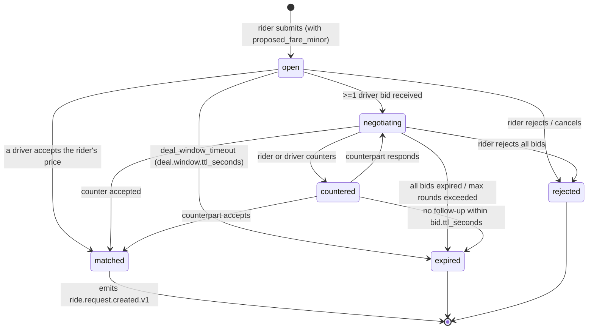

# Make a Deal — Platform-wide Negotiation Kernel

> **Purpose:** Canonical specification of the **Make a Deal** feature
> (InDriver-style price negotiation). This is the single source of truth
> for the deal model, state machine, event catalog, fare-band rules, and
> per-service participation matrix. Every participating service's
> `TECH.md` §12 references this document.
>
> **Status:** Phase 7.5 (added 2026-08-05).
> **Pattern:** Embedded per service (no central deal-service binary).
> **Reference service:** `docs/services/`trip-service` (ride-request)/`.
> **Replaces:** Nothing — net-new feature.

---

## 1. Overview

Make a Deal lets a rider (or driver) propose a price for a request
instead of accepting the system-computed direct price. The platform
supports two offer flavors and four negotiation mechanics.

### 1.1 Offer flavors

| Flavor | Description | Outcomes |
|---|---|---|
| **Direct offer** | System-computed price (`POST /v1/quotes` → `total_minor`). User can only `accept` or `reject`. | `accepted` → request moves to dispatch; `rejected` → request cancelled. |
| **Deal offer** | User proposes a price (`proposed_fare_minor`). Counter-offers are allowed from both sides, bounded by a fare band. | `matched` (one side accepted the other's price) → request moves to dispatch; `expired` / `rejected` → no booking. |

### 1.2 Negotiation mechanics (all four are supported)

1. **Rider proposes → driver accepts/counters.** Core InDriver model.
2. **Driver proposes → rider accepts/counters.** Driver-initiated; mirrors InDriver's "drivers can offer" mode.
3. **Multi-driver bidding.** Open deal is broadcast to N candidates; each submits a bid; rider picks one (or accepts the lowest).
4. **Geo-fenced fare bands.** Every price proposal is validated against a per-zone/per-ride-type fair-price band `{min_fare_minor, max_fare_minor}`. Out-of-band proposals are rejected with `422 FARE_OUT_OF_BAND`.

### 1.3 Architectural pattern

- **Embedded per service.** Each participating service owns its own deal rows, deal state machine, and endpoint surface. There is no central `deal-service` binary.
- **Shared hub doc.** This file is the canonical contract. Per-service `TECH.md` §12 + `INTEGRATION.md` references back to this.
- **Pricing is the only money authority.** All fare-band resolution calls `pricing-service` (`GET /v1/quotes/{id}/fairness-band`). No service computes money locally.
- **Event-driven connections.** Rider-side and driver-side services communicate via Kafka events (`<domain>.deal.*.v1`).

---

## 2. Bounded context

The deal kernel spans multiple bounded contexts. The shared kernel is the
**Deal aggregate**; each context owns its own deals.

### 2.1 Core entities

| Entity | Owned by | Purpose |
|---|---|---|
| `Deal` | rider-side service (e.g. ``trip-service` (ride-request)`) | Per-deal aggregate: `deal_id`, `state`, `current_round`, `rider_id`, `product_type`, `pickup`, `dropoff`, `proposed_fare_minor`, `accepted_fare_minor`, `fairness_band_snapshot`, `expires_at`. |
| `DealBid` | driver-side service (e.g. ``driver-service` (dispatch)`) | Per-bid: `bid_id`, `deal_id`, `driver_id`, `amount_minor`, `state` (`pending`/`accepted`/`rejected`/`countered`/`expired`), `sent_at`, `expires_at`. |
| `DealCounter` | both sides | A counter-offer row: `counter_id`, `deal_id`, `bid_id`, `from_actor` (`rider`/`driver`), `amount_minor`, `round_number`, `submitted_at`. |
| `DealAttempt` | driver-side service | The "round" abstraction: which drivers were invited, what was the broadcast radius, how many bids received. Mirrors ``driver-service` (dispatch)`'s `MatchAttempt`. |

### 2.2 Cross-service referential model

- A `Deal` row holds `rider_id` (UUID) and `product_type` (string) — never a foreign key.
- A `DealBid` holds `deal_id` (UUID) and `driver_id` (UUID) — rider-side service is the source of truth for `deal_id`; driver-side service receives it via the `ride.deal.opened.v1` event.
- All money is `amount_minor BIGINT` + `currency CHAR(3)` per `DATA--003` of `pricing-service/SRS.md`.

### 2.3 What is NOT a deal kernel responsibility

- The deal kernel does **not** compute money. It calls `pricing-service` for the band and the system-computed direct price.
- The deal kernel does **not** hold payment data. On `matched`, the rider-side service emits the existing `*.request.created.v1` event and the existing payment integration handles capture.
- The deal kernel does **not** hold notification templates. `notification-service` listens to `*.deal.*.v1` events and dispatches via its own templates.

---

## 3. State machine

The `Deal` aggregate state machine. Mirrors ``driver-service` (dispatch)`'s `MatchAttempt` style.



### 3.1 State transitions

| From | To | Trigger | Emitted event |
|---|---|---|---|
| `[*]` | `open` | `POST /v1/{ride|order}/{id}/deal` (rider proposes) | `<domain>.deal.opened.v1` |
| `open` | `negotiating` | first driver bid received | `<domain>.deal.bid.submitted.v1` (from driver-side) |
| `negotiating` | `matched` | a driver accepts the rider's price OR rider accepts a driver's bid | `<domain>.deal.accepted.v1` |
| `negotiating` | `countered` | either side submits a counter | `<domain>.deal.countered.v1` |
| `countered` | `matched` | counterpart accepts the counter | `<domain>.deal.accepted.v1` |
| `open`/`negotiating`/`countered` | `expired` | TTL (`deal.window.ttl_seconds` / `deal.bid.ttl_seconds`) | `<domain>.deal.expired.v1` |
| `open`/`negotiating` | `rejected` | either side explicitly rejects | `<domain>.deal.rejected.v1` |
| `matched` | `[*]` | rider-side service emits `*.request.created.v1` | (existing event) |

### 3.2 Counters & guards

- `current_round` (default `1`) — incremented on each counter-offer. Max `deal.max_counter_rounds` (default `3`).
- `attempt_count` — incremented per driver-broadcast round.
- `expires_at` — set when entering `open` (window TTL) and again on each `countered` (bid TTL).

---

## 4. Event catalog

All deal events use the standard platform envelope (see `docs/architecture/EVENT_ARCHITECTURE.md` §"Event Envelope"). The `aggregate_id` is the `deal_id` (not the `bid_id`); partition key = `deal_id` guarantees per-deal ordering.

### 4.1 Event family overview

| Event | Producer | Consumers | Aggregate |
|---|---|---|---|
| `ride.deal.opened.v1` | ``trip-service` (ride-request)` | ``driver-service` (dispatch)`, `notification-service`, `audit-service` | `Deal` |
| `ride.deal.bid.submitted.v1` | ``driver-service` (dispatch)` | ``trip-service` (ride-request)`, `notification-service`, `audit-service` | `Deal` |
| `ride.deal.countered.v1` | ``trip-service` (ride-request)` OR ``driver-service` (dispatch)` | counterpart + `notification-service` + `audit-service` | `Deal` |
| `ride.deal.accepted.v1` | ``trip-service` (ride-request)` | ``driver-service` (dispatch)`, `notification-service`, `audit-service`, `pricing-service` (capture) | `Deal` |
| `ride.deal.rejected.v1` | either side | `notification-service`, `audit-service` | `Deal` |
| `ride.deal.expired.v1` | whichever side holds the timer | counterpart + `notification-service` + `audit-service` | `Deal` |
| `food.deal.opened.v1` | `food-order-service` | ``courier-service` (dispatch)`, `notification-service`, `audit-service` | `Deal` |
| `food.deal.bid.submitted.v1` | ``courier-service` (dispatch)` | `food-order-service`, `notification-service`, `audit-service` | `Deal` |
| `food.deal.countered.v1` | `food-order-service` OR ``courier-service` (dispatch)` | counterpart + `notification-service` + `audit-service` | `Deal` |
| `food.deal.accepted.v1` | `food-order-service` | ``courier-service` (dispatch)`, `notification-service`, `audit-service`, `pricing-service` | `Deal` |
| `food.deal.rejected.v1` | either side | `notification-service`, `audit-service` | `Deal` |
| `food.deal.expired.v1` | timer holder | counterpart + `notification-service` + `audit-service` | `Deal` |
| `pricing.fairness_band.computed.v1` | `pricing-service` | `audit-service`, ``reporting-service` (data lake)` | `Quote` |

### 4.2 Event flow

```mermaid
flowchart LR
    RR[`trip-service` (ride-request)] -->|ride.deal.opened.v1| DS[`driver-service` (dispatch)]
    DS -->|ride.deal.bid.submitted.v1| RR
    RR -->|ride.deal.countered.v1| DS
    DS -->|ride.deal.accepted.v1| RR
    RR -->|ride.deal.accepted.v1| P[pricing-service]
    RR -->|ride.deal.expired.v1| DS
    RR -->|ride.deal.*.v1| N[notification-service]
    RR -->|ride.deal.*.v1| A[audit-service]
    DS -->|ride.deal.*.v1| A
    DS -->|ride.deal.*.v1| N
    P -->|pricing.fairness_band.computed.v1| A
```

### 4.3 Payload schema (canonical example: `ride.deal.opened.v1`)

```json
{
  "event_id":       "01HZX9C8W6K0G3V2Y5N1Q4R7PB",
  "event_name":     "ride.deal.opened.v1",
  "occurred_at":    "2026-08-05T10:42:11.183Z",
  "schema_version": 1,
  "producer":       "`trip-service` (ride-request)",
  "tenant_id":      "global",
  "correlation_id": "01HZX9C7T0XK2P9F0V6E4B1MZA",
  "causation_id":   null,
  "aggregate_type": "Deal",
  "aggregate_id":   "01HZX9C5S3B1L7K0P2F8V4T6YDA",
  "data": {
    "deal_id":              "01HZX9C5S3B1L7K0P2F8V4T6YDA",
    "rider_id":             "01HZX9C8X1N4M5K7B8V3R0Q9D2H",
    "ride_request_id":      "01HZX9C8W6K0G3V2Y5N1Q4R7PB",
    "city_id":              "01HZX9C8X1N4M5K7B8V3R0Q9D2H",
    "zone_id":              "01HZX9C8W6K0G3V2Y5N1Q4R7PB",
    "ride_type":            "economy",
    "pickup":               { "lat": 25.2048, "lon": 55.2708, "address": "Dubai Mall" },
    "dropoff":              { "lat": 25.1419, "lon": 55.2282, "address": "Burj Al Arab" },
    "proposed_fare_minor":  3500,
    "currency":             "AED",
    "fairness_band": {
      "min_fare_minor": 3000,
      "max_fare_minor": 5000,
      "currency":      "AED",
      "source":        { "kind": "min_fare_override", "rule_id": "amsterdam-min", "version": 7 }
    },
    "config_snapshot": { "version": 42, "values": { "deal.window.ttl_seconds": 90 } },
    "quote_id":        "01HZX9C8X1N4M5K7B8V3R0Q9D2H",
    "expires_at":      "2026-08-05T10:43:41.183Z",
    "current_round":   1
  }
}
```

The other `ride.deal.*.v1` events share the same envelope; the `data`
block changes per verb (see the participating service's `INTEGRATION.md`
for the per-event payload).

### 4.4 Event-versioning rules

Per `docs/architecture/EVENT_ARCHITECTURE.md` §"Schema Evolution":

- Within `v1`, producers MAY add optional fields; consumers MUST ignore unknown fields (enforced via JSON Schema at ingress).
- Major-version bump (`v2`) required to remove/rename fields, change types, or change partition key.
- Dual-publish window ≥ 6 months when bumping major versions.

---

## 5. Fare-band resolution algorithm

Every deal opening must compute a fairness band that bounds all subsequent price proposals. The algorithm delegates to `pricing-service`.

### 5.1 Call

```
GET /v1/quotes/{quote_id}/fairness-band
```

Auth: `pricing.read`. Errors: `404 QUOTE_NOT_FOUND`, `410 QUOTE_EXPIRED`.

### 5.2 Resolution order

The band is resolved by `pricing-service` using the existing `pricing.geo_overrides` machinery, with a new rule kind added (`max_fare_override`). Most-specific match wins:

```
1. od_corridor          (pickup→dropoff corridor)
2. max_fare_override    (new — explicit upper bound for negotiation)
3. min_fare_override    (existing — implicit floor)
4. base_fare_override
5. per_km_override
6. per_min_override
```

If no `max_fare_override` matches, the **ceiling** is computed as `pricing.surge.max_multiplier * base_fare_total` (using the `config_snapshot` from the original quote).
If no `min_fare_override` matches, the **floor** is `pricing.min_fare.{city_id}`.

### 5.3 Response shape

```json
{
  "min_fare_minor": 3000,
  "max_fare_minor": 5000,
  "currency":      "AED",
  "source": {
    "min":      { "kind": "min_fare_override", "rule_id": "amsterdam-min", "version": 7 },
    "max":      { "kind": "max_fare_override", "rule_id": "amsterdam-max", "version": 3 }
  },
  "config_snapshot": { "version": 42, "values": { /* ... */ } },
  "computed_at": "2026-08-05T10:42:11.183Z"
}
```

### 5.4 Out-of-band rejection

Every proposed price is validated:

```
if proposed_fare_minor < min_fare_minor:
    reject 422 FARE_BELOW_MIN  (rider cannot low-ball below the regulatory floor)
if proposed_fare_minor > max_fare_minor:
    reject 422 FARE_ABOVE_MAX  (rider cannot overpay above the regulatory ceiling)
```

The band is **frozen at deal-open time** — subsequent surge or geo changes do not retro-constrain an open deal (the `config_snapshot` is captured in the `deal` row).

---

## 6. Money & currency

- All monetary amounts are `amount_minor BIGINT` (integer minor units) + `currency CHAR(3)` (ISO 4217).
- Never floats. Per `DATA--003` of `pricing-service/SRS.md`.
- Currency is taken from the original quote; multi-currency deals are not supported (deals must be in the same currency as the originating quote).
- The `deal` row stores `proposed_fare_minor`, `accepted_fare_minor`, `final_fare_minor` (== `accepted_fare_minor` on `matched`).

---

## 7. Idempotency, correlation, audit

### 7.1 Idempotency

- Every state-changing POST carries `Idempotency-Key: deal:<deal_id>:<action>`.
- Consumer-side dedup uses the standard `inbox` table keyed by `event_id` (ULID/UUIDv7). Per `docs/architecture/FAILURE_HANDLING.md`.
- `POST /v1/deals/{id}/accept` with the same `Idempotency-Key` is a no-op (returns the current state).

### 7.2 Correlation

- `X-Correlation-Id` header is propagated end-to-end.
- Every emitted event puts the same value in the envelope's `correlation_id`.
- The `deal` row stores `correlation_id` for replay.

### 7.3 Audit

- Every deal state transition emits a `*.deal.*.v1` event.
- `audit-service` consumes all `*.deal.*.v1` events and writes immutable rows to `audit.deal_transition.v1`, mirroring `audit.admin.<service>.v1`.
- The audit row includes: `event_id`, `deal_id`, `from_state`, `to_state`, `actor_id`, `actor_role`, `amount_minor`, `currency`, `correlation_id`, `config_snapshot`.

---

## 8. Configuration keys

All `deal.*` keys live in `configuration-service` and inherit the hierarchical scope resolution (`tenant → city → zone → ride_type → global`). Per `docs/services/configuration-service/README.md` §13.

| Key | Type | Default | Scope | Purpose |
|---|---|---|---|---|
| `deal.enabled.{city_id}.{ride_type}` | boolean | `false` | city × ride_type | Feature flag; per-ride-type rollout. |
| `deal.window.ttl_seconds` | integer | `90` | tenant | Time a deal stays `open` / `negotiating` before auto-`expired`. |
| `deal.bid.ttl_seconds` | integer | `15` | tenant | Time a counter-offer stays `countered` before auto-`expired`. |
| `deal.max_counter_rounds` | integer | `3` | tenant | Maximum counter-offer rounds before forcing `expired`. |
| `deal.broadcast.radius_m` | integer | `5000` | city | Radius for the driver-broadcast fan-out. |
| `deal.broadcast.max_concurrent_drivers` | integer | `10` | city | Cap on drivers invited per broadcast round. |
| `deal.band.{tenant}.{city}.{ride_type}.min_fare_minor` | integer | — | tenant × city × ride_type | Hard floor (overrides `pricing.min_fare.{city_id}` if set). |
| `deal.band.{tenant}.{city}.{ride_type}.max_fare_minor` | integer | — | tenant × city × ride_type | Hard ceiling (the new `max_fare_override` rule kind). |
| `deal.band.{tenant}.{city}.{ride_type}.currency` | string | — | tenant × city × ride_type | ISO 4217 currency code. |

### 8.1 Schema registration example

```json
{
  "key": "deal.band.global.amsterdam.economy",
  "value": {
    "min_fare_minor": 3000,
    "max_fare_minor": 5000,
    "currency": "EUR"
  },
  "schema": {
    "type": "object",
    "properties": {
      "min_fare_minor": { "type": "integer", "minimum": 0 },
      "max_fare_minor": { "type": "integer", "minimum": 0 },
      "currency":       { "type": "string",  "minLength": 3, "maxLength": 3 }
    },
    "required": ["min_fare_minor", "max_fare_minor", "currency"]
  }
}
```

---

## 9. Rollout & feature flag

- ``configuration-service` (flags)` key `deal.enabled.{city_id}.{ride_type}` (default OFF).
- Admin (`admin-service`) controls the flag per city × ride_type.
- The participating service MUST short-circuit deal endpoints with `404 DEAL_DISABLED_IN_CITY` when the flag is OFF.
- Rollout plan: 1 city × 1 ride_type → 1 city × all ride_types → all cities × all ride_types.

---

## 10. Per-service participation matrix

This is the canonical map. Each service's `TECH.md` §12 references this section.

| Service | Role | Participation |
|---|---|---|
| ``trip-service` (ride-request)` | Rider-side boundary (ride) | **Participates.** Owns `Deal` rows for rides; produces `ride.deal.*.v1`; consumes `dispatch.deal.bid.submitted.v1`. See ``trip-service` (ride-request)/TECH.md#12-make-a-deal`. |
| ``driver-service` (dispatch)` | Driver-side boundary (ride) | **Participates.** Owns `DealBid` + `DealAttempt` rows; produces `dispatch.deal.bid.submitted.v1`; consumes `ride.deal.opened.v1`, `ride.deal.countered.v1`. See ``driver-service` (dispatch)/TECH.md#12-make-a-deal`. |
| `food-order-service` | Rider-side boundary (food) | **Participates.** Owns `Deal` rows for orders; produces `food.deal.*.v1`; consumes `delivery.deal.bid.submitted.v1`. See `food-order-service/TECH.md#12-make-a-deal`. |
| ``courier-service` (dispatch)` | Driver-side boundary (food) | **Participates.** Owns `DealBid` + `DealAttempt` for couriers; produces `delivery.deal.bid.submitted.v1`; consumes `food.deal.opened.v1`. |
| `pricing-service` | Fare-band authority | **Participates.** Adds `GET /v1/quotes/{id}/fairness-band`; adds `max_fare_override` rule kind; produces `pricing.fairness_band.computed.v1`. See `pricing-service/INTEGRATION.md` §1.x. |
| `configuration-service` | Config storage | **Participates.** Hosts `deal.*` keys; relays via `configuration.updated.v1`. See `configuration-service/README.md` §13. |
| `notification-service` | Outbound channel | **Participates.** Adds 5 deal templates; consumes all `*.deal.*.v1`. See `notification-service/TECH.md#12-make-a-deal`. |
| `audit-service` | Immutable audit | **Participates.** Consumes all `*.deal.*.v1` and `pricing.fairness_band.computed.v1`; writes `audit.deal_transition.v1`. |
| ``geolocation-service` (zones)` | Geo authority | **Inherits.** No deal-specific code. Per-service `TECH.md` §12 is a single line referencing this doc. |
| ``configuration-service` (flags)` | Rollout gate | **Inherits.** Hosts `deal.enabled.{city_id}.{ride_type}` per the existing flag pattern. |
| All other services (49) | — | **Inherits.** Section 12 in `TECH.md` is a single line referencing this doc. |

---

## 11. Worked example

### 11.1 Rider-proposes scenario (Riyadh, economy)

1. Rider opens the app, gets a system quote via `POST /v1/quotes` → `total_minor = 4250`.
2. Rider proposes `3500` → `POST /v1/rides/{id}/deal` with `proposed_fare_minor: 3500`, `Idempotency-Key: deal:01HZX...:open`.
3. ``trip-service` (ride-request)` calls `GET /v1/quotes/{quote_id}/fairness-band` → band `{min: 3000, max: 5000, currency: SAR, source: {min: min_fare_override, max: max_fare_override}}`. `3500` is in band → continue.
4. ``trip-service` (ride-request)` writes a `Deal` row in state `open`, persists `fairness_band_snapshot`, emits `ride.deal.opened.v1`.
5. ``driver-service` (dispatch)` consumes `ride.deal.opened.v1`; enumerates drivers in `deal.broadcast.radius_m`; filters to `online_available`; picks top `deal.broadcast.max_concurrent_drivers` by score.
6. Each invited driver gets a push notification + `GET /v1/dispatch/drivers/{id}/open-deals` returns the deal in `pending` state.
7. Driver A submits a bid `3800` → `POST /v1/dispatch/deals/{deal_id}/bids` with `Idempotency-Key: deal:01HZX...:bid:01HZX...`. ``driver-service` (dispatch)` emits `ride.deal.bid.submitted.v1`.
8. Rider sees driver A's bid (rider's app polls `GET /v1/deals/{id}` or receives push) and counters `3700` → `POST /v1/deals/{id}/counter` with `{bid_id, counter_fare_minor: 3700}`. ``trip-service` (ride-request)` emits `ride.deal.countered.v1`.
9. Driver A accepts `3700` → `POST /v1/dispatch/deals/{deal_id}/accept` with `counter_id`. ``driver-service` (dispatch)` emits `ride.deal.accepted.v1`.
10. ``trip-service` (ride-request)` consumes `ride.deal.accepted.v1`; transitions `Deal` to `matched`; emits the existing `ride.request.created.v1` with `accepted_fare_minor: 3700`. The trip proceeds via the existing dispatch pipeline.
11. `audit-service` has logged all 6 transitions + the original `pricing.fairness_band.computed.v1`.

### 11.2 Direct offer scenario (no negotiation)

1. Rider sees system quote `4250` → `POST /v1/rides/{id}/accept-direct` with `{quote_id}`, `Idempotency-Key: deal:01HZX...:direct-accept`.
2. ``trip-service` (ride-request)` validates the quote is still valid (not expired); transitions request to dispatch; emits `ride.request.created.v1` with `proposed_fare_minor: 4250` (= `total_minor`).
3. No deal events are emitted; the existing flow carries through.

---

## 12. See also

### Platform-wide

- [`docs/architecture/EVENT_ARCHITECTURE.md`](../architecture/EVENT_ARCHITECTURE.md) — event envelope, versioning, partitioning.
- [`docs/architecture/FAILURE_HANDLING.md`](../architecture/FAILURE_HANDLING.md) — idempotency, outbox/inbox.
- [`docs/architecture/OBSERVABILITY.md`](../architecture/OBSERVABILITY.md) — correlation, tracing.
- [`docs/architecture/SECURITY_ARCHITECTURE.md`](../architecture/SECURITY_ARCHITECTURE.md) — auth scopes.
- [`docs/shared/OSS_DEPENDENCIES.md`](OSS_DEPENDENCIES.md) — the parallel canonical hub.
- [`docs/services/RECOMMENDATIONS.md`](../services/RECOMMENDATIONS.md) §6.2b — deal kernel participation table.

### Service-specific

- [`docs/services/`trip-service` (ride-request)/TECH.md`](../services/`trip-service` (ride-request)/TECH.md#12-make-a-deal)
- [`docs/services/`driver-service` (dispatch)/TECH.md`](../services/`driver-service` (dispatch)/TECH.md#12-make-a-deal)
- [`docs/services/food-order-service/TECH.md`](../services/food-order-service/TECH.md#12-make-a-deal)
- [`docs/services/pricing-service/INTEGRATION.md`](../services/pricing-service/INTEGRATION.md) — fairness-band endpoint.
- [`docs/services/configuration-service/README.md`](../services/configuration-service/README.md) — `deal.*` config keys.
- [`docs/services/notification-service/TECH.md`](../services/notification-service/TECH.md#12-make-a-deal) — 5 deal templates.
- [`docs/IMPLEMENTATION_PHASES.md`](../IMPLEMENTATION_PHASES.md) — Phase 7.5 schedule.
