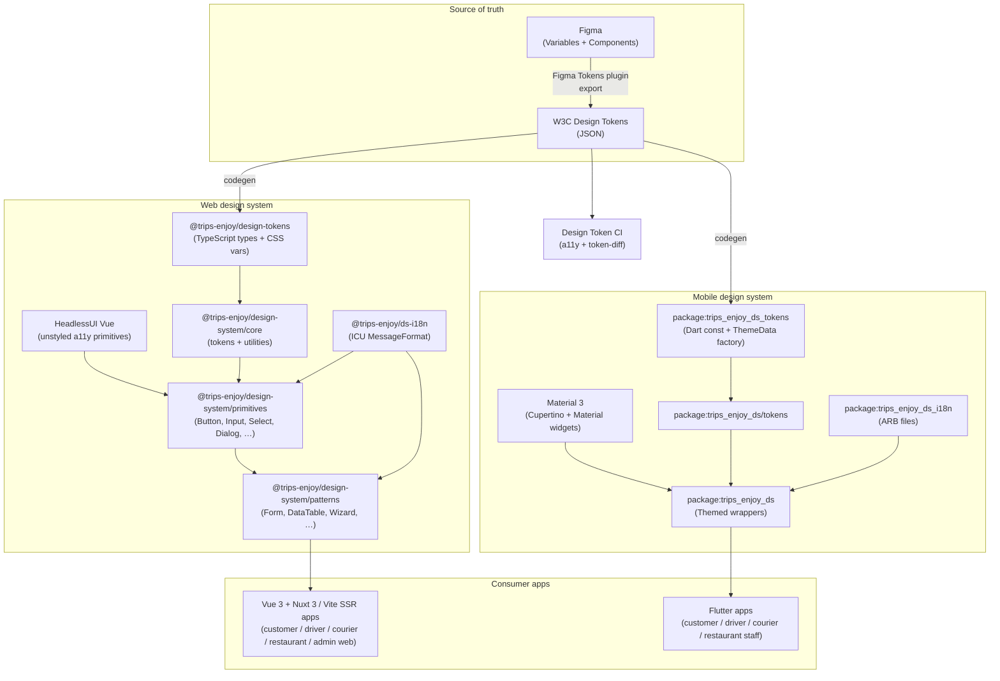

# Design System Architecture

> **Scope.** The platform's cross-channel design system — the **single
> source of truth** for visual design, interaction patterns,
> accessibility, and i18n/RTL across all customer-facing and
> operator-facing surfaces (web + mobile + admin consoles).
>
> The design system lives in the **web repo** (alongside the
> Vue 3 + Nuxt 3 / Vite SSR apps) and the **mobile repo** (alongside the Flutter
> apps), and ships as:
>
> - `@trips-enjoy/design-system` — web (Vue 3 + TypeScript + HeadlessUI Vue + TanStack Query for Vue + Vite SSR), consumed by
>   the customer, driver, courier, restaurant, and admin web apps.
> - `@trips-enjoy/design-tokens` (or `@trips-enjoy/ds-tokens`) — pure-JSON design
>   tokens (W3C Design Tokens Community Group format) — consumed by
>   the mobile app via codegen to a Dart `ThemeData` factory, and
>   by any BFF (Kotlin + Spring Boot 4 or Go) that emits inline
>   style hints.

> **This doc is a sibling of [`README.md`](./README.md)**
> (`platform-spring-boot-starter` shared library) and the per-service
> docs. The design system is a **frontend sibling** of the backend
> shared library: same goals (consistency, drift prevention, single
> source of truth), different stack.

---

## 1. Goals

- **Visual consistency** across every customer / operator surface
  (web + mobile + admin) — a single brand, a single typographic
  scale, a single spacing scale, a single color palette.
- **Behavioural consistency** — a single Button has the same
  affordance, keyboard pattern, focus ring, and ARIA semantics on
  every surface, regardless of stack.
- **RTL parity** — Arabic (and any future RTL locale) is a
  **first-class** rendering target, not a translation afterthought.
  The same components and tokens render correctly in LTR and RTL
  with no per-page overrides.
- **Accessibility floor** — WCAG 2.2 AA minimum, with AAA for
  color contrast where the brand palette allows. Every interactive
  component ships with keyboard navigation, screen-reader
  semantics, and reduced-motion support out of the box.
- **Drift prevention** — the system is consumed via package
  imports (`@trips-enjoy/design-system` on web, `package:trips_enjoy_ds` on
  mobile), never copy-pasted. Token changes propagate to every
  surface in a single release.
- **Themeable for white-label** — the same components render
  under the default brand, a co-branded theme, or a partner
  white-label theme by swapping the token set at runtime.
- **i18n parity** — every user-visible string is extracted to a
  translation catalog (`@trips-enjoy/ds-i18n`) and rendered in the
  recipient's preferred locale (EN, AR, with FR and UR in v2).

## 2. Non-goals

- **Not a backend service.** The design system is a library, not
  a deployable. It has no DB, no events, no SLO. The only "service"
  surface is the npm package publish + the W3C token JSON
  artifact consumed by codegen.
- **Not a CMS.** The system renders static + dynamic UI, but the
  content model (operator-edited marketing copy, A/B-tested
  microcopy) lives in `configuration-service` and the BFF
  (`admin-service`, Kotlin + Spring Boot 4), not in the design
  system.
- **Not an analytics sink.** The system emits the platform's
  standard telemetry (OpenTelemetry, custom events via the
  platform's analytics client) but does not own any analytics
  pipeline.
- **Not a design tool integration.** The system is consumed by
  apps; it is not a Figma plugin or a design-tokens pipeline to
  Figma. The design team maintains the token source of truth in
  Figma Variables and exports the W3C JSON via the Figma Tokens
  plugin.

## 3. Stakeholders

| Stakeholder | Responsibility |
|---|---|
| **Design team** | Token source of truth (in Figma), component specs, accessibility review |
| **Frontend platform team** | Web component implementation (Vue 3 + TS), npm package, build pipeline |
| **Mobile platform team** | Mobile component implementation (Flutter + Dart), pub package, codegen |
| **App teams** (customer / driver / courier / restaurant / admin web) | Consume `@trips-enjoy/design-system`; do not fork; report issues |
| **Localization team** | Translation catalog (`@trips-enjoy/ds-i18n`); locale review for AR / RTL |
| **Accessibility team** | WCAG audit, axe-core CI gate, screen-reader smoke tests |
| **Security** | CSP/SRI for the web bundle, supply-chain (npm audit, `provenance` attestation) |

## 4. Architecture Overview



## 5. Stack

### 5.1 Web (`@trips-enjoy/design-system`)

| Layer | Tech | Rationale |
|---|---|---|
| **Framework** | Vue 3 (Composition API, `<script setup>`) + TypeScript 5.6+ | The platform's chosen web framework (per the user profile) |
| **SSR / hydration** | Nuxt 3 (preferred — opinionated SSR, file-based routing, server data loaders) **OR** Vike (Vite SSR) for the apps that need a less-opinionated SSR shell | Server-side data loading is a platform requirement — the initial render must come from a server-side loader (Nuxt 3 `useAsyncData` / `useFetch`, or Vike `loader`), not a client-side `useQuery` waterfall |
| **Unstyled accessibility primitives** | HeadlessUI Vue (`@headlessui/vue`) | Battle-tested a11y primitives (WAI-ARIA, keyboard nav, focus management, dialog/popover/menu); the design system styles them, not reinvents them |
| **State** | Pinia (app state) + TanStack Query for Vue (`@tanstack/vue-query`, server-cache) | Pinia for cross-component client state; TanStack Query Vue for server cache + mutations + revalidation after hydration |
| **Styling** | Tailwind CSS 4 + `class-variance-authority` (CVA) + `tailwind-merge` | Utility-first styling with CVA variants for type-safe component APIs; `tailwind-merge` resolves conflicting utility classes |
| **Icons** | `lucide-vue-next` (the Vue port of `lucide-react`) | Tree-shakable, consistent stroke weight, MIT-licensed, same icon set as the mobile design system |
| **Forms** | `vee-validate` + `zod` (resolver) | Schema-first validation, type-safe form state, composable |
| **i18n** | `@trips-enjoy/ds-i18n` (built on `vue-i18n` / `@intlify/core`) | ICU MessageFormat, plural/gender/select support; integrates with the platform's `customer-service` locale preference |
| **Composables** | `@vueuse/core` | Battle-tested composables (useStorage, useEventListener, useIntersectionObserver, etc.) — keeps the design-system components free of ad-hoc hook implementations |
| **Animations** | `@vueuse/motion` (the Vue port of `motion`) + `prefers-reduced-motion` guard | Respects WCAG 2.2 reduced-motion requirement |
| **DevTools** | `@tanstack/devtools-vite` (Vite plugin) | Integrated devtools for TanStack Query + Pinia + Router in a single panel; loaded only in dev builds |
| **Build** | Vite (esbuild + Rollup) for the SSR build; CSS extracted via PostCSS; the library uses `unbuild` (Vite-powered) for ESM + CJS dual output | Sub-second rebuilds; tree-shakable for consumers; same Vite pipeline as the consuming apps |
| **Test** | Vitest (unit) + `@vue/test-utils` (component) + Playwright (E2E + a11y smoke) + `@axe-core/playwright` (CI gate) | Standard Vue testing toolchain; axe-core is the a11y gate per WCAG 2.2 AA |
| **Distribution** | npm (private registry, scoped `@trips-enjoy/`) with `--provenance` and `--access=restricted` | Supply-chain attestation, SRI, CSP-compatible |

### 5.2 Mobile (`package:trips_enjoy_ds`)

| Layer | Tech | Rationale |
|---|---|---|
| **Component layer** | Flutter 3.44 + Dart 3.12 (per the user profile) | The platform's chosen mobile stack |
| **Base widgets** | Material 3 (`useMaterial3: true`) + Cupertino (iOS-feel) | Cross-platform look + platform-native feel |
| **Styling** | `ThemeData` + `ColorScheme` from generated Dart factory | Single source of truth, type-safe |
| **Icons** | `flutter_lucide` (Lucide port to Flutter) | Same icon set as web; consistent visual language |
| **Forms** | `reactive_forms` (Dart) + `rxdart` (validation streams) | Reactive form state, type-safe validators |
| **i18n** | `package:trips_enjoy_ds_i18n` (ARB files + `flutter gen-l10n`) | Standard Flutter i18n, integrated with the platform's locale preference |
| **Animations** | `flutter_animate` + `MediaQuery.disableAnimations` guard | Respects reduced-motion system setting |
| **Distribution** | `pub.dev` (private) for the package; apps in the monorepo consume via `path:` reference | Monorepo-local development, versioned release |

### 5.3 Shared design tokens (`@trips-enjoy/design-tokens` / `package:trips_enjoy_ds_tokens`)

The token layer is **stack-agnostic**. Tokens are the only artifact
that crosses the web / mobile boundary, and they cross in the
[W3C Design Tokens Community Group format](https://design-tokens.github.io/community-group/format/)
(JSON).

```json
{
  "color": {
    "brand": {
      "primary":   { "$value": "#0A6CFF", "$type": "color", "$description": "Primary brand color" },
      "secondary": { "$value": "#1F2937", "$type": "color", "$description": "Secondary brand" }
    },
    "semantic": {
      "success":  { "$value": "{color.brand.primary}", "$type": "color" },
      "warning":  { "$value": "#F59E0B", "$type": "color" },
      "danger":   { "$value": "#DC2626", "$type": "color" },
      "info":     { "$value": "{color.brand.primary}", "$type": "color" }
    },
    "neutral": {
      "0":  { "$value": "#FFFFFF", "$type": "color" },
      "50": { "$value": "#F9FAFB", "$type": "color" },
      "100":{ "$value": "#F3F4F6", "$type": "color" },
      "500":{ "$value": "#6B7280", "$type": "color" },
      "900":{ "$value": "#111827", "$type": "color" }
    }
  },
  "typography": {
    "family": {
      "sans": { "$value": ["Inter", "system-ui", "sans-serif"], "$type": "fontFamily" }
    },
    "size": {
      "xs":   { "$value": "0.75rem", "$type": "dimension" },
      "sm":   { "$value": "0.875rem", "$type": "dimension" },
      "base": { "$value": "1rem", "$type": "dimension" },
      "lg":   { "$value": "1.125rem", "$type": "dimension" },
      "xl":   { "$value": "1.25rem", "$type": "dimension" },
      "2xl":  { "$value": "1.5rem", "$type": "dimension" }
    },
    "weight": {
      "regular":  { "$value": 400, "$type": "fontWeight" },
      "medium":   { "$value": 500, "$type": "fontWeight" },
      "semibold": { "$value": 600, "$type": "fontWeight" },
      "bold":     { "$value": 700, "$type": "fontWeight" }
    },
    "lineHeight": {
      "tight":   { "$value": "1.25", "$type": "number" },
      "normal":  { "$value": "1.5",  "$type": "number" },
      "relaxed": { "$value": "1.75", "$type": "number" }
    }
  },
  "spacing": {
    "0":  { "$value": "0",     "$type": "dimension" },
    "1":  { "$value": "0.25rem", "$type": "dimension" },
    "2":  { "$value": "0.5rem",  "$type": "dimension" },
    "3":  { "$value": "0.75rem", "$type": "dimension" },
    "4":  { "$value": "1rem",    "$type": "dimension" },
    "5":  { "$value": "1.25rem", "$type": "dimension" },
    "6":  { "$value": "1.5rem",  "$type": "dimension" },
    "8":  { "$value": "2rem",    "$type": "dimension" },
    "10": { "$value": "2.5rem",  "$type": "dimension" },
    "12": { "$value": "3rem",    "$type": "dimension" },
    "16": { "$value": "4rem",    "$type": "dimension" }
  },
  "radius": {
    "none": { "$value": "0",       "$type": "dimension" },
    "sm":   { "$value": "0.25rem", "$type": "dimension" },
    "md":   { "$value": "0.5rem",  "$type": "dimension" },
    "lg":   { "$value": "1rem",    "$type": "dimension" },
    "full": { "$value": "9999px",  "$type": "dimension" }
  },
  "shadow": {
    "sm":   { "$value": "0 1px 2px 0 rgba(0,0,0,0.05)",                        "$type": "shadow" },
    "md":   { "$value": "0 4px 6px -1px rgba(0,0,0,0.1), 0 2px 4px -1px rgba(0,0,0,0.06)", "$type": "shadow" },
    "lg":   { "$value": "0 10px 15px -3px rgba(0,0,0,0.1), 0 4px 6px -2px rgba(0,0,0,0.05)", "$type": "shadow" }
  },
  "motion": {
    "duration": {
      "fast":     { "$value": "150ms", "$type": "duration" },
      "normal":   { "$value": "250ms", "$type": "duration" },
      "slow":     { "$value": "400ms", "$type": "duration" }
    },
    "easing": {
      "standard":  { "$value": "cubic-bezier(0.4, 0, 0.2, 1)", "$type": "cubicBezier" },
      "decelerate":{ "$value": "cubic-bezier(0.0, 0, 0.2, 1)", "$type": "cubicBezier" },
      "accelerate":{ "$value": "cubic-bezier(0.4, 0, 1, 1)",   "$type": "cubicBezier" }
    }
  },
  "zIndex": {
    "base":    { "$value": 0,    "$type": "number" },
    "dropdown":{ "$value": 1000, "$type": "number" },
    "sticky":  { "$value": 1100, "$type": "number" },
    "overlay": { "$value": 1300, "$type": "number" },
    "modal":   { "$value": 1400, "$type": "number" },
    "toast":   { "$value": 1700, "$type": "number" }
  }
}
```

The token JSON is the **only** artifact that web and mobile share.
Everything below tokens (components, patterns, icons, motion) is
implemented **natively** in each stack, with the same behavioral
contract verified by the cross-stack visual regression test suite
(see §11).

## 6. Component Library (per stack)

### 6.1 Web — `@trips-enjoy/design-system`

| Layer | Components | Notes |
|---|---|---|
| **Primitives** (unstyled → styled wrappers) | Button, IconButton, Input, Textarea, Select, Checkbox, Radio, Switch, Slider, Toggle, Tabs, Accordion, Dialog, Popover, Tooltip, Toast, Alert, Badge, Avatar, Spinner, Skeleton, ProgressBar | Every primitive uses a HeadlessUI Vue base for a11y (keyboard nav, focus trap, ARIA roles) |
| **Form patterns** | Form, FormField, FormError, FormSection, FieldArray, FormWizard | Built on `vee-validate` + `zod` |
| **Data patterns** | DataTable (sortable, filterable, paginated, server-side via TanStack Query Vue `useQuery` / `useInfiniteQuery`), ListView, DetailView, EmptyState, ErrorBoundary | Used by admin / reporting surfaces; SSR initial render via Nuxt 3 `useAsyncData` |
| **Navigation** | TopBar, SideBar, BottomNav, Breadcrumbs, Tabs (page-level), Stepper, Pagination | Used by customer web (rider-app web fallback), admin |
| **Feedback** | Toast, Snackbar, Modal, ConfirmDialog, EmptyState, ErrorState, LoadingSkeleton | All respect `prefers-reduced-motion` |
| **Charts** | LineChart, BarChart, AreaChart, PieChart, KpiCard (built on `@unovis/vue`) | Used by reporting / admin |

### 6.2 Mobile — `package:trips_enjoy_ds`

| Layer | Components | Notes |
|---|---|---|
| **Tokens** | `Tokens.light`, `Tokens.dark` (extension on `ThemeData`) | Generated from W3C JSON via codegen |
| **Atoms** | `LeapButton`, `LeapIconButton`, `LeapText`, `LeapIcon`, `LeapAvatar`, `LeapBadge`, `LeapChip`, `LeapDivider`, `LeapSpinner`, `LeapSkeleton` | Wrap Flutter Material / Cupertino widgets |
| **Inputs** | `LeapTextField`, `LeapTextArea`, `LeapSelect`, `LeapCheckbox`, `LeapRadio`, `LeapSwitch`, `LeapSlider`, `LeapDatePicker`, `LeapTimePicker`, `LeapPhoneInput` (with country picker) | Localized labels via `package:trips_enjoy_ds_i18n` |
| **Layout** | `LeapScaffold`, `LeapAppBar`, `LeapBottomNav`, `LeapSideSheet`, `LeapBottomSheet`, `LeapCard`, `LeapDivider`, `LeapListTile`, `LeapStepper` | RTL-aware (`Directionality` driven by locale) |
| **Feedback** | `LeapToast`, `LeapSnackBar`, `LeapAlert`, `LeapDialog`, `LeapConfirmDialog`, `LeapEmptyState`, `LeapErrorState` | Material `SnackBar` / `AlertDialog` wrapped |
| **Patterns** | `LeapForm` (reactive_forms), `LeapDataList`, `LeapMapPin`, `LeapTripCard`, `LeapOrderCard`, `LeapRatingPrompt` | Domain-specific (ride, food, courier) |

## 7. Internationalization (i18n) and RTL

The platform supports **EN + AR** in v1, with **FR + UR** in v2 (per
the customer-service locale preference). Arabic is a **right-to-left**
(RTL) language; the design system must render correctly in RTL with
**no per-component code changes**.

### 7.1 Locale strategy

- **Per-recipient locale** — the customer's preferred locale is
  stored in `customer-service.customer.preferred_locale` and is
  passed in every API call's `Accept-Language` header (or a
  custom `X-Locale` header). The web app's root `IntlProvider` and
  the mobile app's `MaterialApp` use this locale.
- **Fallback chain** — `ar-SA → ar → en-US → en`. Missing
  translations fall through to the closest ancestor.
- **Date / number / currency formatting** — `Intl.NumberFormat`,
  `Intl.DateTimeFormat` (web) and `intl` package (mobile) with the
  active locale. Currency formatting respects the recipient's
  preferred currency (`customer-service.customer.preferred_currency`)
  not the locale.

### 7.2 RTL support

- **Logical properties only** — components use `padding-inline-start`
  / `padding-inline-end` / `margin-inline-start` / `border-inline-start`,
  not `padding-left` / `padding-right`. CSS `direction: rtl` flips
  the layout automatically. The platform's ESLint rule
  `@trips-enjoy/no-physical-properties` enforces this in web.
- **Icon mirroring** — directional icons (chevrons, arrows,
  back-button) are mirrored in RTL via `transform: scaleX(-1)`
  driven by `[dir="rtl"]`. The icon component's
  `autoMirror` prop defaults to `true` for icons in the
  `arrow-*` / `chevron-*` / `caret-*` set.
- **Number and digit shaping** — Arabic-Indic digits (`٠١٢٣`)
  are opt-in via `<html lang="ar-EG" dir="rtl">`; the
  design system does not auto-shape digits (Hindi-Arabic vs
  Arabic-Indic varies by region).
- **Test gate** — every PR must pass a Playwright visual
  regression test that renders every page in EN + AR; the CI
  fails if the RTL rendering diverges from the LTR rendering by
  more than 1px.

### 7.3 Translation catalog (`@trips-enjoy/ds-i18n` / `package:trips_enjoy_ds_i18n`)

- **Format** — ICU MessageFormat (web: `vue-i18n` /
  `@intlify/core`; mobile: ARB files + `flutter gen-l10n`).
- **Source of truth** — the platform's translation vendor
  (Smartling or equivalent); the catalog is round-tripped via
  the vendor's API.
- **Plural / gender / select** — supported via ICU's
  `plural` / `select` / `selectordinal` rules. The
  `customer-service` profile is consulted for gender pronouns
  where relevant.
- **Missing translation CI gate** — every PR fails if a
  translation is missing in the recipient's preferred locale
  for any user-visible string.

## 8. Accessibility (a11y)

The platform's accessibility target is **WCAG 2.2 Level AA** with
AAA contrast for the brand palette where achievable.

### 8.1 Per-component a11y contract

Every primitive component must ship with:

| Property | Requirement |
|---|---|
| **Keyboard navigation** | Full support (Tab, Shift+Tab, Enter, Space, Escape, arrow keys as appropriate); no keyboard traps |
| **Screen reader** | Correct ARIA roles, labels, descriptions, live-region politeness |
| **Focus management** | Visible focus ring (`outline: 2px solid var(--color-focus)`); focus trap in modals; focus return on close |
| **Color contrast** | 4.5:1 for text, 3:1 for large text and UI components, 7:1 preferred for the brand palette |
| **Motion** | Respects `prefers-reduced-motion`; transitions can be disabled |
| **Touch targets** | Minimum 44×44 CSS pixels (Apple HIG) / 48×48 (WCAG 2.2) |
| **Form labels** | Every input has a programmatic label (`<label for>` or `aria-labelledby`) |
| **Error messaging** | Errors announced via `aria-live="polite"`; associated to inputs via `aria-describedby` |

### 8.2 CI gates

- **axe-core** — every web component is unit-tested with
  `jest-axe` (no violations).
- **Playwright + axe-core** — every web page is smoke-tested
  with `@axe-core/playwright` (no serious or critical
  violations).
- **VoiceOver / TalkBack** — every mobile component is
  smoke-tested via `flutter test` integration tests that
  exercise the accessibility tree.
- **Manual review** — every new component requires a
  accessibility team sign-off before merge.

## 9. Theming and White-Label

The design system supports **three themes**:

- **`default`** — the platform's primary brand.
- **`co-branded`** — partner-branded (e.g. a delivery partner's
  colors + logo on top of the platform's typography and
  patterns).
- **`white-label`** — full custom theme for a customer who
  licenses the platform under their own brand.

Theming is achieved by **swapping the token set at runtime**:

- **Web** — the token JSON is loaded at startup from
  `configuration-service` (`/v1/config/design-tokens`); the
  tokens are written to CSS custom properties on `<html>`. A
  theme switch is a single token-JSON swap, no rebuild.
- **Mobile** — the token JSON is bundled in the app; the
  active theme is selected at startup from
  `configuration-service` (`/v1/config/design-tokens` for the
  build-time baked-in default; runtime swap requires an app
  restart for v1).

## 10. Distribution and Versioning

### 10.1 Web

- **Package**: `@trips-enjoy/design-system` (scoped, private npm).
- **Distribution**: ESM + CJS dual output; CSS extracted as
  `style.css` for tree-shakable Tailwind purge; types via
  TypeScript declarations.
- **Versioning**: semver. The platform's `Renovate` config
  auto-bumps the design-system minor version in every app
  weekly; major versions require an RFC and a 2-week
  deprecation window.
- **Provenance**: published with `--provenance` for npm
  supply-chain attestation.
- **CHANGELOG**: generated from conventional commits;
  breaking changes get a `[!]` marker and a migration note
  in the design-system repo.

### 10.2 Mobile

- **Package**: `package:trips_enjoy_ds` (private pub).
- **Distribution**: path reference in the monorepo for
  development; versioned publish to the private pub registry
  for release.
- **Versioning**: semver, same policy as web.

### 10.3 Tokens (cross-stack)

- **Artifact**: W3C Design Tokens JSON, published as
  `@trips-enjoy/design-tokens` (npm, semver) and `package:trips_enjoy_ds_tokens`
  (pub, semver).
- **Source of truth**: Figma Variables, exported via the
  Figma Tokens plugin; a CI job diffs the export against
  the last published version and posts a PR.
- **Codegen**: web → TypeScript types + CSS variables;
  mobile → Dart `const` + `ThemeData` factory. The codegen
  output is committed; no runtime transformation.

## 11. Quality Gates

| Gate | Tool | Threshold |
|---|---|---|
| **Token schema validation** | W3C Design Tokens validator | Pass; no schema violations |
| **Visual regression** | Chromatic (web) + Percy (mobile) | < 0.1% pixel diff per snapshot, per theme, per locale (LTR + RTL) |
| **Unit test** | Vitest (web) + flutter_test (mobile) | 90% line coverage for `core` and `tokens`; 80% for `primitives` and `patterns` |
| **A11y** | axe-core (web) + flutter a11y (mobile) | 0 serious / critical violations |
| **Bundle size** | `size-limit` (web), `flutter build --analyze-size` (mobile) | Web `< 80 KB` gzipped for `core` + `tokens`; mobile `< 200 KB` AOT for `tokens` |
| **Build time** | tsup timing + `flutter build apk` timing | Web `< 10s` incremental; mobile `< 60s` incremental |
| **i18n completeness** | Custom script | 100% string coverage in EN + AR for every consumer; FR + UR coverage tracked |
| **Dependency audit** | `npm audit` / `flutter pub deps` | 0 high / critical vulnerabilities |

## 12. Adoption Contract (app teams)

Every app that renders a customer / operator surface **must**:

- **Import from the package** — `import { LeapButton, LeapTextField } from '@trips-enjoy/design-system'`
  (web Vue 3) or `import 'package:trips_enjoy_ds/trips_enjoy_ds.dart';` (mobile).
  Copy-paste of a Button from another app is a **build error**
  (enforced by a custom ESLint rule + a Flutter lint).
- **Server-side data loading for the initial render** — every
  page's first paint must come from a server-side loader (Nuxt 3
  `useAsyncData` / `useFetch` in `<script setup lang="ts">` with
  `await` + `useAsyncData` returning a typed `data` ref, or Vike
  `loader` for the non-Nuxt apps). After hydration, TanStack Query
  Vue (`useQuery` / `useMutation` / `useInfiniteQuery`) takes over
  for client-side cache + mutations + revalidation. A
  `vue/no-client-waterfall` lint (or a Playwright first-paint
  assertion) blocks pages whose first paint would otherwise
  require a client-side `useQuery` round-trip.
- **No inline hard-coded colors / spacing** — only token-driven
  values are allowed. A custom ESLint rule
  (`@trips-enjoy/no-hard-coded-colors`) and a Flutter lint
  (`trips_enjoy_ds/no_hard_coded_colors`) flag direct color / spacing
  usage and suggest the token equivalent.
- **i18n-only user-visible strings** — every user-visible string
  is rendered via `vue-i18n` (`$t('key')` in templates,
  `t('key')` in `<script setup>`). The ESLint rule
  `@trips-enjoy/no-hard-coded-strings` and the Flutter lint
  `trips_enjoy_ds/no_hard_coded_strings` enforce this.
- **RTL test gate** — every page renders in EN + AR; the
  Playwright visual regression test fails if the RTL rendering
  diverges by more than 1px from the LTR rendering.

The acceptance criteria is documented in the
[`shared/RECOMMENDATIONS.md`](../services/RECOMMENDATIONS.md) tech
map and the `main.md` "Frontend stack" section.

## 13. Anti-patterns (forbidden)

The following are **explicitly forbidden** across the platform:

- **Reimplementing a design-system component** in an app
  (e.g. a custom `BigButton` instead of `<Button size="lg">`).
  *Why*: drift; the design team cannot guarantee a11y / RTL /
  theming.
- **Hard-coded colors, spacing, or typography** outside the
  design system. *Why*: cannot re-theme; cannot re-brand.
- **Hard-coded user-visible strings**. *Why*: cannot translate;
  cannot re-locale.
- **Adding a new component without a Figma spec + a11y review**.
  *Why*: design / a11y / RTL drift; ad-hoc UI accumulates.
- **Bypassing the design-system npm version pin** (e.g. pinning
  to a `*` version or a `latest` tag). *Why*: uncontrolled
  upgrades break the app.
- **Using a non-platform icon set** in a design-system
  component. *Why*: visual inconsistency.
- **Adding a `position: absolute` hack** to position a
  component in an app instead of using the layout primitives.
  *Why*: the layout primitives already handle the responsive
  + RTL cases; hacks break both.

## 14. Open questions / future work

- **Native iOS and Android shells** — the current Flutter app
  is the only mobile surface; should the platform ship a
  SwiftUI / Jetpack Compose variant for native-feel modules?
  *Default answer: no, Flutter + Material 3 + Cupertino
  widgets is sufficient for v1.*
- **Web Components / micro-frontends** — when the platform
  grows to > 5 web apps, should the design system expose
  Web Components (Custom Elements) for cross-app composition?
  *Default answer: defer until > 5 apps.*
- **Animation system** — the current motion tokens are
  pragmatic; should we invest in a full motion design system
  (choreography, sequencing, physics)? *Default answer:
  defer; revisit in v3.*
- **Dark theme** — the v1 design system supports `light` +
  `dark`; should `high-contrast` be a v2 priority?
  *Default answer: yes; `high-contrast` is the WCAG 2.2 AA
  fallback for users who request it.*

## 15. Related docs

- [`../shared/PLATFORM_BASELINE.md`](./PLATFORM_BASELINE.md) —
  single source for the web + mobile runtime stack; the
  design system is a sibling.
- [`../shared/OSS_DEPENDENCIES.md`](./OSS_DEPENDENCIES.md) —
  the SPDX license catalogue; every design-system library
  (HeadlessUI Vue, Tailwind, CVA, lucide, etc.) is listed there.
- [`../shared/CONVENTIONS.md`](./CONVENTIONS.md) — code
  conventions; the design-system ESLint / Flutter lint rules
  follow §3.
- [`../../main.md`](../../main.md) — top-level platform
  specification (the web / mobile stack is decided here).
- [`../../services/RECOMMENDATIONS.md`](../services/RECOMMENDATIONS.md)
  — the technology map; the design system is the
  frontend equivalent of `platform-spring-boot-starter`.
- [`../../architecture/HLD.md`](../architecture/HLD.md) — the
  high-level design (Channel Layer); the design system is the
  visual + behavioral contract of the Channel Layer.
- [`../MIGRATION_HUB.md`](../MIGRATION_HUB.md) — the
  historical context for the platform's 58 → 20 → 21
  consolidation; the design system is a sibling of the
  shared library that survived the consolidation.
