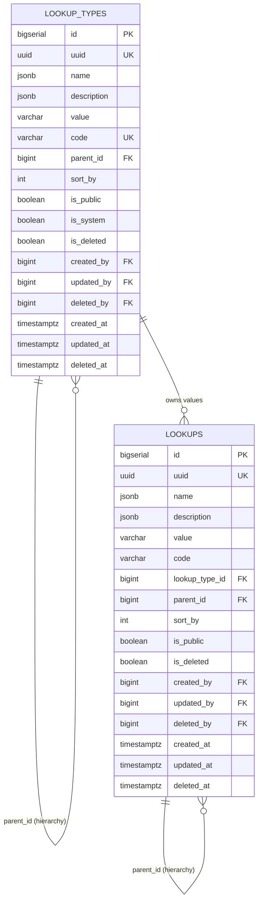

# Shared `lookup_types` + `lookups` Catalog

> **Cross-cutting enumeration catalog** — one pair of tables, one stable
> `code` namespace, one admin-port contract, and one event stream shared
> by **every** service in the platform.
>
> This file is part of the `docs/shared/` set; it does **not** live
> inside any one service. Every service copies the two tables into its
> own schema and binds to the platform-wide contract defined here.
>
> See [`README.md`](./README.md) for the wider shared library and
> [`INTEGRATION.md`](./INTEGRATION.md) for cross-cutting consumer
> patterns.

---

## 1. Why a shared catalog

Almost every service ships its own enumeration-of-things:

- `payment-service` has `payment_methods`, `currencies`, `gateway_codes`,
  `refund_reasons`, `dispute_statuses`.
- `trip-service` has `ride_types`, `trip_statuses`, `cancellation_reasons`.
- ``restaurant-service` (menu)` has `cuisine_categories`, `dietary_tags`, `spice_levels`.
- `notification-service` has `template_categories`,
  `notification_channels`, `delivery_states`.
- ``admin-service` (support module)` has `case_statuses`, `case_priorities`,
  `case_categories`, `escalation_paths`.

Without a shared contract, each of those is a private schema in a
private service that nobody outside can read, reason about, or
administer. The platform-wide blast radius of a missed rename or a
typo in a `code` is enormous (see
[`../architecture/CONSISTENCY_STRATEGY.md`](../architecture/CONSISTENCY_STRATEGY.md)).

`lookup_types` + `lookups` is the platform's answer:

- **One schema shape.** Every service copies the same two-table
  pair; integration code is reusable.
- **One stable `code` namespace.** Codes are platform-wide strings
  (`payment.method.card`, `trip.status.completed`); they are what
  cross-service consumers key on.
- **One event stream.** Every mutation emits a
  `*.lookup.*.v1` event on the shared topic; caches invalidate.
- **One admin contract.** The `/admin/v1/lookups/**` endpoints expose
  CRUD across all types, gated by the standard RBAC roles.

---

## 2. Scope

| In scope | Out of scope |
|---|---|
| Hierarchical enumerations (single-table `parent_id` self-FK) | Full CMS / business-rule authoring (use `configuration-service`) |
| Stable, low-cardinality values referenced across services | Long-lived customer-editable content (per-tenant) |
| System-managed values (`is_system = true`) created by migrations | Per-row tenancy; lookups are **global** by default with optional `tenant_id` |
| Public read of `is_public = true` rows for client UIs | Secrets, credentials, PII |
| Soft delete (`deleted_at`) — never hard delete system rows | Schema-level data modelling for service-specific domains |

---

## 3. Ownership

The catalog is **owned by no single service**; it is a shared contract
maintained alongside the platform baseline. Concretely:

| Concern | Owner | Why |
|---|---|---|
| Schema shape (DDL, indexes, constraints) | Platform baseline (`docs/shared/`) | One copy lives in every service schema |
| The catalog of `is_system = true` types + rows | `platform` team via Liquibase migrations | System seeds are platform decisions |
| Per-type business authoring (e.g. adding a new cuisine) | The bounded context that owns the domain (e.g. ``restaurant-service` (menu)` writes `lookup_type_code = 'menu.cuisine'`) | Domain expertise |
| Cross-type audit log | `audit-service` (the platform-wide immutable audit) | One audit pipeline, one retention policy |
| Admin-port contract `/admin/v1/lookups/**` | `platform-spring-boot-starter` (auto-configured in every service) | Same RBAC + same shape everywhere |
| Cache invalidation | `platform-spring-boot-starter` `LookupCacheInvalidator` (subscribes to `*.lookup.*.v1`) | One consumer, zero per-service glue |

There is no `lookup-service` in the service catalog. Each service owns
the rows for types it has declared (FK to its own data via `lookup_type_id`).
A read on another service's catalog is an event-driven replication, not
a synchronous call.

---

## 4. The two tables

Both tables share the same column shape (long-tail auditable entity);
they differ in that `LOOKUPS` adds a `lookup_type_id` to bind the value
to its type.

### 4.1 `lookup_types`

The catalogue of types. One row per type (e.g. `payment.method`,
`trip.status`, `menu.cuisine`). The `code` is platform-wide and
unique; the `value` is the canonical display label.

| Column | Type | Constraints | Notes |
|---|---|---|---|
| `id` | BIGSERIAL | PK | clustered PK for BTree locality; internal |
| `uuid` | UUID | NOT NULL, UNIQUE | UUIDv7; externally exposed id |
| `name` | JSONB | NOT NULL | localised display name; default `{"en": <value>}`; supports `{"en","ar",…}` |
| `description` | JSONB | NULL | localised description |
| `value` | VARCHAR(128) | NOT NULL | canonical English label (single-locale fallback) |
| `code` | VARCHAR(128) | NOT NULL, UNIQUE | platform-wide stable key; `[a-z][a-z0-9_.\-]{1,127}` |
| `parent_id` | BIGINT | NULL, FK → `lookup_types.id` | self-FK for type hierarchy (e.g. `ride_type` → `service_type`) |
| `sort_by` | INT | NOT NULL DEFAULT 0 | admin-defined ordering |
| `is_public` | BOOLEAN | NOT NULL DEFAULT false | if true, row is exposed to non-admin clients via `/v1/lookups/**` |
| `is_system` | BOOLEAN | NOT NULL DEFAULT false | if true, the row is platform-managed and cannot be deleted by tenants |
| `is_deleted` | BOOLEAN | NOT NULL DEFAULT false | denormalised companion to `deleted_at` for cheap `WHERE NOT is_deleted` |
| `created_by` | BIGINT | NOT NULL, FK → `identity.identities.id` | identity FK (kept BIGINT to match `lookup-service` style; UUID variant is `created_by_uuid` if you need to bind to a non-BIGINT identity service) |
| `updated_by` | BIGINT | NOT NULL, FK → `identity.identities.id` | as above |
| `deleted_by` | BIGINT | NULL, FK → `identity.identities.id` | as above |
| `created_at` | TIMESTAMPTZ | NOT NULL DEFAULT now() | audit |
| `updated_at` | TIMESTAMPTZ | NOT NULL DEFAULT now() | audit |
| `deleted_at` | TIMESTAMPTZ | NULL | soft delete; for `is_system = true`, soft delete still allowed but recovery window is platform-defined (default 30d) |

**Indexes**

- PK on `id`
- UNIQUE on `uuid`
- UNIQUE on `code` — the cross-service join key
- BTree on `parent_id` — subtree traversal
- Partial index on `(code) WHERE is_deleted = false` — the dominant
  read path
- Partial index on `(is_public, code) WHERE is_deleted = false AND is_public = true`
  — public lookup endpoint
- GIN on `name jsonb_path_ops` and `description jsonb_path_ops` —
  localised text search

**Constraints**

- `CHECK (code ~ '^[a-z][a-z0-9_.\-]{1,127}$')`
- `CHECK (value ~ '^.{1,128}$')`
- `CHECK ((deleted_at IS NULL) = (is_deleted = false))`
- `CHECK (parent_id <> id)` — no self-parent

### 4.2 `lookups`

The catalogue of values. One row per allowed value of a type (e.g.
`payment.method.card`, `payment.method.wallet`, `trip.status.completed`).
The `code` is unique within a `lookup_type_id`, not platform-wide
(`payment.method.card` lives under `payment.method`).

| Column | Type | Constraints | Notes |
|---|---|---|---|
| `id` | BIGSERIAL | PK | clustered PK; internal |
| `uuid` | UUID | NOT NULL, UNIQUE | UUIDv7; externally exposed id |
| `name` | JSONB | NOT NULL | localised display name |
| `description` | JSONB | NULL | localised description |
| `value` | VARCHAR(128) | NOT NULL | canonical English label |
| `code` | VARCHAR(128) | NOT NULL | stable within the type; `[a-z][a-z0-9_.\-]{1,127}` |
| `lookup_type_id` | BIGINT | NOT NULL, FK → `lookup_types.id` | parent type (mandatory) |
| `parent_id` | BIGINT | NULL, FK → `lookups.id` | self-FK for hierarchy (e.g. cuisine > sub-cuisine) |
| `sort_by` | INT | NOT NULL DEFAULT 0 | admin-defined ordering |
| `is_public` | BOOLEAN | NOT NULL DEFAULT false | expose to `/v1/lookups/**` |
| `is_deleted` | BOOLEAN | NOT NULL DEFAULT false | denormalised; soft delete |
| `created_by` | BIGINT | NOT NULL, FK → `identity.identities.id` | identity |
| `updated_by` | BIGINT | NOT NULL, FK → `identity.identities.id` | identity |
| `deleted_by` | BIGINT | NULL, FK → `identity.identities.id` | identity |
| `created_at` | TIMESTAMPTZ | NOT NULL DEFAULT now() | audit |
| `updated_at` | TIMESTAMPTZ | NOT NULL DEFAULT now() | audit |
| `deleted_at` | TIMESTAMPTZ | NULL | soft delete |

**Indexes**

- PK on `id`
- UNIQUE on `uuid`
- UNIQUE on `(lookup_type_id, code) WHERE is_deleted = false` — the
  cross-service join key, with soft-delete guard
- BTree on `lookup_type_id` — list-by-type
- BTree on `parent_id` — subtree
- Partial index on `(lookup_type_id, code) WHERE is_deleted = false AND is_public = true`
  — public client reads
- GIN on `name jsonb_path_ops`, `description jsonb_path_ops`

**Constraints**

- `CHECK (code ~ '^[a-z][a-z0-9_.\-]{1,127}$')`
- `CHECK (value ~ '^.{1,128}$')`
- `CHECK ((deleted_at IS NULL) = (is_deleted = false))`
- `CHECK (parent_id IS NULL OR lookup_type_id = (SELECT lookup_type_id FROM lookups WHERE id = parent_id))`
  — parent must share the type

---

## 5. Mermaid ER Diagram



---

## 6. Canonical DDL

The DDL below is the **template** that every service applies to its
own schema (substitute `<schema>` with the service's schema, e.g.
`payment`, `trip`, `menu`).

```sql
-- =====================================================================
-- Shared LOOKUP_TYPES + LOOKUPS catalog — apply per-service schema
-- Schema: <schema>
-- Source of truth: docs/shared/LOOKUPS.md
-- =====================================================================

CREATE TABLE <schema>.lookup_types (
    id           BIGSERIAL   PRIMARY KEY,
    uuid         UUID        NOT NULL UNIQUE,
    name         JSONB       NOT NULL,
    description  JSONB,
    value        VARCHAR(128) NOT NULL,
    code         VARCHAR(128) NOT NULL UNIQUE
        CHECK (code ~ '^[a-z][a-z0-9_.\-]{1,127}$'),
    parent_id    BIGINT      REFERENCES <schema>.lookup_types(id),
    sort_by      INT         NOT NULL DEFAULT 0,
    is_public    BOOLEAN     NOT NULL DEFAULT false,
    is_system    BOOLEAN     NOT NULL DEFAULT false,
    is_deleted   BOOLEAN     NOT NULL DEFAULT false,
    created_by   BIGINT      NOT NULL REFERENCES identity.identities(id),
    updated_by   BIGINT      NOT NULL REFERENCES identity.identities(id),
    deleted_by   BIGINT      REFERENCES identity.identities(id),
    created_at   TIMESTAMPTZ NOT NULL DEFAULT now(),
    updated_at   TIMESTAMPTZ NOT NULL DEFAULT now(),
    deleted_at   TIMESTAMPTZ,
    CHECK (value ~ '^.{1,128}$'),
    CHECK ((deleted_at IS NULL) = (is_deleted = false)),
    CHECK (parent_id IS NULL OR parent_id <> id)
);

CREATE INDEX idx_lookup_types_parent
    ON <schema>.lookup_types (parent_id);
CREATE INDEX idx_lookup_types_active_code
    ON <schema>.lookup_types (code)
    WHERE is_deleted = false;
CREATE INDEX idx_lookup_types_active_public
    ON <schema>.lookup_types (is_public, code)
    WHERE is_deleted = false AND is_public = true;
CREATE INDEX idx_lookup_types_name_gin
    ON <schema>.lookup_types USING gin (name jsonb_path_ops);
CREATE INDEX idx_lookup_types_desc_gin
    ON <schema>.lookup_types USING gin (description jsonb_path_ops);

CREATE TABLE <schema>.lookups (
    id              BIGSERIAL   PRIMARY KEY,
    uuid            UUID        NOT NULL UNIQUE,
    name            JSONB       NOT NULL,
    description     JSONB,
    value           VARCHAR(128) NOT NULL,
    code            VARCHAR(128) NOT NULL
        CHECK (code ~ '^[a-z][a-z0-9_.\-]{1,127}$'),
    lookup_type_id  BIGINT      NOT NULL REFERENCES <schema>.lookup_types(id),
    parent_id       BIGINT      REFERENCES <schema>.lookups(id),
    sort_by         INT         NOT NULL DEFAULT 0,
    is_public       BOOLEAN     NOT NULL DEFAULT false,
    is_deleted      BOOLEAN     NOT NULL DEFAULT false,
    created_by      BIGINT      NOT NULL REFERENCES identity.identities(id),
    updated_by      BIGINT      NOT NULL REFERENCES identity.identities(id),
    deleted_by      BIGINT      REFERENCES identity.identities(id),
    created_at      TIMESTAMPTZ NOT NULL DEFAULT now(),
    updated_at      TIMESTAMPTZ NOT NULL DEFAULT now(),
    deleted_at      TIMESTAMPTZ,
    CHECK (value ~ '^.{1,128}$'),
    CHECK ((deleted_at IS NULL) = (is_deleted = false)),
    CHECK (
        parent_id IS NULL
        OR lookup_type_id = (
            SELECT lookup_type_id FROM <schema>.lookups WHERE id = parent_id
        )
    )
);

CREATE UNIQUE INDEX uniq_lookups_type_code_active
    ON <schema>.lookups (lookup_type_id, code)
    WHERE is_deleted = false;
CREATE INDEX idx_lookups_lookup_type
    ON <schema>.lookups (lookup_type_id);
CREATE INDEX idx_lookups_parent
    ON <schema>.lookups (parent_id);
CREATE INDEX idx_lookups_active_public
    ON <schema>.lookups (lookup_type_id, code)
    WHERE is_deleted = false AND is_public = true;
CREATE INDEX idx_lookups_name_gin
    ON <schema>.lookups USING gin (name jsonb_path_ops);
CREATE INDEX idx_lookups_desc_gin
    ON <schema>.lookups USING gin (description jsonb_path_ops);

-- The unique index above replaces a plain UNIQUE constraint so that
-- soft-deleted rows can be re-created under the same (type, code).
-- Application layer MUST enforce uniqueness against this partial index.
```

### 6.1 Cross-schema note

The `created_by`, `updated_by`, `deleted_by` FKs point at
`identity.identities.id` (cross-schema). That schema is owned by
`identity-service`; per
[`../architecture/SERVICE_ISOLATION.md`](../architecture/SERVICE_ISOLATION.md)
cross-schema FKs are discouraged in this platform. **Recommended
pattern:** drop the FK constraint in production and rely on
`identity-service` validation at write time (see
[`CONSISTENCY_STRATEGY.md`](../architecture/CONSISTENCY_STRATEGY.md)).
The DDL above is illustrative; the production-friendly variant uses
`BIGINT` columns without the FK:

```sql
created_by  BIGINT NOT NULL,   -- identity.identities.id (no DB FK)
updated_by  BIGINT NOT NULL,
deleted_by  BIGINT
```

---

## 7. Cross-service references

A consumer service should **never** JOIN `lookup_types` or `lookups`
across the wire. The supported patterns are:

| Pattern | Use when | How |
|---|---|---|
| Same service owns the row | The lookup is intrinsic to the bounded context | Direct FK inside `<schema>.lookups` |
| Replicate via event | Other services need the catalog | Subscribe to `*.lookup.*.v1` and project a thin `lookups_cache` |
| Read at startup, refresh on event | Read-mostly catalog | Boot-time snapshot + `LookupCacheInvalidator` |

The contract is:

> A consumer that needs a `lookup_type_code` it does not own
> **must** reference it by `code` (string) and **must not** write to
> the source row. Mutations to system-managed types are reserved to
> the platform migration pipeline.

| Column in consumer | Type | Refers to | Source of truth |
|---|---|---|---|
| `payment_method` (in `payments`) | VARCHAR | `lookups.code` where `lookup_type_id.code = 'payment.method'` | `<schema owning payment.method>` |
| `ride_type` (in `ride_request`) | VARCHAR | `lookups.code` where `lookup_type_id.code = 'ride_type'` | the service that declared it |
| `cuisine_code` (in `menu_item`) | VARCHAR | `lookups.code` where `lookup_type_id.code = 'menu.cuisine'` | ``restaurant-service` (menu)` |

Cross-service references **never** carry a database FK; the
`code` string IS the contract.

---

## 8. The cross-service event contract

Every mutation emits one of four events on the shared topic
`platform.lookup.events.v1`. Consumers (cache invalidators, audit
service, replication projections) subscribe by `lookup_type_code`.

| Event | Trigger | Key fields |
|---|---|---|
| `platform.lookup.type.created.v1` | A new `lookup_types` row inserted | `lookup_type_uuid`, `code`, `name`, `is_system`, `actor_id` |
| `platform.lookup.type.updated.v1` | A `lookup_types` row patched | `lookup_type_uuid`, `diff` (jsonpatch) |
| `platform.lookup.type.deleted.v1` | A `lookup_types` row soft-deleted | `lookup_type_uuid`, `code`, `actor_id` |
| `platform.lookup.value.created.v1` | A new `lookups` row inserted | `lookup_uuid`, `lookup_type_code`, `code`, `is_public`, `actor_id` |
| `platform.lookup.value.updated.v1` | A `lookups` row patched | `lookup_uuid`, `lookup_type_code`, `diff` |
| `platform.lookup.value.deleted.v1` | A `lookups` row soft-deleted | `lookup_uuid`, `lookup_type_code`, `actor_id` |

Envelopes follow [`../architecture/EVENT_ARCHITECTURE.md`](../architecture/EVENT_ARCHITECTURE.md):

```json
{
  "event_id": "0190b9c2-7c8e-7f01-a4c0-…",
  "event_type": "platform.lookup.value.updated.v1",
  "occurred_at": "2026-08-05T12:34:56.789Z",
  "correlation_id": "…",
  "producer": "payment-service",
  "aggregate_type": "lookup",
  "aggregate_id": "<lookup_uuid>",
  "partition_key": "payment.method",
  "schema_version": 1,
  "payload": {
    "lookup_uuid": "…",
    "lookup_type_code": "payment.method",
    "code": "card",
    "diff": { "value": { "from": "Credit/Debit Card", "to": "Card" } }
  }
}
```

`partition_key = lookup_type_code` so all events for one type are
ordered. Consumers that only need a subset subscribe with a filter.

---

## 9. Admin-port contract

Every service that adopts the shared catalog auto-exposes (via
`platform-spring-boot-lookup`) the same admin endpoints on
`/admin/v1/lookups/**`, gated by the standard RBAC role
`platform.admin` (per-service `<service>.admin`).

| Method | Path | Auth | Purpose |
|---|---|---|---|
| GET | `/admin/v1/lookup-types` | `platform.admin` | list types (paged, sortable, filterable by `is_public`, `is_system`) |
| POST | `/admin/v1/lookup-types` | `platform.admin` | create a type |
| GET | `/admin/v1/lookup-types/{uuid}` | `platform.admin` | fetch one |
| PATCH | `/admin/v1/lookup-types/{uuid}` | `platform.admin` | partial update; emits `*.updated.v1` |
| DELETE | `/admin/v1/lookup-types/{uuid}` | `platform.admin` | soft delete (refuses if `is_system = true` and `actor_role != 'platform.super_admin'`) |
| GET | `/admin/v1/lookup-types/{uuid}/values` | `platform.admin` | list values for a type |
| POST | `/admin/v1/lookup-types/{uuid}/values` | `platform.admin` | create a value under the type |
| GET | `/admin/v1/lookups/{uuid}` | `platform.admin` | fetch one value |
| PATCH | `/admin/v1/lookups/{uuid}` | `platform.admin` | partial update |
| DELETE | `/admin/v1/lookups/{uuid}` | `platform.admin` | soft delete |

Idempotency: standard `Idempotency-Key` header per the
[`INTEGRATION.md`](./INTEGRATION.md) shared library.

Public read (for client UIs that need a dropdown of e.g. cuisines)
is auto-exposed on `/v1/lookup-types/{code}/values?publicOnly=true`
and only returns rows where `is_public = true`.

---

## 10. RBAC matrix

| Operation | `platform.super_admin` | `<service>.admin` | `<service>.support` | `public` (anonymous) |
|---|---|---|---|---|
| Read `is_public = true` rows via `/v1/lookups/**` | ✅ | ✅ | ✅ | ✅ |
| Read any row via `/admin/v1/lookups/**` | ✅ | ✅ (own service only) | read-only | ❌ |
| Create / update non-system row | ✅ | ✅ | ❌ | ❌ |
| Soft-delete non-system row | ✅ | ✅ | ❌ | ❌ |
| Mutate `is_system = true` row | ✅ | ❌ | ❌ | ❌ |
| Recover soft-deleted row within window | ✅ | ✅ | ❌ | ❌ |
| Cross-service replication via event | ✅ | ✅ (own subscription) | ❌ | ❌ |

`<service>.admin` is the standard per-service admin scope; see
[`RECOMMENDATIONS.md`](../services/RECOMMENDATIONS.md). Every service
that adopts the catalog gets its own `<service>.admin` declaration
in its `README.md` §10.7 per the
[super-admin preset pattern](../services/RECOMMENDATIONS.md).

---

## 11. Caching

| Layer | TTL | Invalidation |
|---|---|---|
| Service-local Caffeine | 5 min | `LookupCacheInvalidator` consumes `*.lookup.*.v1` and evicts `lookup_type_code` |
| Per-service Redis (`platform-spring-boot-caching`) | 30 min | Same consumer, with Pub/Sub fan-out inside the service |
| Admin console (browser) | session | EventSource on `/admin/v1/lookups/events` (server-sent from the same consumer) |

A service that does not need millisecond-fresh data may opt out of
the Caffeine layer; the Redis layer is on by default. The
`is_public` reads are CDN-cacheable with `Cache-Control: max-age=300`
because the catalog is rarely hot-mutated.

---

## 12. Migration & seeding

System rows (`is_system = true`) are seeded by a platform migration
shipped in the `platform-spring-boot-lookup` module. The module
contains:

```
liquibase/
├── lookup-types-changelog.yaml
└── lookups-changelog.yaml
```

Each service applies the changelog at deploy time; if a service has
not declared a given system type (because it doesn't need it), the
seed is a no-op.

Service-specific extensions (e.g. ``restaurant-service` (menu)` adding
`menu.cuisine` rows) are written via the admin API, never via a
migration — except for the seed of the **type row** itself, which is
platform-managed.

Adding a new system type requires an RFC PR against this file
(`LOOKUPS.md`) plus a matching Liquibase changeset that contains the
seed. See [`VERSIONING.md`](./VERSIONING.md) for the policy.

---

## 13. Adoption checklist (per service)

To adopt the shared catalog, a service must:

- [ ] Apply the DDL in §6 to its own schema in a new migration.
- [ ] Add `implementation("com.trips-enjoy.platform:spring-boot-starter-lookup:4.1.0")`.
- [ ] Add `LookupCacheInvalidator` to its Kafka consumer group
      (subscribes to `platform.lookup.events.v1`).
- [ ] Declare its owned `lookup_type_code` namespaces in
      `README.md` §10 (per the platform README template) so the
      ownership is discoverable.
- [ ] Wire `/admin/v1/lookups/**` into the standard RBAC role
      `<service>.admin` (see §10 of [`RECOMMENDATIONS.md`](../services/RECOMMENDATIONS.md)).
- [ ] Replace any local enum column (e.g. `payments.method` was
      previously `payments.method::TEXT` CHECK) with a `VARCHAR`
      column referencing `lookups.code` by string.
- [ ] Add the cross-reference row to §7 of this file (or PR one in).
- [ ] Add an `audit.lookup.<service>.v1` consumer if the service needs
      to react to admin-driven changes (off by default).

A service may **not**:

- ❌ Add a column to `lookup_types` / `lookups` (extend the
  per-service child table instead — see §14).
- ❌ Hard-delete a row.
- ❌ Mutate `is_system = true` rows without `platform.super_admin`.

---

## 14. Extension pattern

If a service needs a column the shared schema doesn't have (e.g.
`payment-service` wants `lookups.gateway_provider_id` on payment-method
lookups), the supported pattern is a **child table** in the service
schema:

```sql
CREATE TABLE payment.payment_method_lookups (
    lookup_id    BIGINT PRIMARY KEY
        REFERENCES payment.lookups(id) ON DELETE CASCADE,
    gateway_provider_id BIGINT NOT NULL,
    min_amount_minor BIGINT,
    max_amount_minor BIGINT,
    -- service-specific columns go here, never on the shared table
    UNIQUE (lookup_id)
);
```

The service-side query layer JOINs the child on `id = lookup_id`; the
shared catalog stays clean. This is the same pattern used for the
`notification.template_history` extension — see
[`docs/services/notification-service/ERD.md`](../services/notification-service/ERD.md)
for an analogous example.

---

## 15. Soft-delete semantics

| Row | Behaviour |
|---|---|
| `is_deleted = false` | Active; served on all reads. |
| `is_deleted = true`, `deleted_at < now() - 30d` | Hard-deleted by the nightly purge job; only `audit-service` retains the row. |
| `is_deleted = true`, `deleted_at >= now() - 30d` | Soft-deleted; visible to admins under "Trash"; restorable. |
| `is_system = true` | The 30-day purge is **skipped**; recovery is via a platform migration. |

The partial unique index
`UNIQUE (lookup_type_id, code) WHERE is_deleted = false` means the
same `(type, code)` pair can be re-used after a row is soft-deleted;
the application layer must surface "code is in trash" warnings.

---

## 16. Auditability

Every mutation emits both:

1. The platform event (`*.lookup.*.v1`, see §8), and
2. A standard `audit.admin.<service>.v1` event via
   `platform-spring-boot-audit` (the admin-port auto-emit).

`audit-service` is the single source of truth for who-changed-what;
the local `lookup_types` / `lookups` tables carry `created_by`,
`updated_by`, `deleted_by` for cheap join-based display only.

---

## 17. Versioning & deprecation

- A `code` is **immutable**. To rename a code: create a new one with
  the desired code, dual-write for a deprecation window
  (`is_deleted = false` on the old code but `is_public = false`), and
  remove the old code after consumers have migrated.
- A `lookup_type_code` is **never deleted**; it can only be deprecated
  (set `is_public = false` and emit a `*.type.deleted.v1` to inform
  consumers).
- A new shared column requires an RFC PR against this file with the
  full DDL update + migration plan.

---

## 18. Open-source / licensing

The shared catalog schema is published under the project's standard
OSS license. The implementation is in
`platform-spring-boot-starter`; see
[`OSS_DEPENDENCIES.md`](./OSS_DEPENDENCIES.md) for the per-service
OSS bundle index — every adopting service adds a row referencing
this shared module.

---

## 19. See also

- [`README.md`](./README.md) — `platform-spring-boot-starter` overview
- [`MODULES.md`](./MODULES.md) — sub-module breakdown; `platform-spring-boot-lookup` lives here
- [`INTEGRATION.md`](./INTEGRATION.md) — adding the starter to a service
- [`AUTO_CONFIG.md`](./AUTO_CONFIG.md) — `platform.lookup.*` auto-config keys
- [`CONVENTIONS.md`](./CONVENTIONS.md) — RFC 7807 errors; correlation IDs; PII rules
- [`TESTING.md`](./TESTING.md) — `BaseIntegrationTest` helpers, lookups fixtures
- [`DEAL_FEATURE.md`](./DEAL_FEATURE.md) — the Make-a-Deal kernel shares the same enumeration pattern
- [`../architecture/DATA_OWNERSHIP.md`](../architecture/DATA_OWNERSHIP.md) — per-service schema rule
- [`../architecture/CONSISTENCY_STRATEGY.md`](../architecture/CONSISTENCY_STRATEGY.md) — cross-schema FK policy
- [`../architecture/EVENT_ARCHITECTURE.md`](../architecture/EVENT_ARCHITECTURE.md) — event envelope contract
- [`../architecture/DATABASE_ARCHITECTURE.md`](../architecture/DATABASE_ARCHITECTURE.md) — partitioning canonical template
- [`../architecture/KEYCLOAK_ARCHITECTURE.md`](../architecture/KEYCLOAK_ARCHITECTURE.md) — RBAC role source
- [`../services/RECOMMENDATIONS.md`](../services/RECOMMENDATIONS.md) — per-service admin/RBAC pattern; `lookup` is the next §10.7 row to add
