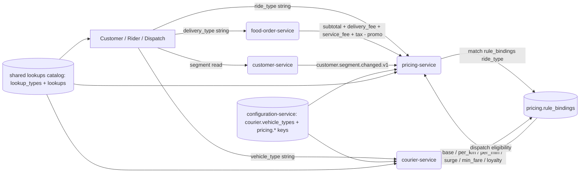

# Platform-Wide Type Catalog

> **Business-facing type vocabulary** — ride types (Enjoy Economy / VIP / XL /
> Comfort / Assist), courier vehicle types, food delivery types, customer and
> merchant segments.
>
> This file is part of the `docs/shared/` set. It is the **single
> human-readable page** that maps every user-facing type label to the catalog
> key, the per-service CHECK constraint, and the per-type pricing engine
> (`pricing-service.rule_bindings`).
>
> See [`LOOKUPS.md`](./LOOKUPS.md) for the underlying catalog mechanism
> (`lookup_types` + `lookups`, two-table pair, stable `code` namespace,
> admin-port contract, `*.lookup.*.v1` event family), and
> [`CONFIGURATION_ARCHITECTURE.md`](../architecture/CONFIGURATION_ARCHITECTURE.md)
> for how scope-based overrides (`scope_type = 'ride_type'` etc.) compose
> with these types at runtime.

---

## 1. Purpose & scope

### 1.1 What this doc covers

The **type vocabulary** the platform uses across ride, delivery, courier, and
customer contexts. Each type is:

1. A **brand label** shown to the user ("Enjoy Economy").
2. A **stable catalog key** carried in API bodies and events (`economy`).
3. A **localised display name** in the `lookups.name` JSONB column
   (`{"en":"Enjoy Economy","ar":...}`).
4. A **CHECK constraint** in the owning service's table.
5. (Optionally) A **per-type override** in `pricing.rule_bindings`.

### 1.2 What this doc does not cover

- Lifecycle states (`trip.state`, `order.state`, `courier.status`, etc.) — these
  are documented per-service in their respective `ERD.md` CHECK constraint
  lists.
- Payment methods, currencies, gateway codes, dispute statuses — owned by
  `payment-service` and surfaced via the standard `LOOKUPS.md` catalog.
- Cuisine / dietary / spice — owned by ``restaurant-service` (menu)` and
  surfaced via the standard `LOOKUPS.md` catalog.
- Notification template categories / channels / delivery states — owned by
  `notification-service` and surfaced via the standard `LOOKUPS.md` catalog.
- Support case statuses / priorities — owned by ``admin-service` (support)`
  and surfaced via the standard `LOOKUPS.md` catalog.

For those, follow the platform's standard "declare a `lookup_type`" recipe in
[`LOOKUPS.md` 4](./LOOKUPS.md#4-the-two-tables).

### 1.3 Out-of-band dimensions (catalog-only, no service CHECK)

These dimensions live entirely in the shared `lookups` catalog — there is no
in-service CHECK constraint for them. They are listed here for completeness,
because they are referenced from API bodies.

| `lookup_type.code` | Typical values | Owning service | Where used |
|---|---|---|---|
| `cuisine_category` | `italian`, `japanese`, `lebanese`, ... | ``restaurant-service` (menu)` | branch onboarding, menu filter |
| `dietary_tag` | `vegetarian`, `vegan`, `halal`, `gluten_free`, ... | ``restaurant-service` (menu)` | menu item tagging |
| `spice_level` | `mild`, `medium`, `hot`, `extra_hot` | ``restaurant-service` (menu)` | menu item display |
| `notification_channel` | `email`, `sms`, `push`, `whatsapp`, `in_app` | `notification-service` | template dispatch |
| `template_category` | `transactional`, `marketing`, `safety`, `rewards` | `notification-service` | template authoring |
| `case_status` | `open`, `pending`, `escalated`, `resolved`, `closed` | ``admin-service` (support)` | support module |
| `case_priority` | `p1`, `p2`, `p3`, `p4` | ``admin-service` (support)` | support SLA |
| `payment_method` | `card`, `wallet`, `apple_pay`, `google_pay`, `cash` | `payment-service` | checkout |
| `currency` | `EUR`, `USD`, `GBP`, `MAD`, `AED`, ... | `payment-service` | quote / payment intent |
| `gateway_code` | `stripe`, `adyen`, `cmpayments`, `hyper_pay`, `payfort`, ... | `payment-service` | provider routing |
| `refund_reason` | `customer_request`, `driver_cancelled`, `no_show`, `service_quality`, ... | `payment-service` | refund workflow |
| `dispute_status` | `opened`, `evidence_required`, `won`, `lost`, `closed` | `payment-service` | dispute lifecycle |

These are deliberately **not** in the section-by-section catalog below — they
follow the standard `lookup_types` + `lookups` mechanism documented in
[`LOOKUPS.md`](./LOOKUPS.md) and are administered via
`/admin/v1/lookups/**`.

---

## 2. How types flow through the platform



Key flow rules:

- **`ride_type`** is owned by `pricing-service` (it does not exist as a
  CHECK constraint anywhere — `pricing-service/ERD.md:19` notes
  `ride_type | string | ride type catalog | configuration-service`). The
  request body carries the key; the engine matches `rule_bindings` rows
  scoped by `ride_type`.
- **`vehicle_type`** is owned by `courier-service` (CHECK at
  `courier-service/ERD.md:74`) AND mirrored in the configuration catalog
  (`courier-service/README.md:204` default
  `["bicycle","motorcycle","car","scooter","walking"]`). Either side can
  reject an unknown value.
- **`delivery_type`** has no in-service CHECK; it lives only as a feature
  flag key (`deal.enabled.{city_id}.{delivery_type}` per
  `food-order-service/INTEGRATION.md:90`) and as a reuse of the `ride_type`
  slot for the food vertical (`food-order-service/TECH.md:203`).
- **`segment`** is owned by `customer-service` (CHECK at
  `customer-service/ERD.md:78`) and emitted via
  `customer.segment.changed.v1` (`customer-service/INTEGRATION.md:277`) for
  `pricing-service` to apply loyalty discounts.

---

## 3. Ride types

The ride-hailing product family. Each `ride_type` is a stable string key
carried in the `POST /v1/quotes` request body, validated against the
`configuration-service` catalog, and matched by `rule_bindings` to determine
the per-type fare formula.

### 3.1 Catalog

| Brand label | `ride_type` key | Typical vehicle class | Pricing behaviour (rule_bindings) | Surge behaviour | Segment eligibility |
|---|---|---|---|---|---|
| **Enjoy Economy** | `economy` | sedan / hatchback | `base_fare_override` + `per_km_override` + `per_min_override` + `min_fare_override` | full surge up to `pricing.surge.max_multiplier` | all segments |
| **Enjoy VIP** | `vip` | premium sedan (e.g. executive) | higher base + lower per_km + lower per_min + `surge_pressure ≤ 1.5` | surge capped below `max_multiplier` | `vip` + `frequent` |
| **Enjoy XL** | `xl` | SUV / van (6+ seats) | per_km ~1.4× economy; larger `min_fare` | full surge | all segments |
| **Enjoy Comfort** | `comfort` | newer sedan (extra legroom) | mid-tier base + per_km + per_min | mid surge | `standard` + `frequent` |
| **Enjoy Assist** | `assist` | wheelchair-accessible vehicle | per-type override | surge disabled (accessibility guarantee) | all segments (assisted booking only) |

Display labels are localised via the `lookups.name` JSONB column
([`LOOKUPS.md:99`](./LOOKUPS.md)). The catalog row code is `ride_type`, and
each value is a child row in `lookups` with `lookup_type.code = 'ride_type'`.

### 3.2 Where the catalog lives

- **Configuration-service** (source of truth for the catalog of valid
  keys) — see `configuration-service/INTEGRATION.md:466` for an example key
  in a URL path: `deal.band.global.amsterdam.economy`.
- **Pricing-service** (consumes the catalog) — `pricing-service/ERD.md:19`:
  `ride_type | string | ride type catalog | configuration-service`.
- **Trip-service** (echoes, does not own) — `trip-service/ERD.md:39`:
  `ride_type | TEXT | NOT NULL | matches the request`. The trip row
  stores whatever `ride.request.matched.v1` carried; no CHECK constraint.

### 3.3 Validation contract

- A `ride_type` MUST be a known key from `configuration-service`
  ([`pricing-service/SRS.md:154`](../../services/pricing-service/SRS.md)).
- Unknown `ride_type` returns `422 RIDE_TYPE_UNKNOWN`
  ([`pricing-service/SRS.md:220`](../../services/pricing-service/SRS.md),
  [`pricing-service/WORKFLOWS.md:118`](../../services/pricing-service/WORKFLOWS.md)).
- The request shape is documented in
  [`pricing-service/INTEGRATION.md:14-31`](../../services/pricing-service/INTEGRATION.md)
  (`POST /v1/quotes` body); the trip-service equivalent carries the same
  field through ([`trip-service/INTEGRATION.md:20`](../../services/trip-service/INTEGRATION.md)).

### 3.4 Per-type pricing divergence

See [8](#8-how-per-type-pricing-diverges) for the engine contract. The
short version: per-ride-type numeric formulas live in `rule_bindings` rows
scoped by `ride_type`, with `rule_kind` in
`{base_fare_override, per_km_override, per_min_override, surge_pressure,
min_fare_override, max_fare_override, loyalty_discount, od_corridor}`.

---

## 4. Courier vehicle types

The courier fleet. Each `vehicle_type` is a CHECK-constrained column on
`courier.couriers` AND mirrored in the configuration catalog under the key
`courier.vehicle_types`.

### 4.1 Catalog

| Brand label | `vehicle_type` key | Capacity | Typical delivery type | Eligibility notes |
|---|---|---|---|---|
| **Bicycle** | `bicycle` | small parcel (≤ 5 kg, hand-held) | food (light), courier | urban zones; no engine requirement |
| **Scooter** | `scooter` | small parcel (≤ 15 kg) | food (light), courier | urban zones |
| **Motorcycle** | `motorcycle` | parcel (≤ 30 kg) | food, parcel, courier | all cities |
| **Car** | `car` | large parcel / bulk | grocery, parcel, bulk | all cities |
| **Walking** | `walking` | hand-held only | ultra-short food (≤ 1 km) | dense city centers |

### 4.2 Where the catalog lives

- **Courier-service** (CHECK) — `courier-service/ERD.md:74`:
  `CHECK: vehicle_type IS NULL OR vehicle_type IN ('bicycle','motorcycle','car','scooter','walking')`.
  DDL at `courier-service/ERD.md:366-367`.
- **Configuration-service** (runtime catalog) —
  `courier-service/README.md:204`:
  `courier.vehicle_types | string[] | configuration-service | default ["bicycle","motorcycle","car","scooter","walking"]`.
- **Courier-service SRS validation** —
  `courier-service/SRS.md:188`: `A vehicle_type MUST be in courier.vehicle_types`.

### 4.3 Validation contract

- Unknown `vehicle_type` returns `400` (`courier-service/INTEGRATION.md:83`,
  `courier-service/WORKFLOWS.md:428`).
- The change-vehicle-type endpoint is
  `PUT /v1/couriers/{id}/vehicle-type` with body
  `{ "vehicle_type": "motorcycle" }`
  (`courier-service/INTEGRATION.md:81`,
  `courier-service/WORKFLOWS.md:419`).
- Each successful change emits `courier.updated.v1` with
  `changed_fields: [vehicle_type]`
  (`courier-service/WORKFLOWS.md:422`).

### 4.4 Per-type dispatch behaviour

The `vehicle_type` is matched against the dispatch request
(`courier-service/WORKFLOWS.md:394-441`); the dispatch worker in
``courier-service` (dispatch)` (see Appendix A of the courier ERD) picks
nearest available couriers whose `vehicle_type` is compatible with the
order's needs. There is no per-vehicle-type price formula on the courier
side; price is calculated by the calling order flow (food or parcel).

---

## 5. Food delivery types

The food vertical's delivery-mode dimension. There is **no in-service
CHECK** for `delivery_type` — the value lives in the `lookups` catalog and
in the configuration feature flag `deal.enabled.{city_id}.{delivery_type}`.

### 5.1 Catalog

| Brand label | `delivery_type` key | Pricing shape | Dispatch notes |
|---|---|---|---|
| **Instant** | `instant` | `subtotal + delivery_fee + service_fee + tax - promo` per [`pricing-service/WORKFLOWS.md:216`](../../services/pricing-service/WORKFLOWS.md) | dispatched immediately, no batching |
| **Scheduled** | `scheduled` | same formula; quote frozen at `scheduled_for` | locked quote per [`pricing-service/BRD.md:114`](../../services/pricing-service/BRD.md) BR--036 |
| **Group / Batched** | `group` | per-item delivery fee, discounted | courier batch per [`courier-service/ERD.md` Appendix A](../../services/courier-service/ERD.md) (`courier.dispatches.batched`) |

### 5.2 Where the catalog lives

- **Shared lookups catalog** (`lookup_type.code = 'delivery_type'`) — the
  recommended place. The `lookups.name` JSONB column carries the localised
  brand label; the `lookups.code` carries the stable key
  (`instant`, `scheduled`, `group`).
- **Configuration-service feature flag** —
  `food-order-service/INTEGRATION.md:90`: the key
  `deal.enabled.{city_id}.{delivery_type}` toggles Make-a-Deal
  negotiations per delivery type per city.
- **Food-order-service TECH.md note** — `food-order-service/TECH.md:203`
  notes that the food vertical reuses the `ride_type` config slot, with
  values `courier` / `scooter` / `bicycle` (a subset of courier vehicle
  types). New delivery types follow the same `lookups` recipe.

### 5.3 Pricing

Food pricing does **not** use `rule_bindings`; it reads
configuration-service keys directly
([`pricing-service/WORKFLOWS.md:210-211`](../../services/pricing-service/WORKFLOWS.md)).
The per-branch delivery fee override is a configuration key
([`pricing-service/BRD.md:94`](../../services/pricing-service/BRD.md) BR--023).
The food formula is documented in
[`pricing-service/WORKFLOWS.md:216`](../../services/pricing-service/WORKFLOWS.md).

---

## 6. Customer segments

The customer's lifecycle segment, recomputed nightly and on LTV change
([`customer-service/SRS.md:125`](../../services/customer-service/SRS.md)
FR--021). Drives loyalty pricing on the `pricing-service` side.

### 6.1 Catalog

| Brand label | `segment` key | Trigger | Loyalty tier mapping | Affects pricing |
|---|---|---|---|---|
| **Standard** | `standard` | default on signup | none | no loyalty discount |
| **Frequent** | `frequent` | ≥ `customer.segment.frequent_rides` rides in 30 days (default 20) | silver | `pricing.loyalty.frequent_rider.applied_pct` discount |
| **VIP** | `vip` | LTV ≥ `customer.segment.vip_ltv_minor` (default 1 000 000 minor units) | gold / platinum | deeper loyalty discount; access to `enjoy_vip` |
| **Churned** | `churned` | idle ≥ `customer.segment.churned_idle_days` (default 90) | none | excluded from promos |

### 6.2 Where the catalog lives

- **Customer-service** (CHECK + history) — `customer-service/ERD.md:78`:
  `CHECK: segment IN ('standard','frequent','vip','churned')`. DDL at
  `customer-service/ERD.md:301-302`. History table
  `customer.customer_segment_history` at `customer-service/ERD.md:126-138`.
- **Customer-service BR--034** transition rules —
  `customer-service/BRD.md:116`: `standard ↔ frequent (rides per month),
  frequent → vip (LTV), * → churned (idle days)`.
- **Customer-service event** — `customer.segment.changed.v1` carries
  `from_segment`, `to_segment`, `trigger`
  ([`customer-service/INTEGRATION.md:277-292`](../../services/customer-service/INTEGRATION.md)).
- **Pricing-service loyalty pipeline** —
  [`pricing-service/SRS.md:93-97`](../../services/pricing-service/SRS.md)
  (FR--031..FR--035); tier values `silver`/`gold`/`platinum` at
  [`pricing-service/README.md:236-238`](../../services/pricing-service/README.md).
- **Configuration thresholds** —
  [`customer-service/README.md:216-218`](../../services/customer-service/README.md):
  `customer.segment.frequent_rides` (default 20),
  `customer.segment.vip_ltv_minor` (default 1 000 000),
  `customer.segment.churned_idle_days` (default 90).

### 6.3 Validation contract

- A `segment` MUST be in `('standard','frequent','vip','churned')`
  ([`customer-service/SRS.md:177-178`](../../services/customer-service/SRS.md)).
- A suspended customer is blocked from ride / order / cart / payment
  actions; downstream services reject with `CUSTOMER_SUSPENDED` per
  [`customer-service/BRD.md:114`](../../services/customer-service/BRD.md)
  BR--032.
- Adding a new segment value: update the `customers_segment_check`
  constraint; the segment-recompute job picks up the new value
  ([`customer-service/ERD.md:458-460`](../../services/customer-service/ERD.md)).

---

## 7. Merchant tiers & restaurant types

The merchant-side equivalent of customer segments. Each `restaurants.type`
is a CHECK-constrained column on `restaurant.restaurants`.

### 7.1 Catalog

| Brand label | `restaurants.type` key | Notes |
|---|---|---|
| **Restaurant** | `restaurant` | default full-service |
| **Café** | `cafe` | coffee + light food |
| **Bakery** | `bakery` | baked goods |
| **Cloud kitchen** | `cloud_kitchen` | delivery-only (no dine-in) |
| **Food truck** | `food_truck` | mobile |
| **Other** | `other` | catch-all |

### 7.2 Where the catalog lives

- **Restaurant-service** (CHECK) —
  `restaurant-service/ERD.md:71-72`: `CHECK: type IN
  ('restaurant','cafe','bakery','cloud_kitchen','food_truck','other')`.
  DDL at `restaurant-service/ERD.md:229-231`.
- **Cuisine list** is catalog-only, in `configuration-service` under
  `restaurant.cuisine.list` (`restaurant-service/ERD.md:85` — column note:
  `from restaurant.cuisine.list`).

### 7.3 Validation contract

- A `restaurants.type` MUST be one of the six values above.
- Adding a new type value: forward-only migration; drop CHECK, add new
  CHECK ([`restaurant-service/ERD.md:372-373`](../../services/restaurant-service/ERD.md)).

---

## 8. How per-type pricing diverges

> **Per-ride-type numeric formulas are owned by `pricing-service` and live in
> `pricing.rule_bindings`. This section describes the engine shape; the
> actual values live in `configuration-service` and are loaded per quote.**

### 8.1 Rule bindings shape

`pricing.rule_bindings` is the per-tenant / per-city / per-zone / per-OD-pair /
per-ride-type override table
([`pricing-service/ERD.md:182-215`](../../services/pricing-service/ERD.md)).
A binding row has:

| Column | Type | Notes |
|---|---|---|
| `tenant_id` | TEXT, default `'global'` | tenant scope |
| `city_id` | TEXT, NULL | city scope |
| `origin_zone_id` | UUID, NULL | origin zone scope |
| `destination_zone_id` | UUID, NULL | destination zone scope |
| `ride_type` | TEXT, NULL | ride-type scope (NULL = global) |
| `rule_kind` | TEXT, CHECK | see [8.2](#82-rule_kind-enum) |
| `value` | JSONB | rule-specific payload |
| `priority` | INT, default 100 | lower wins on equal scope |
| `effective_from` / `effective_to` | TIMESTAMPTZ | time-windowed override |

### 8.2 `rule_kind` enum

The override vocabulary is the `rule_kind` CHECK
([`pricing-service/ERD.md:211`](../../services/pricing-service/ERD.md);
extended at [`pricing-service/INTEGRATION.md:215`](../../services/pricing-service/INTEGRATION.md)):

| `rule_kind` | Effect |
|---|---|
| `base_fare_override` | replaces `pricing.base_fare` for this scope |
| `per_km_override` | replaces `pricing.per_km` for this scope |
| `per_min_override` | replaces `pricing.per_min` for this scope |
| `surge_pressure` | multiplier applied on top of the zone surge |
| `loyalty_discount` | percentage discount applied when segment matches |
| `min_fare_override` | replaces `pricing.min_fare.{city_id}` for this scope |
| `max_fare_override` | adds a ceiling (Phase 7.5 Make-a-Deal fairness band) |
| `od_corridor` | surcharge/discount on a specific OD pair |

### 8.3 Lookup precedence

Per [`pricing-service/SRS.md:99-100`](../../services/pricing-service/SRS.md)
FR--037, the rule_bindings lookup walks the scopes in this order, lower
`priority` wins within scope, and ambiguous equal-priority matches are
rejected at admin validation:

1. `(origin_zone_id, destination_zone_id, ride_type)`
2. `(origin_zone_id | destination_zone_id, ride_type)`
3. `(zone_id, ride_type)`
4. `(city_id, ride_type)`
5. `(tenant_id, ride_type)`
6. Global

### 8.4 Per-type formula in practice

Two `rule_bindings` rows with different `ride_type` values produce the
Economy-vs-VIP divergence documented in [3.1](#31-catalog). The engine
itself has no `enjoy_*` branch — the only key it reads from the request is
`ride_type`. Display labels like "Enjoy VIP" are a `lookups.name` concern.

### 8.5 Food pricing

Food pricing does **not** use `rule_bindings`; it reads
configuration-service keys directly
([`pricing-service/WORKFLOWS.md:210-211`](../../services/pricing-service/WORKFLOWS.md)).
The per-branch delivery fee override is a configuration key
([`pricing-service/BRD.md:94`](../../services/pricing-service/BRD.md)
BR--023). The food formula is `subtotal + delivery_fee + service_fee + tax -
promo` ([`pricing-service/WORKFLOWS.md:216`](../../services/pricing-service/WORKFLOWS.md)).

### 8.6 Example request and config snapshot

The `POST /v1/quotes` request body and the `config_snapshot.values` shape
are documented in
[`pricing-service/INTEGRATION.md:14-92`](../../services/pricing-service/INTEGRATION.md).
The configuration keys the engine reads include:

- `pricing.base_fare`
- `pricing.per_km`
- `pricing.per_min`
- `pricing.surge.max_multiplier`
- `pricing.min_fare.{city_id}`
- `pricing.surge.step` / `bucket_index`
- `pricing.rating_density.*`
- `pricing.loyalty.frequent_rider.*`
- `pricing.geo_overrides.*`
- `pricing.cancellation.fee_after_minutes` / `pricing.cancellation.fee_amount`
- `tax.<jurisdiction>.<code>`

### 8.7 Platform margin doctrine — "20% + 1{currency}" + dynamic multiplier

> **Locked (2026-08-07).** Per the platform's financial doctrine, every
> ride type is priced on a dynamic per-quote basis and the platform margin
> is computed **after** discounts are applied to the customer-facing price.
> **All discounts come 100% from the platform** — none of it is borne by
> the driver.

#### 8.7.1 Dynamic per-quote multiplier (replaces "static" catalog values)

The brand labels in [3.1](#31-catalog) (`economy` / `vip` / `xl` /
`comfort` / `assist`) are **catalog keys**, not fixed numeric values. The
effective `base_fare`, `per_km`, `per_min`, and `surge` applied to a
specific quote are computed each time via the `dynamic_multiplier`
flow:

```
effective_base_fare    = pricing.base_fare   * dynamic_multiplier
effective_per_km       = pricing.per_km      * dynamic_multiplier
effective_per_min      = pricing.per_min     * dynamic_multiplier
effective_surge        = pricing.surge       * dynamic_multiplier
```

`dynamic_multiplier` is derived per quote from the same inputs the engine
already reads (see [8.3](#83-lookup-precedence)):

- `rule_bindings` overrides scoped by `ride_type`, `zone`, `city`,
  `tenant` (lower `priority` wins; `geo_overrides` OD-pair is a
  specialization);
- `rating_density` window (per
  [`pricing-service/SRS.md:88-92`](../../services/pricing-service/SRS.md));
- `loyalty.frequent_rider.*` (per
  [`pricing-service/SRS.md:93-97`](../../services/pricing-service/SRS.md));
- `od_corridor` surcharges (per
  [`pricing-service/ERD.md:182-215`](../../services/pricing-service/ERD.md));
- `promotion_code` validated by ``pricing-service` (promotion)` (per
  [`pricing-service/SRS.md:69` (FR--007)](../../services/pricing-service/SRS.md)).

The catalog key only selects the *default* per-type override shape (which
`rule_bindings` rows apply first); the `dynamic_multiplier` is the
composed effect. Two back-to-back quotes with the same `ride_type` may
therefore resolve to different effective base/km/min values — this is by
design.

#### 8.7.2 The "20% + 1{currency}" platform margin

For every ride the platform earns:

```
platform_commission = 0.20 * gross_fare + 1 {currency}
```

where `gross_fare` is the **pre-discount** fare (i.e. the fare computed
from the dynamic per-type formula above, *before* loyalty / promo /
geo-override discount lines are subtracted). The fixed `+ 1 {currency}`
surcharge is a flat per-ride component in the customer's currency (e.g.
`+ 1 SAR`, `+ 1 EUR`, `+ 1 USD`); the currency follows the trip's
`currency` field on the quote.

#### 8.7.3 Discount ownership — **all discounts are platform-borne**

The doctrine is unambiguous:

> **Every cent of every discount — loyalty, promo, geo-override,
> surge-capped, OD-corridor discount, customer-segment-driven, manual
> override — is paid 100% by the platform. None of it is deducted from
> the driver's earnings.**

| Side | What they see | What they receive |
|---|---|---|
| **Customer** | the **net** fare (gross − total discounts) | pays `gross − Σdiscounts` |
| **Driver** | the **gross** fare (no discount reduction) | receives earnings calculated on `gross_fare`, exactly as if no discount had been applied |
| **Platform** | absorbs `Σdiscounts` as a **cost** (expense line), and **earns** `0.20 × gross + 1 {currency}` commission | keeps `commission − Σdiscounts` (plus any tax forwarded — see [8.7.4](#874-tax-forwarding)) |

This is the inverse of the previous accounting view (where `6310_promotion_discount` was a **revenue-reducer**). Under the new doctrine,
`6310_promotion_discount`, `loyalty_discount_applied`, and any other
discount lines become **platform-borne expense lines** — they are
debited to the platform's P&L, not netted against `driver_payable`.

#### 8.7.4 Worked example (100 SAR quote)

Inputs:

| Input | Value |
|---|---|
| `gross_fare` (post-dynamic-multiplier, pre-discount) | 100.00 SAR |
| `Σdiscounts` (loyalty + promo + geo-override) | 13.04 SAR |
| `net_fare` (customer pays) | 86.96 SAR |
| `tax_rate` (jurisdiction; e.g. 15% VAT) | 15% |
| `tax_forwarded` (15% × net) | 13.04 SAR |
| `platform_commission` (0.20 × gross + 1) | 21.00 SAR |

Outcome:

| Party | Receives / pays | Amount (SAR) |
|---|---|---|
| Customer pays | `gross − Σdiscounts` | **86.96** |
| Driver receives | `gross` (no discount reduction) | **100.00** |
| Platform keeps — commission | `0.20 × gross + 1` | **+21.00** |
| Platform absorbs — discount | `Σdiscounts` (cost / P&L debit) | **−13.04** |
| Platform forwards — tax | `tax_rate × net` (passthrough; not platform P&L) | **13.04 forwarded** (out of customer payment) |
| **Platform net bottom-line on this ride** | `commission − discount` | **+7.96 SAR** |
| **Total cash to driver + platform** | `driver + platform_net + tax_forwarded` | `100 + 7.96 + 13.04` = **121.00 SAR** reconciled to `customer_paid (86.96) + platform_out_of_pocket (34.04)` = **121.00 SAR** ✓ |

The arithmetic sanity-checks: customer pays 86.96, the platform tops up
the driver payout by the 13.04 discount gap (cash-out of the platform's
own funds, not from customer payment), and the platform retains the
21 commission and forwards the 13.04 tax.

#### 8.7.5 Configuration keys (the engine reads, never hard-codes)

Per `pricing-service/BRD.md:81` (BR--010 "MUST read all pricing rules
from `configuration-service`; no hard-coded values") and
`pricing-service/README.md:54-56`:

| Key | Purpose | Default |
|---|---|---|
| `pricing.commission.pct` | the `0.20` in the formula | `0.20` |
| `pricing.commission.flat_minor.{currency}` | the `+ 1 {currency}` flat surcharge per ride | `{currency: 100}` minor (e.g. `100` minor = 1.00 SAR for `currency = SAR`) |
| `pricing.commission.base` | whether the percentage applies to `gross` or `net`; **must be `gross`** under the new doctrine | `gross` (locked; do not flip without re-ratification) |
| `pricing.discount_bearer` | who absorbs discounts; **must be `platform`** | `platform` (locked) |

A flip of `pricing.commission.base` or `pricing.discount_bearer` from
the locked values is a **breaking change** to the platform's financial
contract and requires:

1. ADR (canonical via
   [`../../architecture/adrs/0001-microservices-architecture.md`](../../architecture/adrs/0001-microservices-architecture.md)
   process);
2. Re-posting all open `trip_reward` and `ledger.postings` rows under
   the new doctrine;
3. Update to [`../architecture/SYSTEM_OVERVIEW.md`](../architecture/SYSTEM_OVERVIEW.md)
   and [`../../workflows/ACCOUNTING_WORKFLOWS.md`](../../workflows/ACCOUNTING_WORKFLOWS.md).

Until then, treat both keys as **immutable**.

#### 8.7.6 Ledger postings — direction of change

| Line | Old doctrine (pre-2026-08-07) | New doctrine (2026-08-07+, locked here) |
|---|---|---|
| `6310_promotion_discount` | reduces recognised revenue (credit offset on `4100_commission_revenue`) | **expense** — debited on `promotion.redeemed.v1`, sourced from platform's commission, **never** netted against `driver_payable` |
| `loyalty_discount_applied` | implicit in the net revenue at capture | **expense** — debited on `pricing.loyalty_discount.applied.v1`, sourced from platform's commission, **never** netted against `driver_payable` |
| `driver_payable` | net (gross − discount − commission) | **gross** — no discount applied |
| `4100_commission_revenue` | net (gross − discount) | `0.20 × gross + 1 {currency}` — independent of the discount line |
| `tax_payable` | 15% × net (post-discount) | **unchanged** — 15% × net |

The platform retains the right to **separate** the discount absorption
from the commission in sub-ledger views (e.g. `4100_commission_revenue`
gross, `6310_promotion_discount` expense, `6311_loyalty_discount`
expense, `commission_net = 4100 − 6310 − 6311`), but the **gross**
amounts are immutable.

#### 8.7.7 What this rule does NOT change

- The dynamic per-quote multiplier still applies (8.7.1).
- Per-ride-type `rule_bindings` overrides still apply (8.2 / 8.3).
- Min-fare floor (`pricing.min_fare.{city_id}`) still applies; the
  customer-facing `net_fare` MUST be ≥ min-fare, exactly as today.
- Tax forwarding rules are unchanged.
- Driver incentives (quest rewards, guaranteed top-up) are still
  credited via `6302_guaranteed_minimum` ↔ `driver_payable` — the
  doctrine applies to **customer-facing discounts**, not driver-side
  incentives.

#### 8.7.8 Cross-references

- Pricing engine contract — [`pricing-service/README.md` 13](../../services/pricing-service/README.md)
  (configuration keys) and [`pricing-service/INTEGRATION.md`](../../services/pricing-service/INTEGRATION.md)
  (quote request/response shape).
- Ledger postings — [`docs/workflows/ACCOUNTING_WORKFLOWS.md` "Driver incentive / Promotion / discount"](../../workflows/ACCOUNTING_WORKFLOWS.md)
  (cross-link from the accounting workflow for the new expense treatment).
- Chart of accounts — [`ledger-service/ERD.md`](../../services/ledger-service/ERD.md)
  (`4100_commission_revenue`, `6310_promotion_discount`, the proposed
  `6311_loyalty_discount` sub-account).
- Driver earnings — [`payment-service/ERD.md` `payment.driver_earnings`](../../services/payment-service/ERD.md).

---

## 9. Validation & error model

| Error | Source | Where |
|---|---|---|
| `RIDE_TYPE_UNKNOWN` (422) | unknown `ride_type` string | [`pricing-service/SRS.md:220`](../../services/pricing-service/SRS.md), [`pricing-service/WORKFLOWS.md:118`](../../services/pricing-service/WORKFLOWS.md) |
| `VEHICLE_TYPE_INVALID` (400) | courier `vehicle_type` not in catalog | [`courier-service/INTEGRATION.md:83`](../../services/courier-service/INTEGRATION.md), [`courier-service/WORKFLOWS.md:428`](../../services/courier-service/WORKFLOWS.md) |
| `BRANCH_UNAVAILABLE` (422) | food branch closed | [`pricing-service/WORKFLOWS.md:232-233`](../../services/pricing-service/WORKFLOWS.md) |
| `CUSTOMER_SUSPENDED` | suspended customer attempts ride/order | [`customer-service/BRD.md:114`](../../services/customer-service/BRD.md) BR--032 |
| `GEO_OVERRIDE_AMBIGUOUS` (422) | multiple OD rows match a quote | [`pricing-service/WORKFLOWS.md:606-610`](../../services/pricing-service/WORKFLOWS.md) |

All errors follow the platform's RFC 7807 `application/problem+json` model
(documented in [`CONVENTIONS.md`](./CONVENTIONS.md)).

---

## 10. Migration rules

| Dimension | Migration steps |
|---|---|
| Add a new `ride_type` | (1) Add a new `lookups` row under `lookup_type.code = 'ride_type'`. (2) Add `rule_bindings` rows for any per-type pricing divergence. (3) If the new type needs new rules, ensure the `rule_kind` enum already covers them; if not, follow `pricing-service/INTEGRATION.md:215` (Phase 7.5 added `max_fare_override` this way). (4) Update [3.1](#31-catalog). (5) `configuration.updated.v1` triggers consumer reload. |
| Add a new `vehicle_type` | (1) Update `couriers_vehicle_type_check` per [`courier-service/ERD.md:594-596`](../../services/courier-service/ERD.md) (forward-only migration; drop + add CHECK). (2) Update the `courier.vehicle_types` configuration key ([`courier-service/README.md:204`](../../services/courier-service/README.md)). (3) Update [4.1](#41-catalog). |
| Add a new `delivery_type` | (1) Add a `lookups` row under `lookup_type.code = 'delivery_type'`. (2) Update the food-order quote request validation. (3) Add a `deal.enabled.{city_id}.{delivery_type}` flag if Make-a-Deal applies. (4) Update [5.1](#51-catalog). |
| Add a new `segment` | (1) Update `customers_segment_check` per [`customer-service/ERD.md:458-460`](../../services/customer-service/ERD.md). (2) Update the segment-recompute job + the `customer.segment.*` configuration thresholds. (3) Update the `pricing.loyalty.frequent_rider.tiers.*` mapping if a new loyalty tier is needed. (4) Update [6.1](#61-catalog). |
| Add a new `restaurants.type` | (1) Update the `restaurants.type` CHECK per [`restaurant-service/ERD.md:372-373`](../../services/restaurant-service/ERD.md) (forward-only migration). (2) Update [7.1](#71-catalog). |

All migrations respect the platform's "never break deep links" rule
(append-only per the
[`trips-enjoy-docs-append-not-renumber` memory](../../..)) — when a type
is **renamed**, the new value is added alongside the old and the old is
deprecated per the
[`VERSIONING.md`](./VERSIONING.md) deprecation policy.

---

## 11. Cross-references

### 11.1 Source-of-truth files per dimension

| Dimension | Owner (CHECK / state machine) | Catalog (lookups) | Pricing engine |
|---|---|---|---|
| `ride_type` | `pricing-service` (validates against configuration catalog) | `lookups` row under `lookup_type.code = 'ride_type'` | `pricing-service.rule_bindings` |
| `vehicle_type` | `courier-service` (CHECK) | `lookups` row under `lookup_type.code = 'vehicle_type'`; configuration key `courier.vehicle_types` | n/a (dispatch only) |
| `delivery_type` | n/a | `lookups` row under `lookup_type.code = 'delivery_type'` | `pricing-service` reads configuration keys directly |
| `segment` | `customer-service` (CHECK) | n/a (not in lookups — single source of truth = customer table) | `pricing-service` loyalty pipeline |
| `restaurants.type` | `restaurant-service` (CHECK) | n/a | n/a |

### 11.2 See also

### Sibling shared docs

- [`LOOKUPS.md`](./LOOKUPS.md) — the underlying catalog mechanism
  (`lookup_types` + `lookups`, event stream, admin contract).
- [`CONVENTIONS.md`](./CONVENTIONS.md) — error model, correlation IDs.
- [`VERSIONING.md`](./VERSIONING.md) — SemVer / deprecation policy for
  catalog renames.
- [`PLATFORM_BASELINE.md`](./PLATFORM_BASELINE.md) — single source for
  PostgreSQL 18, Kafka, Keycloak, Redis, OpenTelemetry.
- [`README.md`](./README.md) — `platform-spring-boot-starter` overview
  (the library that ships the `LookupCacheInvalidator` and admin endpoints).

### Platform architecture

- [`../architecture/CONFIGURATION_ARCHITECTURE.md`](../architecture/CONFIGURATION_ARCHITECTURE.md) —
  scope precedence, `rule_bindings` lookup, evaluation context.
- [`../architecture/CONSISTENCY_STRATEGY.md`](../architecture/CONSISTENCY_STRATEGY.md) —
  cross-service reference strategy (string codes, no DB FKs across services).
- [`../architecture/EVENT_ARCHITECTURE.md`](../architecture/EVENT_ARCHITECTURE.md) —
  event families that carry type changes (`customer.segment.changed.v1`,
  `courier.updated.v1`, `configuration.updated.v1`, etc.).

### Per-service ERDs (the CHECK constraints)

- [`../services/pricing-service/ERD.md`](../services/pricing-service/ERD.md) —
  `product_type` CHECK; `rule_bindings`; `geo_overrides`.
- [`../services/courier-service/ERD.md`](../services/courier-service/ERD.md) —
  `couriers.vehicle_type` CHECK.
- [`../services/customer-service/ERD.md`](../services/customer-service/ERD.md) —
  `customers.segment` CHECK; `customer_segment_history`.
- [`../services/restaurant-service/ERD.md`](../services/restaurant-service/ERD.md) —
  `restaurants.type` CHECK.

### Per-service READMEs / BRDs

- [`../services/pricing-service/README.md`](../services/pricing-service/README.md),
  [`BRD.md`](../services/pricing-service/BRD.md),
  [`SRS.md`](../services/pricing-service/SRS.md),
  [`WORKFLOWS.md`](../services/pricing-service/WORKFLOWS.md) — per-ride-type
  pricing.
- [`../services/trip-service/README.md`](../services/trip-service/README.md) —
  trip-side `ride_type` echo.
- [`../services/courier-service/README.md`](../services/courier-service/README.md) —
  vehicle types.
- [`../services/food-order-service/README.md`](../services/food-order-service/README.md),
  [`TECH.md`](../services/food-order-service/TECH.md) — delivery types.
- [`../services/customer-service/README.md`](../services/customer-service/README.md),
  [`BRD.md`](../services/customer-service/BRD.md) — segments.
- [`../services/restaurant-service/README.md`](../services/restaurant-service/README.md) —
  merchant types.

### Catalog mechanism

- [`LOOKUPS.md` 4](./LOOKUPS.md#4-the-two-tables) — `lookup_types` +
  `lookups` table shape.
- [`LOOKUPS.md` 3](./LOOKUPS.md#3-ownership) — ownership rules: how a
  service declares a type and where the rows live.
