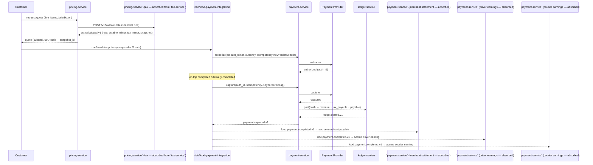
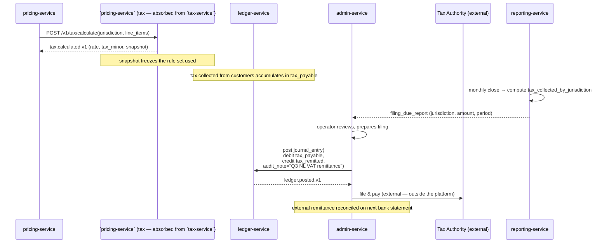
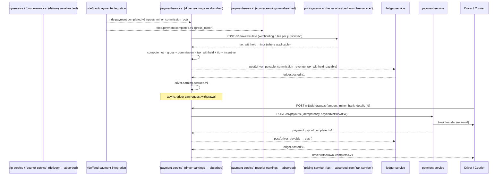
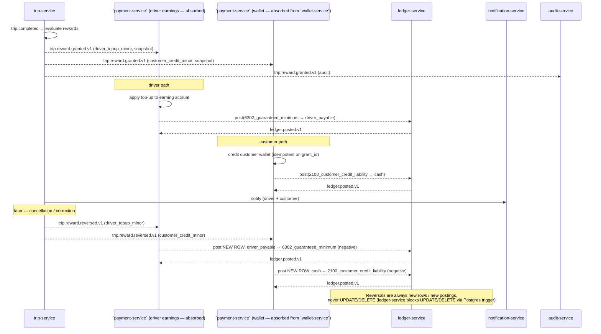
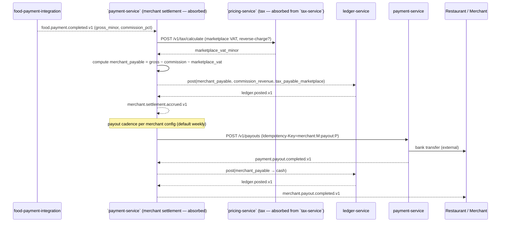
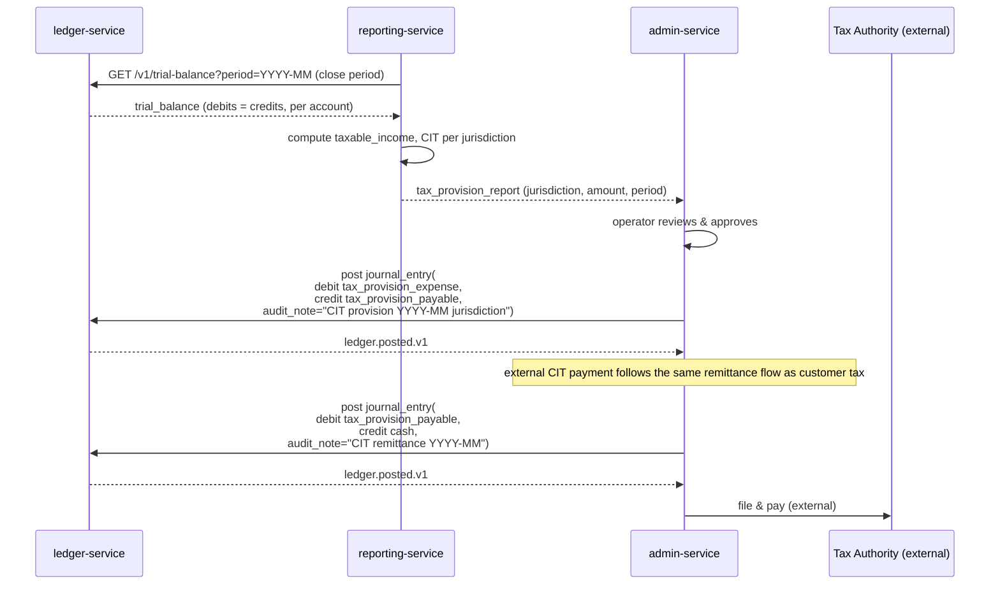
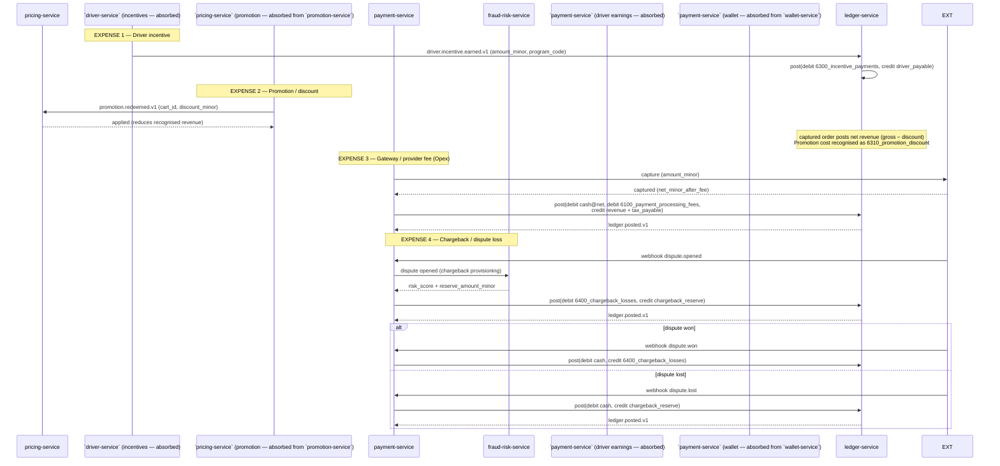
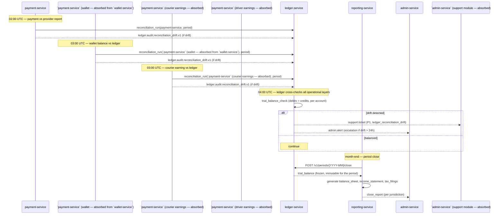

# Accounting Workflows

This document is the single accounting view of the platform. It consolidates
the per-service docs and shows how **transactions, taxes, expenses, and
government costs** flow from the customer, through the operational services,
into the double-entry ledger, and out to remittance, regulatory filing, and
financial reporting.

For the operational payment view (authorize → capture → refund mechanics,
saga choreography) see
[`PAYMENT_WORKFLOWS.md`](PAYMENT_WORKFLOWS.md) and
[`REFUND_WORKFLOWS.md`](REFUND_WORKFLOWS.md). This document is the
*accounting* counterpart.

## Scope & Boundaries

**In scope** — what an accounting reader needs to trace end-to-end:

- Customer transaction recognition (ride fare, food order, tip).
- Tax recognition, collection, and remittance (VAT / sales tax / GST,
  marketplace facilitator tax, driver / courier withholding, corporate
  income tax, regulatory fees).
- Expense recognition — driver / courier incentives, customer refunds and
  adjustments, operating expenses (gateway fees, SMS, third-party APIs),
  chargeback / dispute losses.
- Payable accruals — driver, courier, and merchant payables; commission
  revenue; payout settlement.
- Multi-currency conversion postings.
- Daily reconciliation and period close (trial balance, balance sheet,
  income statement).

**Out of scope** — covered in linked docs:

- Operational capture / refund saga mechanics →
  [`PAYMENT_WORKFLOWS.md`](PAYMENT_WORKFLOWS.md),
  [`REFUND_WORKFLOWS.md`](REFUND_WORKFLOWS.md).
- Provider integration and webhook handling → `services/payment-service/`.
- Per-service mechanics (e.g. how ``payment-service` (driver earnings — absorbed)` computes net
  pay) → each service's own `WORKFLOWS.md`.

## Accounting Model

The platform separates money truth into **four layers**. Every accounting
fact crosses all four layers on its way from the customer to a regulatory
report.

```mermaid
flowchart LR
    subgraph PR["1. Pricing layer"]
        TX["`pricing-service` (tax — absorbed from `tax-service`)<br/>(jurisdictions, rates, exemptions)"]
        PRC["pricing-service<br/>(quote assembly)"]
    end
    subgraph OP["2. Operational layer"]
        PAY["payment-service<br/>(provider ACL)"]
        WLT["`payment-service` (wallet — absorbed from `wallet-service`)<br/>(customer balance)"]
        DE["`payment-service` (driver earnings — absorbed)"]
        CE["`payment-service` (courier earnings — absorbed)"]
        RS["`payment-service` (merchant settlement — absorbed)"]
    end
    subgraph AU["3. Audit layer"]
        LD["ledger-service<br/>(double-entry, system of record)"]
    end
    subgraph RP["4. Reporting layer"]
        REP["reporting-service<br/>(trial balance, P&amp;L, BS)"]
        AUD["audit-service<br/>(7-yr retention)"]
        AN["`reporting-service` (data lake ingestion — absorbed)"]
    end
    TX --> PRC
    PRC -->|quote incl. tax| PAY
    PAY --> WLT
    PAY -->|capture/accrual events| DE
    PAY -->|capture/accrual events| CE
    PAY -->|capture/accrual events| RS
    PAY -.->|consumes money events| LD
    WLT -.->|consumes money events| LD
    DE -.->|consumes money events| LD
    CE -.->|consumes money events| LD
    RS -.->|consumes money events| LD
    LD -->|ledger.posted.v1| REP
    LD -->|ledger.posted.v1| AUD
    LD -->|ledger.posted.v1| AN
```

**Strong-consistency invariants** that hold across all four layers (see
[`architecture/CONSISTENCY_STRATEGY.md`](../architecture/CONSISTENCY_STRATEGY.md)):

- **Money is conserved** — no creation or destruction outside documented
  flows. Enforced by the double-entry ledger; every money-movement event
  is matched by a `ledger.posted.v1`.
- **A payment is captured exactly once** — `Idempotency-Key` on
  `payment.capture`, outbox in `payment-service`, inbox + dedup in
  consumers.
- **A wallet's balance equals the sum of its postings** — reconciled by
  ``payment-service` (wallet — absorbed from `wallet-service`)` daily against `ledger-service`.

## Actors and Services

| Actor | Services |
|-------|----------|
| Customer | `pricing-service`, ``pricing-service` (tax — absorbed from `tax-service`)`, `payment-service`, ``payment-service` (wallet — absorbed from `wallet-service`)`, `reporting-service` (statements) |
| Driver | `pricing-service`, ``pricing-service` (tax — absorbed from `tax-service`)`, ``payment-service` (driver earnings — absorbed)`, `payment-service`, `reporting-service` (1099 / tax statement) |
| Courier | `pricing-service`, ``pricing-service` (tax — absorbed from `tax-service`)`, ``payment-service` (courier earnings — absorbed)`, `payment-service`, `reporting-service` (tax statement) |
| Restaurant / Merchant | ``pricing-service` (tax — absorbed from `tax-service`)`, ``payment-service` (merchant settlement — absorbed)`, `payment-service`, `reporting-service` (statement) |
| Platform (Finance / Tax) | ``pricing-service` (tax — absorbed from `tax-service`)`, `ledger-service`, `reporting-service`, `admin-service` (manual journal entries), ``admin-service` (support module — absorbed)` (refund / dispute tickets) |
| Regulator / Auditor | `audit-service` (7-yr retention), `reporting-service` (regulatory exports), ``pricing-service` (tax — absorbed from `tax-service`)` (jurisdiction filings) |

## Workflow: Customer Transaction Recognition (Ride / Food)

Every customer transaction crosses the same recognition boundary: the price
is computed (including tax), the customer is charged, and the resulting
money is split between **platform revenue**, **tax payable**, and the
**driver / courier / merchant payable** for the fulfillment side. The
ledger records this as a single balanced double-entry posting on
`payment.captured.v1`.



**Accounting entries recognised:** Revenue (gross), tax payable (liability),
driver / courier / merchant payable (liability), cash (asset). All posted
by `ledger-service` on the same `payment.captured.v1`; downstream services
post their own payable / earning accruals as separate balanced postings.

## Workflow: Tax Calculation & Remittance

``pricing-service` (tax — absorbed from `tax-service`)` is **read-mostly**: it never posts to the ledger directly. It
exposes a synchronous `POST /v1/tax/calculate` and emits `tax.calculated.v1`
for analytics. Tax that is collected from the customer is recognised as a
`tax_payable` ledger liability (see the customer transaction workflow
above). Periodically, a finance operator remits the collected tax to the
relevant tax authority via a `ledger-service` journal entry that moves the
balance from `tax_payable` to `tax_remitted` (an expense of the period).



**Accounting entries:** Periodic debit `tax_payable` (liability ↓),
credit `tax_remitted` (expense ↑). One posting per jurisdiction per period.
Multi-jurisdiction filings are separate journal entries (never combined).
The `audit_note` requirement (≥ 10 chars) enforced by `ledger-service`
ensures every remittance is human-explained.

## Workflow: Driver / Courier Income (Gross-to-Net)

Driver and courier earnings are accrued as a **gross-to-net** calculation:
the fare (gross) is reduced by platform commission, withholding tax (where
jurisdictions require it), and any penalties; tips and incentives are added
back; the net amount becomes the driver's withdrawable balance. Withdrawals
to a bank account produce the cash-side posting.



**Accounting entries:** At accrual — debit `commission_expense` /
`tax_withheld_payable`, credit `driver_payable` / `courier_payable`. At
payout — debit `driver_payable`, credit `cash`. Tips are commission-free by
default (per-city overrides via `configuration-service`).

## Workflow: Guaranteed Rewards — Driver Top-Up + Customer Credit

`trip-service` evaluates eligibility for both a **driver guaranteed-minimum
top-up** (when the trip's accrued earnings fall below the city-configured
floor) and a **customer credit** (loyalty / promo / issue-resolution), and
emits `trip.reward.granted.v1` at trip completion. Two independent reward
streams fan out from the same event: the driver side flows through
``payment-service` (driver earnings — absorbed)` to `ledger-service`, and the customer side flows
through ``payment-service` (wallet — absorbed from `wallet-service`)` to `ledger-service`. Reversals on cancellation or
trip correction emit `trip.reward.reversed.v1`, which produces
**new (negative) postings** against the same accounts — never an
UPDATE/DELETE (per [[accounting-four-layer-truth-model]] "How to
apply").



**Accounting entries:**

| Side | Debit account | Credit account | Trigger event |
|------|---------------|----------------|---------------|
| Driver grant | `6302_guaranteed_minimum` (expense ↑) | `driver_payable` (liability ↑) | `trip.reward.granted.v1` |
| Driver reversal | `driver_payable` (liability ↓) | `6302_guaranteed_minimum` (expense ↓) | `trip.reward.reversed.v1` |
| Customer grant | `2100_customer_credit_liability` (liability ↑) | `cash` (asset ↑) | `trip.reward.granted.v1` |
| Customer reversal | `cash` (asset ↓) | `2100_customer_credit_liability` (liability ↓) | `trip.reward.reversed.v1` |

Driver rewards are added to the same ``payment-service` (driver earnings — absorbed)` accrual that
captures the base fare / commission / tip — they are *not* a separate
accrual row. Customer rewards are credits against the customer wallet and
are redeemable against the next ride / food order (or withdrawable per
jurisdiction rule). Idempotency key:
`trip:{trip_id}:reward:{grant|reversal}` (see "Idempotency in
Accounting").

## Workflow: Restaurant Settlement & Marketplace VAT

For each food order the platform owes the merchant their share (gross
minus commission, minus marketplace VAT where applicable). The settlement
accrues immediately on `food.payment.completed.v1` and pays out on the
merchant's configured cadence (default weekly).



**Accounting entries:** At accrual — debit `merchant_receivable`, credit
`merchant_payable` / `commission_revenue` / `tax_payable_marketplace`. At
payout — debit `merchant_payable`, credit `cash`. Disputes open a debit
entry (see expense workflow) that does not affect the original commission
posting unless the dispute is explicitly reversed.

## Workflow: Corporate Income Tax & Regulatory Fees

Corporate income tax (CIT) and per-jurisdiction regulatory fees are
**period-end** accruals calculated by `reporting-service` from the ledger
trial balance and posted by `admin-service` as journal entries. They do
not flow through the customer transaction stream.



**Accounting entries:** Provision — debit `tax_provision_expense`,
credit `tax_provision_payable`. Remittance — debit `tax_provision_payable`,
credit `cash`. Regulatory fees (municipal, per-ride levies, license fees)
use the same pair but distinct account codes (`regulatory_fee_expense` /
`regulatory_fee_payable`).

## Workflow: Expense Recognition — Incentives, Refunds, Opex, Chargebacks

Four expense categories hit the ledger through four different paths but
all flow through `ledger-service` as `expense` account postings.



**Accounting entries (summary):**

| Expense | Debit account | Credit account |
|---------|--------------|----------------|
| Driver / courier incentive | `6300_incentive_payments` | `driver_payable` / `courier_payable` |
| Promotion / discount | `6310_promotion_discount` | (reduces recognised revenue at capture) |
| Gateway / provider fee | `6100_payment_processing_fees` | (offset against cash on capture) |
| Chargeback loss | `6400_chargeback_losses` | `chargeback_reserve` (then to cash on resolution) |
| Customer refund | `6200_refunds` | `cash` (closed-loop debit on wallet) |

### Rating-Density Surge Surcharge + Loyalty Discount

The **rating-density surge surcharge** (a per-zone surcharge that scales
with both the historical average driver-rating distribution in the zone
and the live demand-to-supply ratio) and the **loyalty discount**
(tier-based fare discount applied at quote time for high-tier loyalty
members) are **not separate expense entries**. They are quote-time
adjustments produced by `pricing-service` and frozen into the quote
snapshot; the recognised `revenue` at capture is already *net* of both.

Flow: `pricing-service` reads `review.zone_aggregated.v1` and
`loyalty.frequent_zone.aggregated.v1` (helper events) and applies the
surcharge / discount to the line items; the resulting `quote_snapshot_id`
is carried through to ``payment-service` (ride payment saga — absorbed)` →
`payment-service` → `ledger-service`. The capture posts the *net*
amount, so the rating-density and loyalty adjustments reduce recognised
`revenue` rather than appearing as expense postings. They are observable
through `pricing.rating_density.applied.v1` and
`pricing.loyalty_discount.applied.v1` (consumed by ``reporting-service` (data lake ingestion — absorbed)`
and `reporting-service`).

> **Doctrine clarification (2026-08-07, pending ADR ratification).** The
> pre-2026-08-07 treatment above — "rating-density and loyalty adjustments
> reduce recognised revenue" — is **superseded** for any quote issued
> after the doctrine lock-in. The platform's locked financial doctrine
> (canonical in [`docs/shared/TYPE_CATALOG.md` 8.7](../shared/TYPE_CATALOG.md#87-platform-margin-doctrine--20--1currency--dynamic-multiplier))
> states:
>
> - **All discounts come 100% from the platform.** Loyalty, promotion,
>   geo-override, surge-capped, OD-corridor, and any other customer-facing
>   discount lines are **platform-borne expense** (`6310_promotion_discount`,
>   the proposed `6311_loyalty_discount`). They MUST NOT be netted against
>   `driver_payable`.
> - **Driver payout is calculated on `gross_fare`** (pre-discount),
>   exactly as if no discount had been applied.
> - **Customer-facing price** is `net_fare = gross_fare − Σdiscounts`.
> - **Platform margin** is `0.20 × gross_fare + 1 {currency}` (e.g. 21 SAR
>   on a 100 SAR gross), with the fixed `{currency}` flat surcharge
>   declared per-currency in `pricing.commission.flat_minor.{currency}`.
> - **Tax** is forwarded as `tax_rate × net_fare` (e.g. 15% × 86.96 SAR =
>   13.04 SAR), unchanged from the prior treatment.
>
> Worked example (100 SAR gross, 13.04 SAR discount, 15% VAT):
> customer pays 86.96 SAR; driver receives 100 SAR (gross); platform keeps
> 21 SAR commission, absorbs 13.04 SAR discount loss, forwards 13.04 SAR
> tax — net platform P&L on the ride is **+7.96 SAR**.
>
> The flip from "revenue-reducer" to "platform expense" requires:
> (a) ADR (canonical via
> [`docs/architecture/adrs/0001-microservices-architecture.md`](../architecture/adrs/0001-microservices-architecture.md)),
> (b) re-posting open `ledger.postings` under the new doctrine,
> (c) update to this file and to `TYPE_CATALOG.md` 8.7. Until the ADR is
> accepted, treat this note as the **authoritative intent** for new code
> and the **target state** for migration of existing code.

## Workflow: Reconciliation & Period Close

Reconciliation is a **first-class control**. Every operational financial
service runs a daily job against `ledger-service` (or the payment
provider). Drift opens a P1 ticket; severity escalates if drift persists
more than one day. At month end the ledger closes the period and
`reporting-service` regenerates the trial balance, balance sheet, and
income statement for that period.



**Acceptance criterion:** zero unresolved reconciliation drift older than
24 hours across all financial services. Drift older than 24 hours
escalates to a P0 incident.

## Idempotency in Accounting

Every accounting-relevant write is idempotent. The keys below extend the
patterns in [`PAYMENT_WORKFLOWS.md`](PAYMENT_WORKFLOWS.md) "Idempotency
in Practice" with the accounting-specific actions.

| Action | Idempotency key |
|--------|-----------------|
| Capture (ride / food) | `order:<order_id>:cap` |
| Refund | `order:<order_id>:refund:<reason>` |
| Driver earning accrual | `trip:<trip_id>:earn` |
| Courier earning accrual | `delivery:<delivery_id>:earn` |
| Driver / courier withdrawal | `driver:<driver_id>:wd:<withdrawal_id>` / `courier:<courier_id>:wd:<withdrawal_id>` |
| Merchant payout | `merchant:<merchant_id>:payout:<payout_id>` |
| Reward grant (driver top-up + customer credit) | `trip:<trip_id>:reward:grant` |
| Reward reversal | `trip:<trip_id>:reward:reversal` |
| Tax remittance journal entry | `tax:<jurisdiction_id>:<YYYY-MM-DD>:remit` |
| CIT provision journal entry | `cit:<jurisdiction_id>:<YYYY-MM>:provision` |
| Manual journal entry (admin) | `journal:<admin_id>:<request_id>` |
| Reconciliation run | `recon:<service>:<YYYY-MM-DD>` |

## Failure Paths Summary

| Failure | Handling | Compensating posting |
|---------|----------|----------------------|
| Capture fails after authorization | `payment.void` or wait for auto-expiry | None (no money moved) |
| Refund fails after capture | Retry with same `Idempotency-Key`; surface to ``admin-service` (support module — absorbed)` | `payment.refund.initiated.v1` is the journal anchor; nothing reverses until provider confirms |
| Wallet hold expires without capture | Auto-release at TTL | Reversal of the hold-side posting on `wallet.released.v1` |
| Driver earning accrual fails (provider outage) | Retry; eventual accrual from `ride.payment.completed.v1` | None — accrual is a forward-only posting |
| Merchant payout fails (bank rejects) | Mark `payout_run` retry; surface to ``admin-service` (support module — absorbed)`; max 5 retries with backoff | None until retry succeeds; admin can force-payout with journal entry |
| Chargeback opened | Immediate provisioning posting (`6400_chargeback_losses` / `chargeback_reserve`) | On resolution: win → reverse provision; loss → post `cash` ↔ `chargeback_reserve` |
| Tax rule snapshot stale at capture | ``pricing-service` (tax — absorbed from `tax-service`)` re-runs at capture; snapshot is advisory only | None — the amount_minor in the capture is the truth |
| Reconciliation drift | P1 ticket; escalate P0 if > 24h | Admin `journal_entry` to true-up after investigation; `audit_note` ≥ 10 chars required |
| Period close with unbalanced trial balance | Block close; alert admin | None — close is atomic and only succeeds if `Σ debits = Σ credits` |
| Multi-currency conversion mismatch | Two-posting journal entry (one per currency); second leg is the offset | If conversion rate stale, rate is frozen at posting time and revalued next period |

## Acceptance Criteria

- 100% of `payment.captured.v1` events produce a matching `ledger.posted.v1`
  within 5 minutes (saga SLA).
- 100% of operational services pass daily reconciliation with zero drift
  within 24 hours; any drift > 24h is a P0.
- 99% of customer refunds produce a `ledger.posted.v1` reversing entry
  within 60 seconds of provider confirmation.
- 100% of merchant payouts include a balanced ledger posting pair
  (accrual + cash settlement).
- 100% of driver / courier withdrawals produce both an accrual and a
  payout-side posting; net = gross − commission − withholding + tip +
  incentive is enforced by `ledger-service` consistency check.
- Tax remittance journal entries are filed per jurisdiction per period;
  cross-jurisdiction mixing is rejected at the API layer.
- Trial balance regenerates in < 30 seconds for any closed period in the
  last 7 years.
- Period close is atomic — no partial close is visible to reporting or
  regulatory exports.
- Each eligible trip produces at most one `trip.reward.granted.v1`; any
  later reversal is a separate posting, never an UPDATE.
- Customer credit balances reconcile daily against ledger (the sum of
  wallet credits for a customer equals the `2100_customer_credit_liability`
  postings for that customer).

## See also

- [`PAYMENT_WORKFLOWS.md`](PAYMENT_WORKFLOWS.md) — operational capture /
  refund saga.
- [`REFUND_WORKFLOWS.md`](REFUND_WORKFLOWS.md) — refund orchestration.
- [`architecture/DATA_OWNERSHIP.md`](../architecture/DATA_OWNERSHIP.md) —
  who owns each money fact.
- [`architecture/CONSISTENCY_STRATEGY.md`](../architecture/CONSISTENCY_STRATEGY.md) —
  money-conserved invariant and the trip-payment canonical case.
- [`architecture/adrs/0013-double-entry-ledger.md`](../architecture/adrs/0013-double-entry-ledger.md) —
  rationale for the double-entry ledger.
- [`architecture/EVENT_ARCHITECTURE.md`](../architecture/EVENT_ARCHITECTURE.md) —
  financial event catalog.
- [`architecture/FAILURE_HANDLING.md`](../architecture/FAILURE_HANDLING.md) —
  saga + compensation pattern for financial flows.
- [`shared/PLATFORM_BASELINE.md`](../shared/PLATFORM_BASELINE.md) —
  single source for platform-wide facts (PostgreSQL, Kafka, Keycloak).
- Per-service accounting impact: `ledger-service`, ``pricing-service` (tax — absorbed from `tax-service`)`,
  `payment-service`, ``payment-service` (wallet — absorbed from `wallet-service`)`, ``payment-service` (driver earnings — absorbed)`,
  ``payment-service` (courier earnings — absorbed)`, ``payment-service` (merchant settlement — absorbed)`,
  ``driver-service` (incentives — absorbed)`, ``pricing-service` (promotion — absorbed from `promotion-service`)`, `pricing-service`,
  ``payment-service` (ride payment saga — absorbed)`, ``payment-service` (food payment saga — absorbed)`,
  `fraud-risk-service`, `reporting-service`, `audit-service`,
  `admin-service`, ``admin-service` (support module — absorbed)` — each `README.md` has an
  `## Accounting impact` section or pointer.