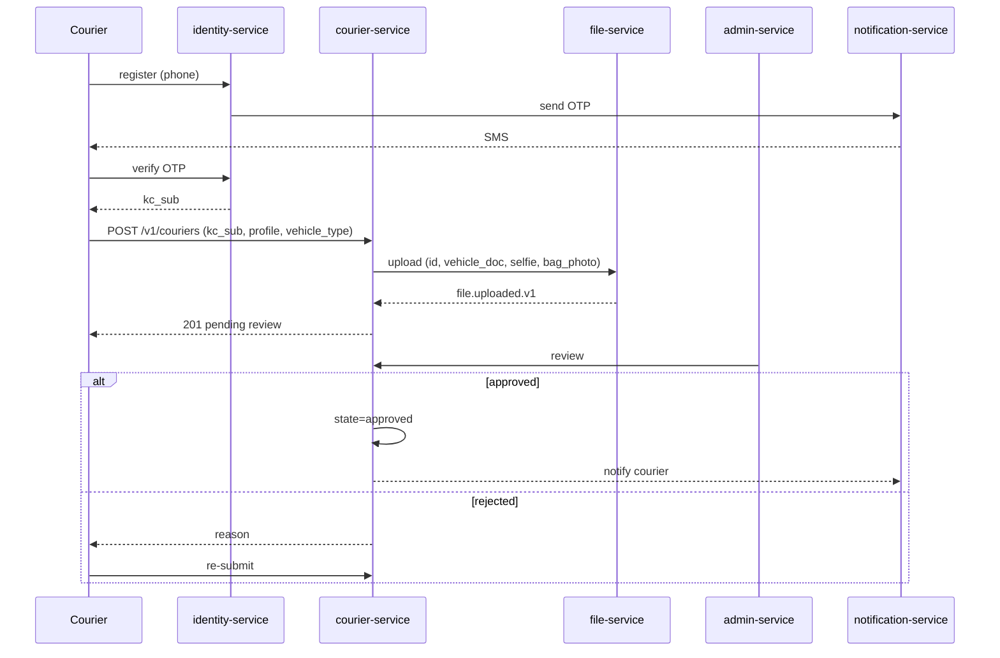
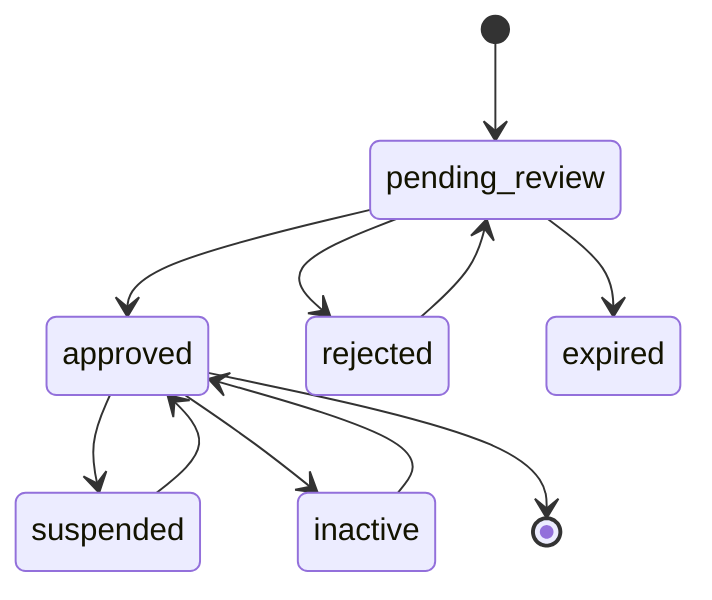
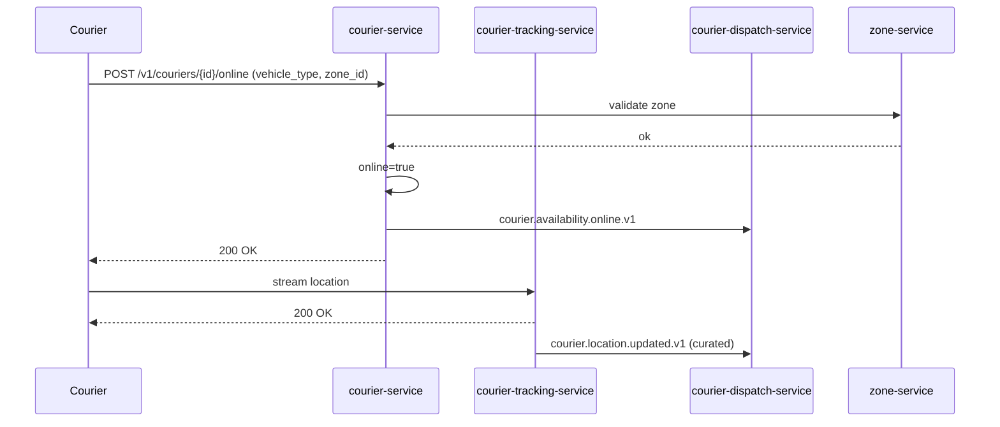
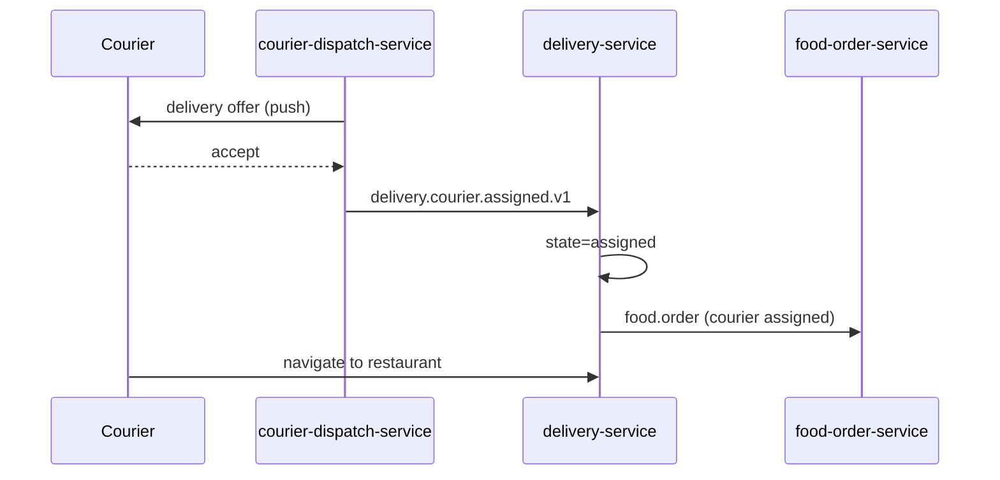
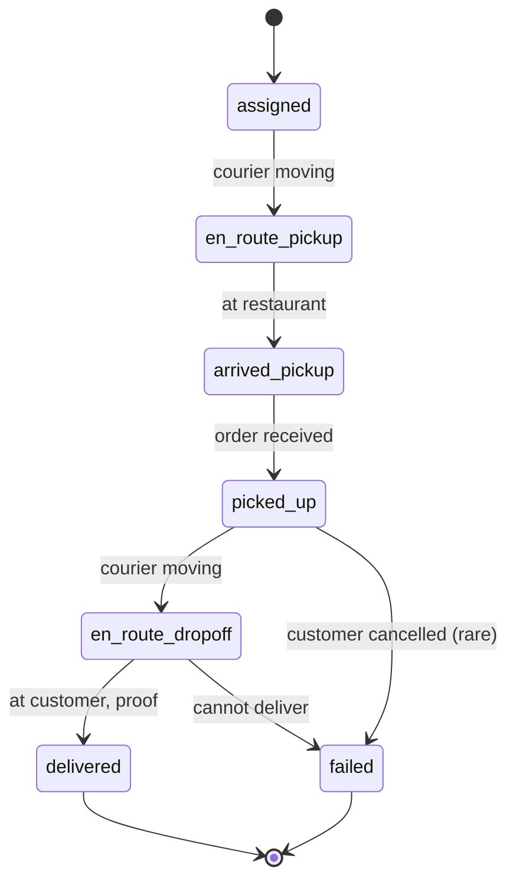
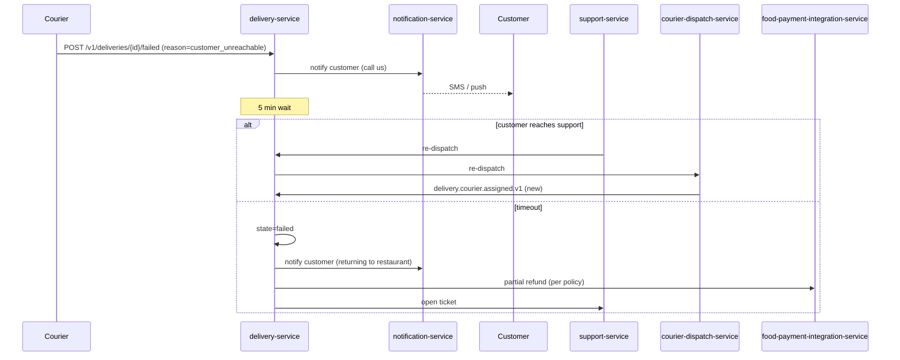
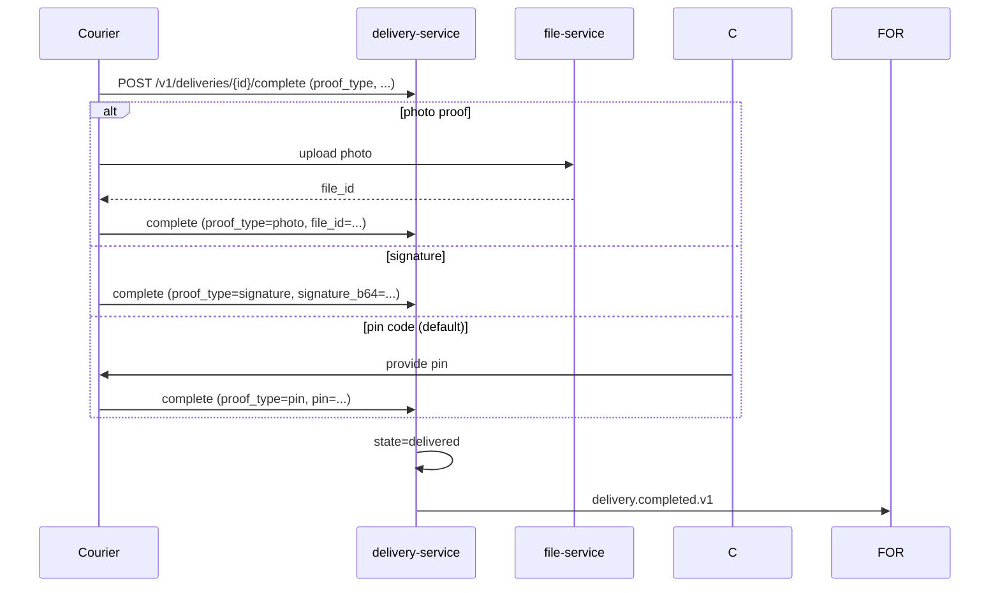
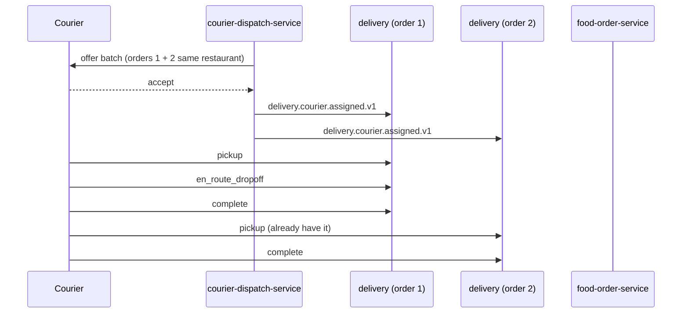

# Courier Workflows

This document consolidates end-to-end flows that affect a courier's
lifecycle: onboarding, going online, accepting deliveries, completing
them, earning, withdrawing, and going offline.

> For the **accounting view** of courier earnings (gross-to-net,
> commission, withholding, expense recognition, payable, payout,
> reconciliation) see
> [`ACCOUNTING_WORKFLOWS.md`](ACCOUNTING_WORKFLOWS.md) — "Workflow:
> Driver / Courier Income (Gross-to-Net)".

## Workflow: Courier Onboarding (KYC)

State machine for `courier`:

## Workflow: Courier Goes Online

## Workflow: Courier Accepts a Delivery

## Workflow: Delivery Lifecycle

## Workflow: Delivery Failure (Customer Unreachable)

## Workflow: Proof of Delivery

## Workflow: Courier Earnings

See [PAYMENT_WORKFLOWS.md](PAYMENT_WORKFLOWS.md). Couriers see:

- Today's deliveries and pay.
- Weekly summary.
- Bonuses / quest progress.
- Withdrawal history.

## Workflow: Multi-Order Pickup (where supported)

The platform supports batched dispatch where orders come from the
same restaurant and the dropoffs are within a small radius.

## Failure Paths Summary

| Failure | Handling |
|---------|----------|
| Document expires | Auto-suspend after grace period |
| Online but idle (no deliveries) | After T minutes, courier suggested to go offline |
| Cannot reach restaurant | Reassign after T minutes |
| Cannot reach customer | Re-dispatch or refund (per policy) |
| Item damaged | Photo + report; support ticket; possible partial refund |
| Bank details invalid | Courier prompted to update |
| App crash mid-delivery | Re-open app; trip state recovered from `delivery-service` |

## Acceptance Criteria

- 99% of courier earnings are accrued within 5 minutes of delivery.
- 99% of failed deliveries are resolved (re-dispatched or refunded)
  within 30 minutes.
- 100% of proof-of-delivery images are stored encrypted.
