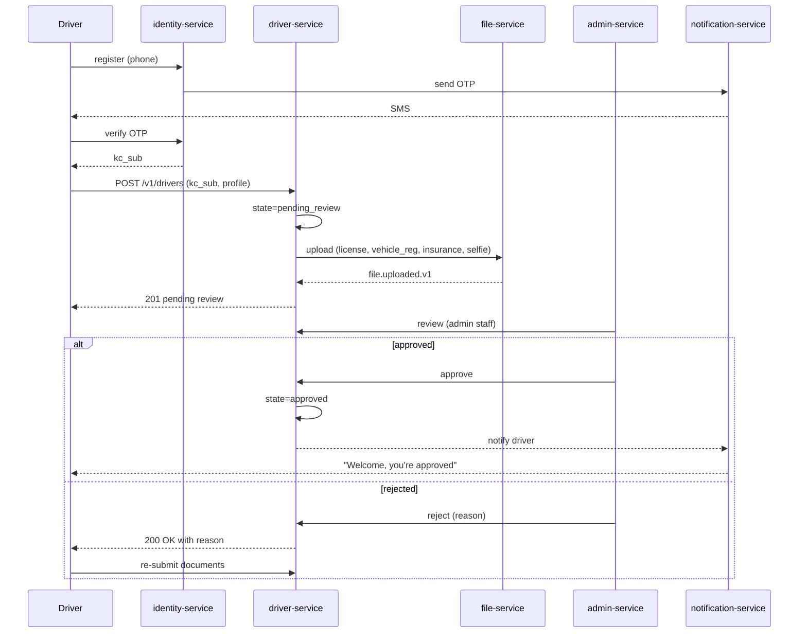
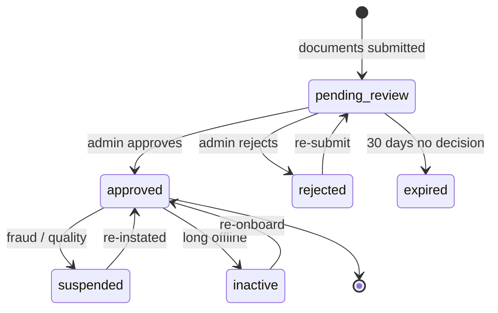
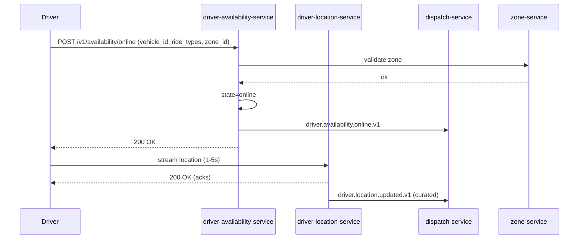
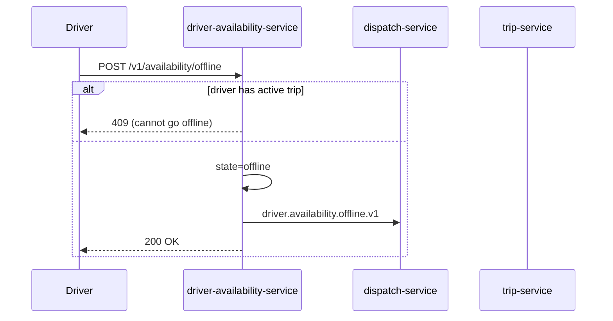
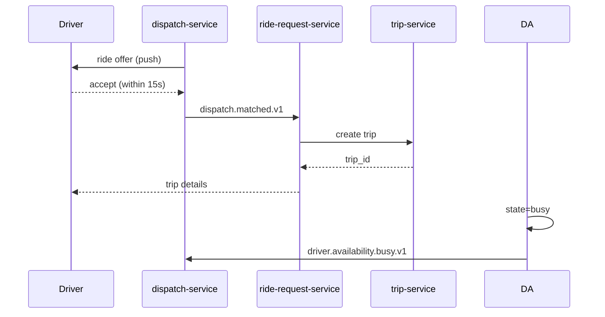
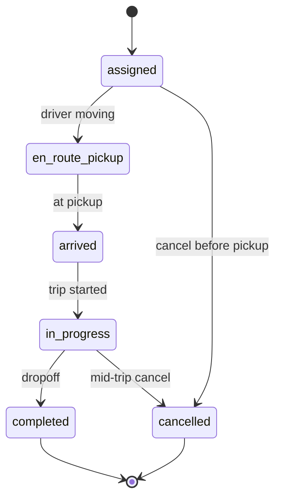
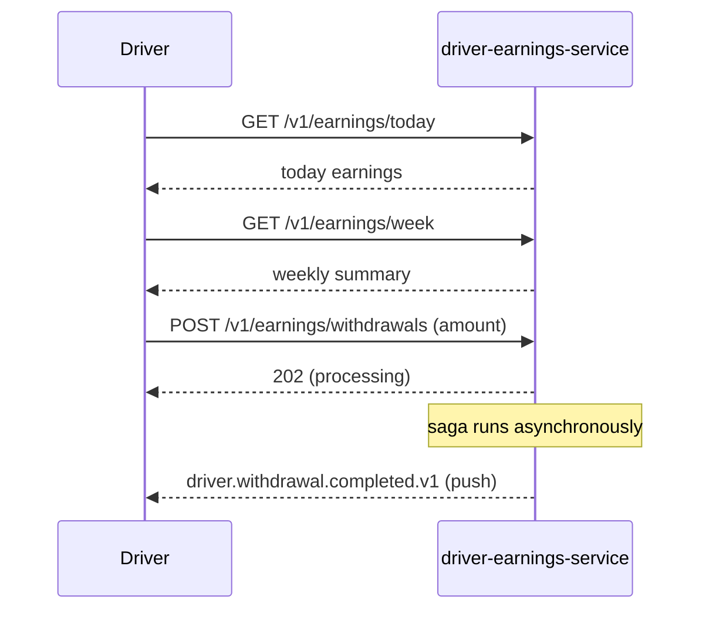
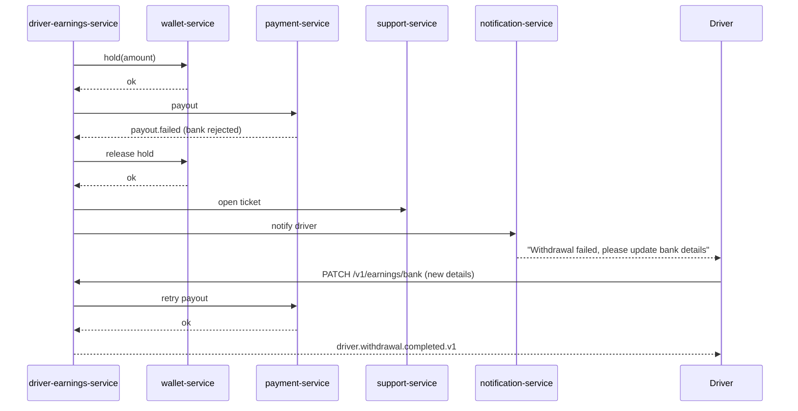
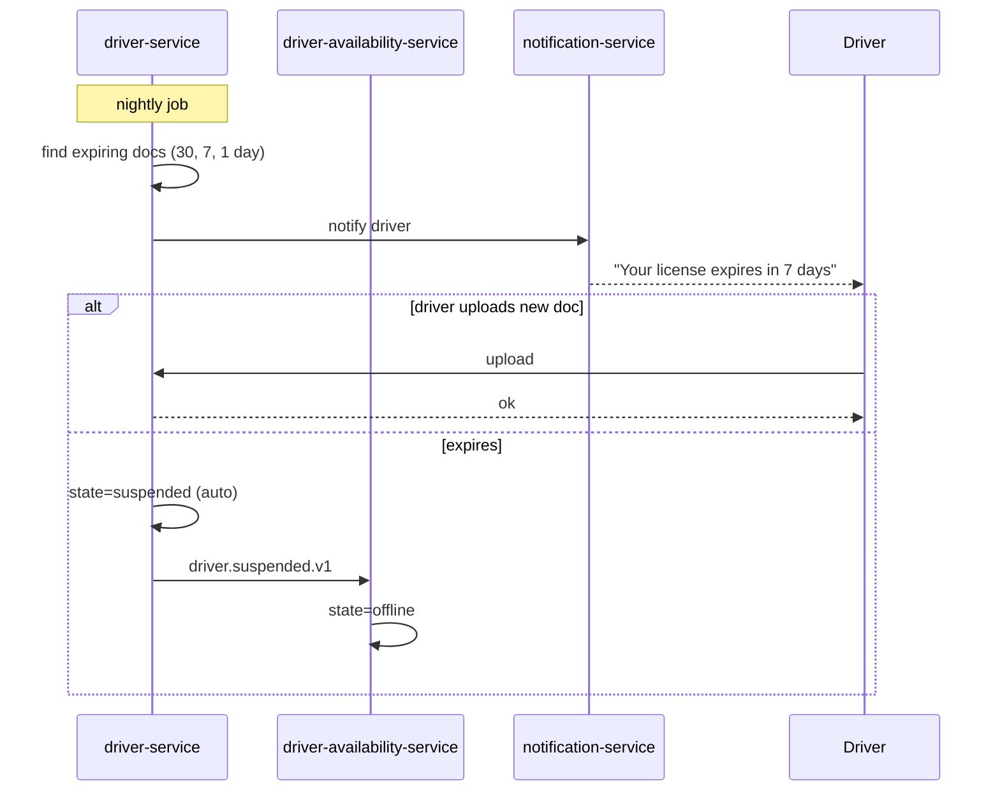
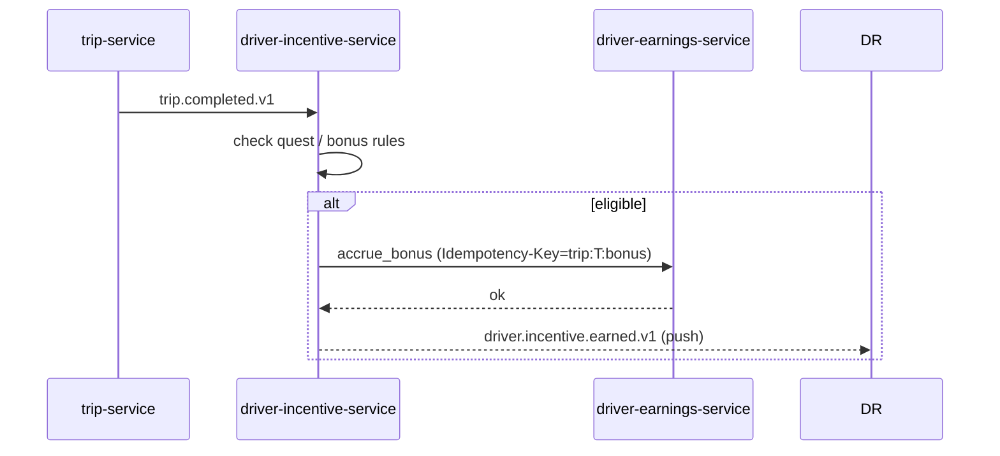

# Driver Workflows

This document consolidates end-to-end flows that affect a driver's
lifecycle: onboarding, going online, accepting rides, completing
trips, earning, withdrawing, and going offline.

> For the **accounting view** of driver earnings (gross-to-net,
> commission, withholding, expense recognition, payable, payout,
> reconciliation) see
> [`ACCOUNTING_WORKFLOWS.md`](ACCOUNTING_WORKFLOWS.md) — "Workflow:
> Driver / Courier Income (Gross-to-Net)".

## Workflow: Driver Onboarding (KYC)

State machine for `driver`:

## Workflow: Driver Goes Online

## Workflow: Driver Goes Offline

If the driver tries to go offline mid-trip, the request is rejected.
The driver may go offline after `trip.completed.v1`.

## Workflow: Driver Accepts a Ride

## Workflow: Trip Lifecycle (driver view)

Driver actions map 1:1 to `trip-service` API calls (see
`trip-service/WORKFLOWS.md` for details).

## Workflow: Driver Earnings

See [PAYMENT_WORKFLOWS.md](PAYMENT_WORKFLOWS.md) for the financial
side. Driver-facing:

## Workflow: Driver Withdrawal Failure

## Workflow: Document Expiry

## Workflow: Driver Incentive Accrual

## Workflow: Driver Safety Incident

See [RIDE_WORKFLOWS.md](RIDE_WORKFLOWS.md) — "Safety / SOS". The
driver may also report a customer via `ride-safety-service`; this
opens a support ticket and may suspend the customer.

## Failure Paths Summary

| Failure | Handling |
|---------|----------|
| Document expires | Auto-suspend after grace period |
| Online but not moving | Triggered by `driver-location-service`; after T minutes, marked suspicious |
| Repeated cancellations | Driver quality review; possible suspension |
| Negative balance (rare) | Reconciliation job opens a ticket |
| Withdrawal bank details invalid | Driver prompted to update; no funds moved |
| Mid-trip crash | `trip-service` detects heartbeat loss; if no recovery in T, opens a P1 safety ticket |

## Acceptance Criteria

- Driver can complete onboarding in < 24 hours of all documents
  being uploaded.
- 99% of document expiry warnings are sent 7+ days before expiry.
- 99% of trip completions result in earning accrual within 5 minutes.
- 100% of withdrawal failures are notified to the driver within
  1 minute.
