# Driver Workflows

This document consolidates end-to-end flows that affect a driver's
lifecycle: onboarding, going online, accepting rides, completing
trips, earning, withdrawing, and going offline. Reflects the
**20-service architecture** consolidated 2026-08-05 per
[ADR-0017](../architecture/adrs/0017-20-service-architecture.md).

> For the **accounting view** of driver earnings (gross-to-net,
> commission, withholding, expense recognition, payable, payout,
> reconciliation) see
> [`ACCOUNTING_WORKFLOWS.md`](ACCOUNTING_WORKFLOWS.md) — "Workflow:
> Driver / Courier Income (Gross-to-Net)".

## Request lifecycle (parent events)

Per [ADR-0020](../architecture/adrs/0020-polymorphic-request-id.md), every ride request emits polymorphic `request.*.v1` parent events. The driver-facing match event (`dispatch.matched.v1`) maps to `request.matched.v1` from the driver's perspective. The request lifecycle is owned by `trip-service`.

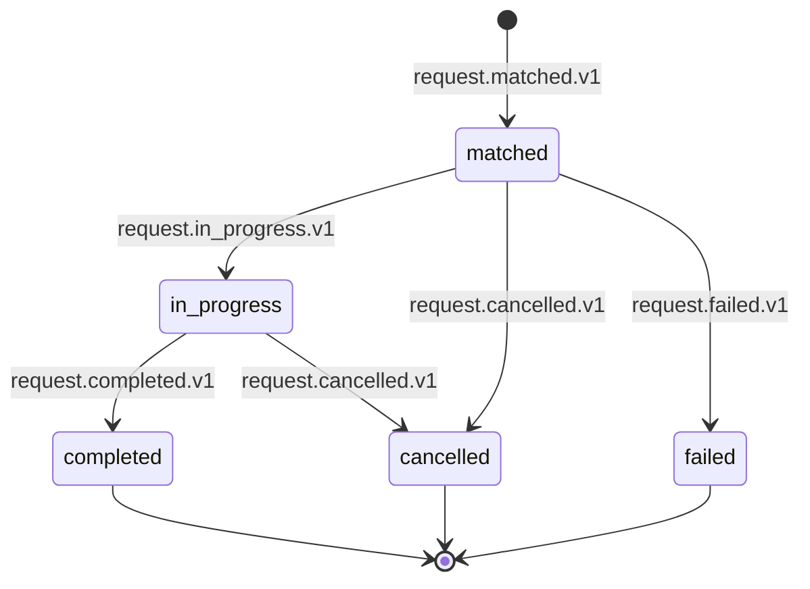

Each `request.*.v1` event carries `request_id`, `service='trip'`, `workflow_process_id`, `status`, and `correlation_id`.

## Workflow: Driver Onboarding (KYC)

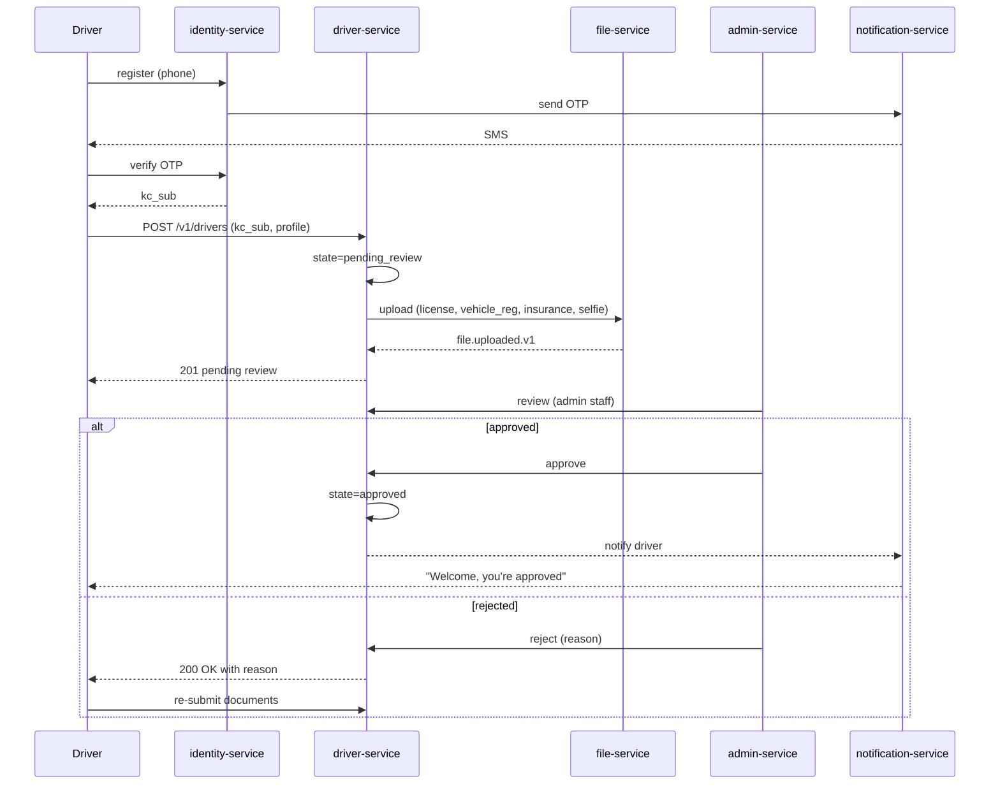

State machine for `driver`:

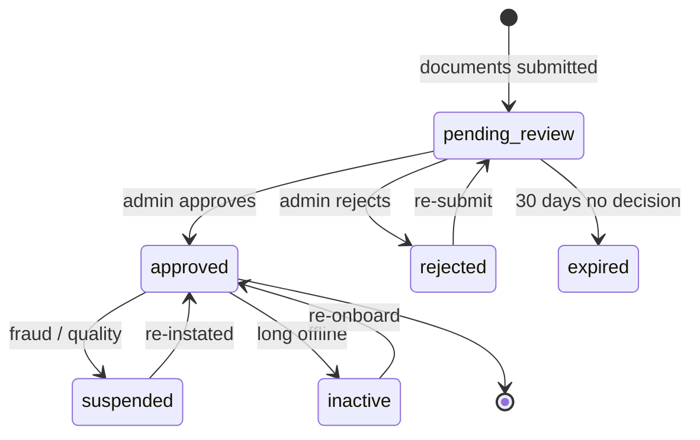

## Workflow: Driver Goes Online

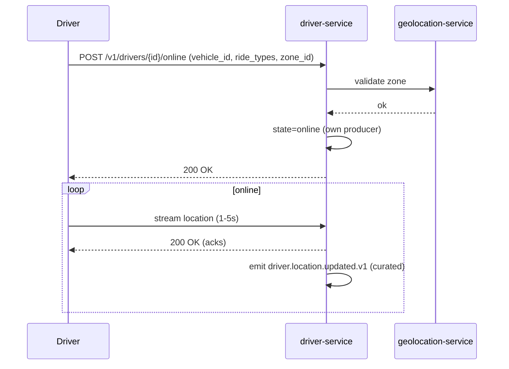

## Workflow: Driver Goes Offline

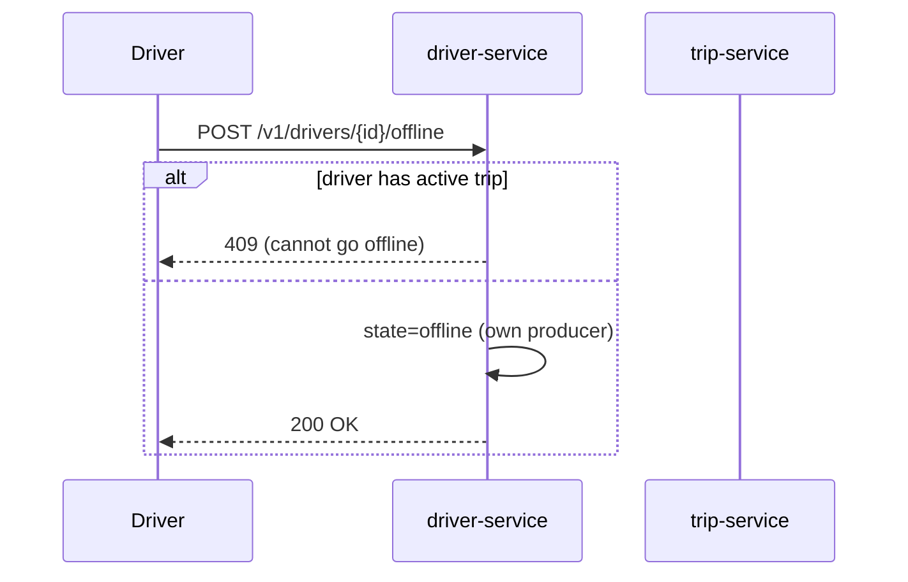

If the driver tries to go offline mid-trip, the request is rejected.
The driver may go offline after `trip.completed.v1`.

## Workflow: Driver Accepts a Ride

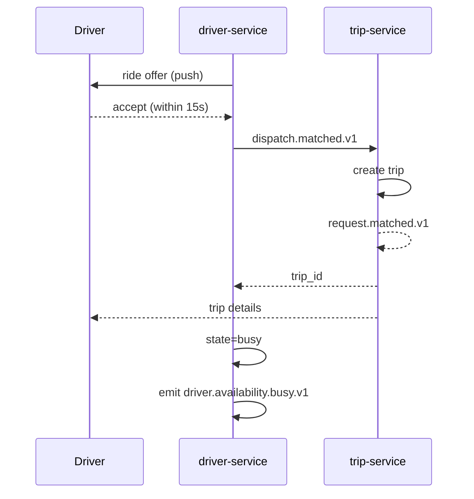

## Workflow: Trip Lifecycle (driver view)

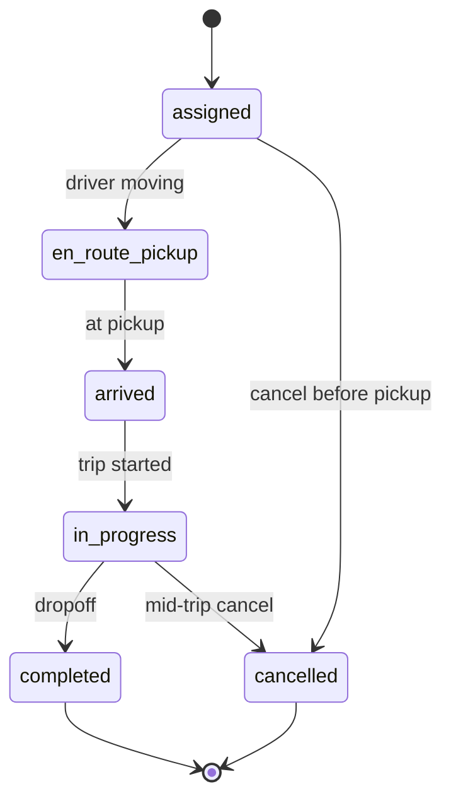

Driver actions map 1:1 to `trip-service` API calls (see
`trip-service/WORKFLOWS.md` for details).

## Workflow: Driver Earnings

See [PAYMENT_WORKFLOWS.md](PAYMENT_WORKFLOWS.md) for the financial
side. Driver-facing (in `payment-service`, which absorbed
`driver-earnings-service`):

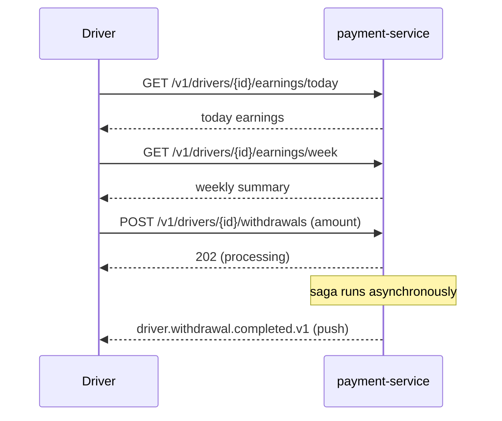

## Workflow: Driver Withdrawal Failure

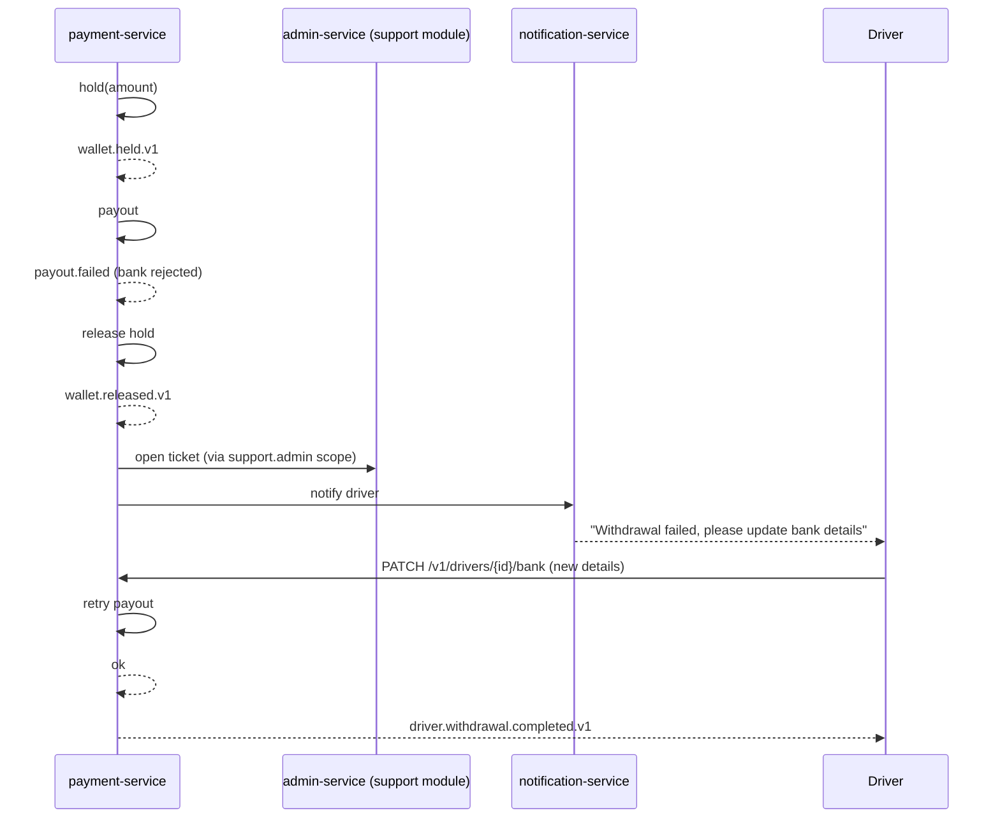

## Workflow: Document Expiry

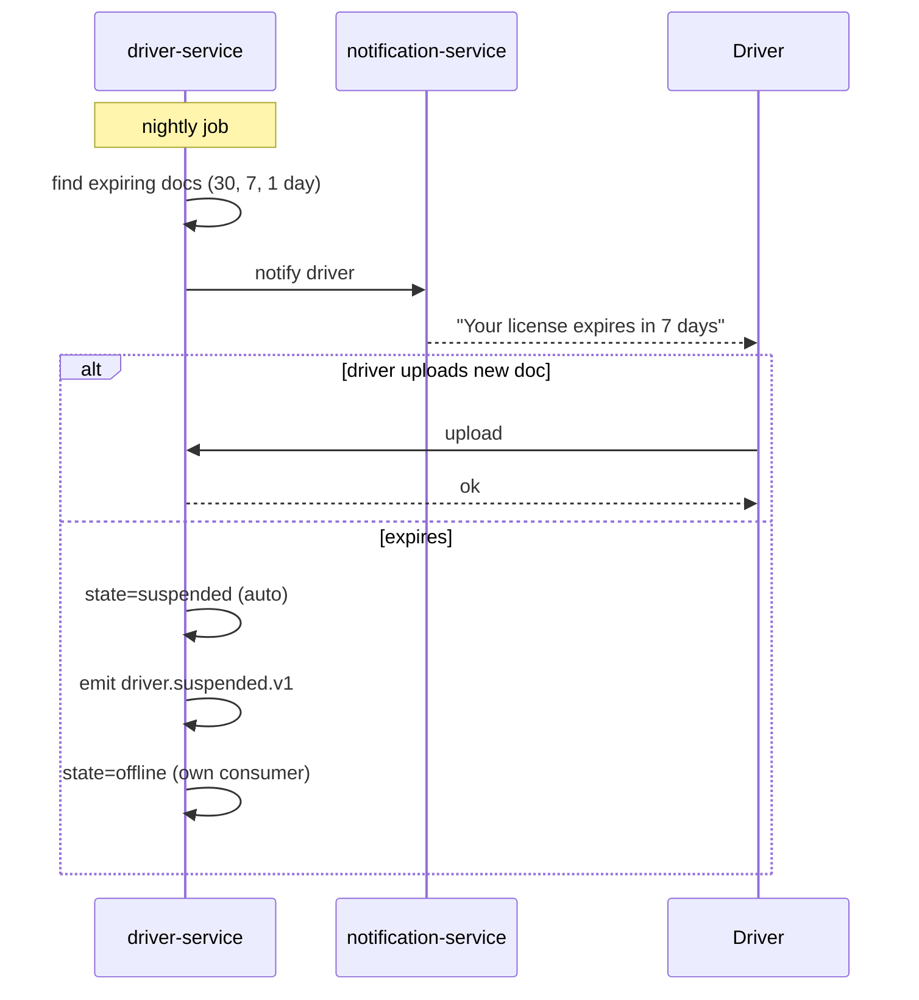

## Workflow: Driver Incentive Accrual

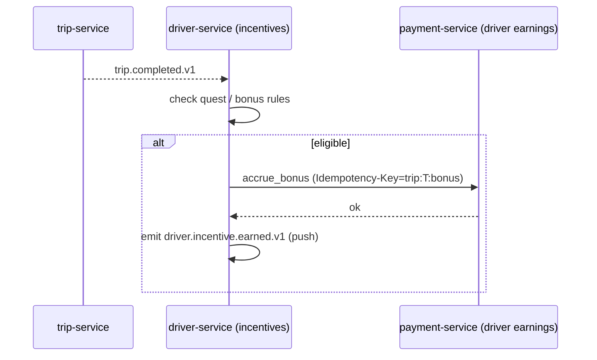

## Workflow: Driver Safety Incident

See [RIDE_WORKFLOWS.md](RIDE_WORKFLOWS.md) — "Safety / SOS". The
driver may also report a customer via the safety capability inside
`trip-service` (absorbed from `ride-safety-service`); this opens a
support ticket and may suspend the customer.

## Failure Paths Summary

| Failure | Handling |
|---------|----------|
| Document expires | Auto-suspend after grace period |
| Online but not moving | Triggered by the embedded location stream in `driver-service`; after T minutes, marked suspicious |
| Repeated cancellations | Driver quality review; possible suspension |
| Negative balance (rare) | Reconciliation job opens a ticket |
| Withdrawal bank details invalid | Driver prompted to update; no funds moved |
| Mid-trip crash | `trip-service` detects heartbeat loss; if no recovery in T, opens a P1 safety ticket |

## Acceptance Criteria

- Driver can complete onboarding in < 24 hours of all documents
  being uploaded.
- 99% of document expiry warnings are sent 7+ days before expiry.
- 99% of trip completions result in earning accrual within 5 minutes.
- 100% of withdrawal failures are notified to the driver within
  1 minute.

## Conductor — Driver Onboarding

Driver onboarding (KYC → approval → training → vehicle inspection →
activation) runs on Netflix Conductor per
[ADR-0018](../architecture/adrs/0018-workflow-engine-conductor.md) and
[`shared/CONDUCTOR_WORKFLOWS.md`](../shared/CONDUCTOR_WORKFLOWS.md) 3.4.

The workflow ID is `wf.onboarding.driver.v1` and has 8 tasks:

1. `identity_service_kyc_start` (worker in `identity-service`)
2. `identity_service_document_verify` (per document, parallel)
3. `fraud_risk_service_risk_score` (worker in `fraud-risk-service`)
4. `admin_service_manual_approval` (HUMAN TASK in `admin-service` UI, 24h SLA)
5. `notification_service_approval_template` (worker in `notification-service`)
6. `driver_service_training_module_complete` (HUMAN TASK in `driver-service` UI, 7-day SLA)
7. `driver_service_vehicle_inspection` (HUMAN TASK in `driver-service` UI, 3-day SLA)
8. `driver_service_activation` (worker in `driver-service`) → emits `driver.activated.v1`

The owner is `driver-service`. SLA breaches fire
`driver.onboarding.sla_breach.v1`. Compensation is not used; a
rejected onboarding is a terminal `rejected` state.

The in-service driver state machine (per [ADR-0010](../architecture/adrs/0010-saga-pattern.md))
remains authoritative for the online/offline lifecycle and the ride
acceptance flow; only the long-running onboarding path uses
Conductor.

## Related docs

- [`../SERVICE_INTEGRATION_MATRIX.md`](../SERVICE_INTEGRATION_MATRIX.md) — service × event × dependency matrix
- [`../architecture/EVENT_ARCHITECTURE.md`](../architecture/EVENT_ARCHITECTURE.md) — event catalog and delivery semantics
- [`../architecture/SERVICE_ISOLATION.md`](../architecture/SERVICE_ISOLATION.md) — downstream failure handling per class
