# Food Order Workflows

This document covers the end-to-end flows for the food delivery
product. Per-service state machines are in each service's `WORKFLOWS.md`.

> For the **accounting view** of food order transactions (customer
> transaction recognition; merchant payable; courier earning;
> marketplace VAT; expense) see
> [`ACCOUNTING_WORKFLOWS.md`](ACCOUNTING_WORKFLOWS.md) — "Workflow:
> Customer Transaction Recognition (Ride / Food)" and "Workflow:
> Restaurant Settlement & Marketplace VAT".

## Actors and Services

| Actor | Services they touch directly |
|-------|------------------------------|
| Customer | `cart-service`, `checkout-service`, `food-order-service`, `payment-service`, `review-rating-service` |
| Restaurant operator | `restaurant-order-mgmt-service`, `menu-service`, `branch-service` |
| Courier | `courier-dispatch-service`, `delivery-service`, `courier-earnings-service` |
| System | `merchant-service`, `restaurant-service`, `inventory-service`, `promotion-service`, `pricing-service`, `tax-service`, `notification-service`, `food-payment-integration-service`, `restaurant-settlement-service` |

## Workflow: Customer Places a Food Order (Happy Path)

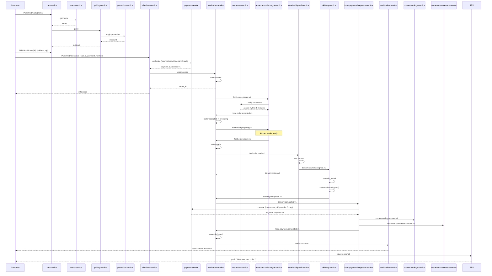

State machine for `food_order`:

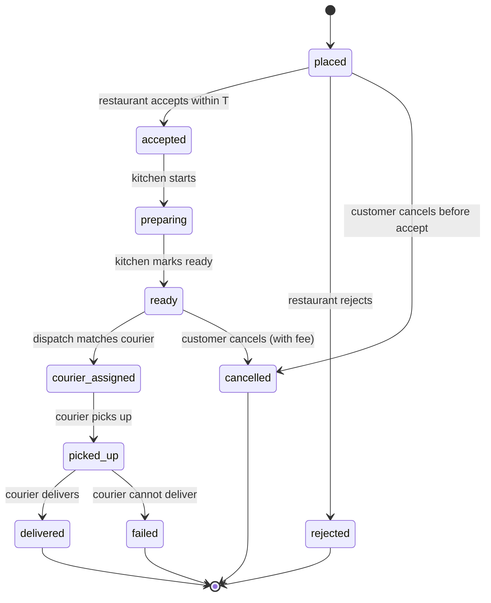

## Workflow: Cart Lifecycle

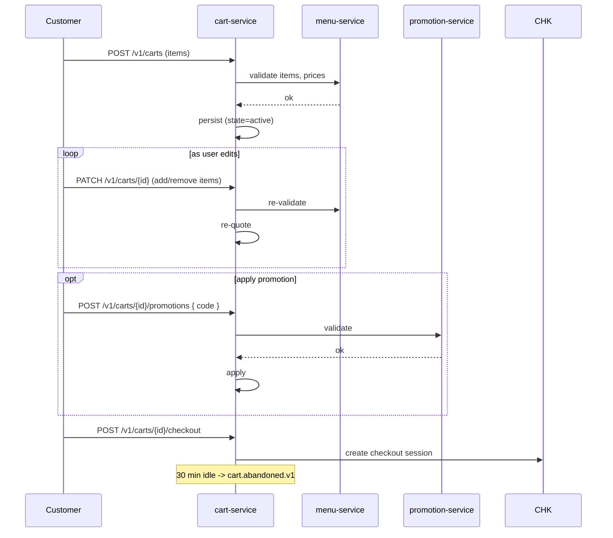

If the menu item becomes unavailable while the cart is active,
`menu.item.unavailable.v1` is consumed; the item is removed from the
cart and the user is notified.

If the price changes, `menu.item.price.changed.v1` triggers a
re-quote; the cart is updated and the user is notified of the diff.

## Workflow: Restaurant Acceptance (with timer)

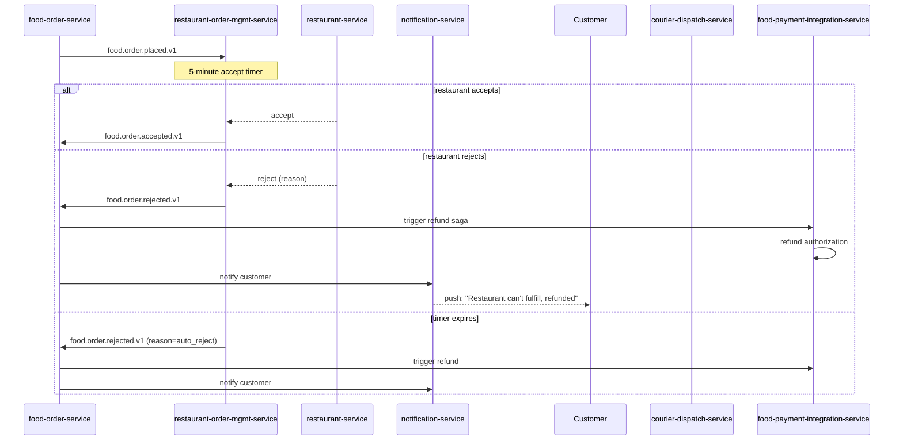

## Workflow: Courier Dispatch and Delivery

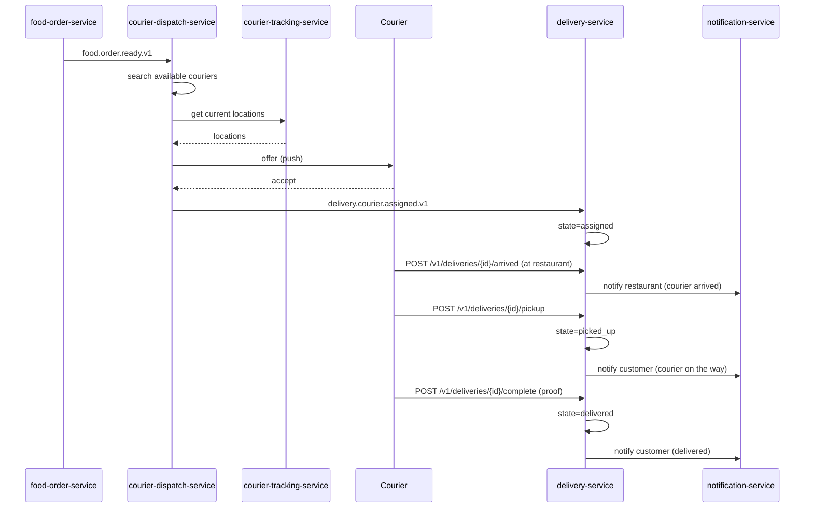

## Workflow: Customer Cancellation (with policy)

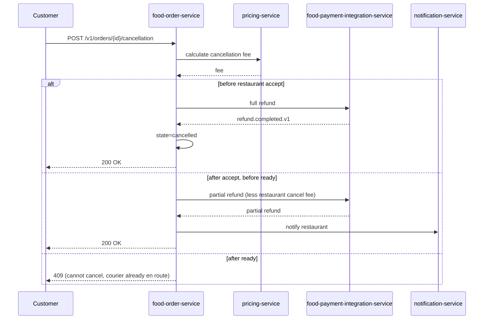

## Workflow: Restaurant Cancellation

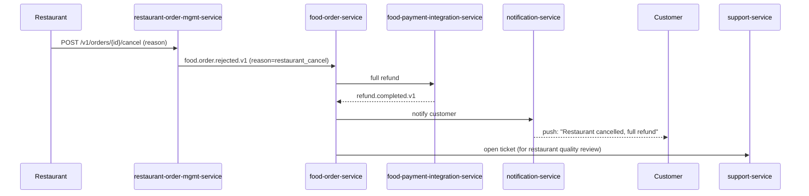

## Workflow: Courier Cancellation / Reassignment

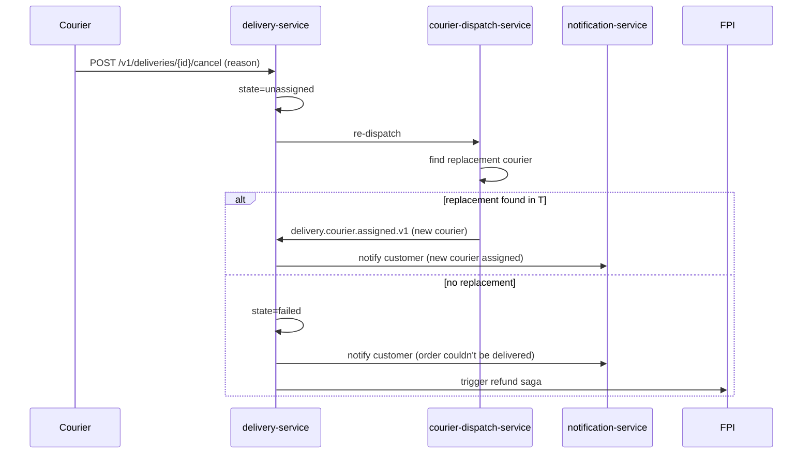

## Workflow: Failed Delivery (courier can't reach customer)

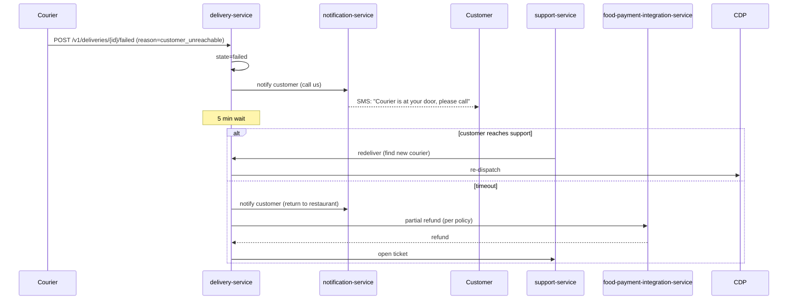

## Workflow: Wrong / Missing Items

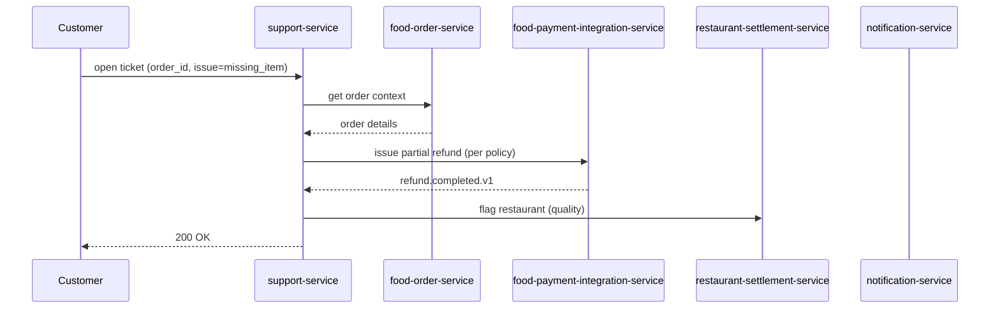

## Workflow: Promotion Redemption

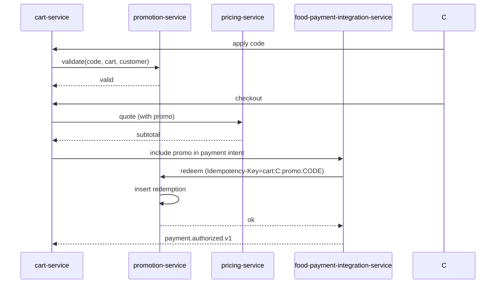

## Workflow: Settlement Payout

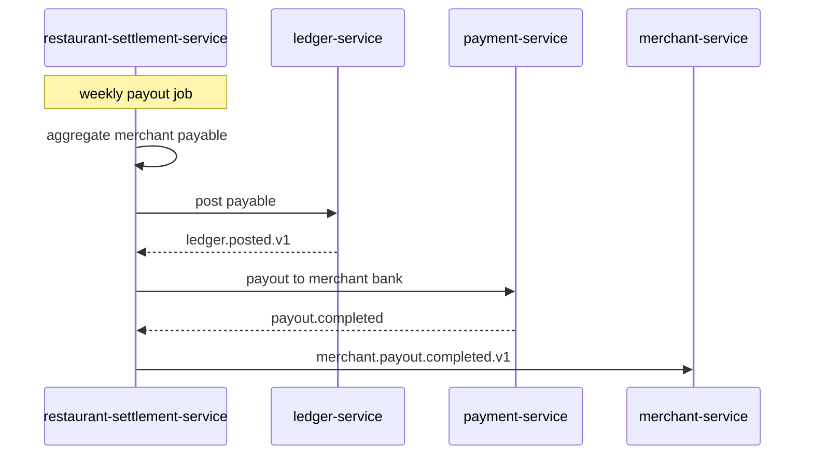

## Failure Paths Summary

| Failure | Handling |
|---------|----------|
| Restaurant doesn't accept in T | Auto-reject, full refund, notify customer |
| Restaurant is offline | Cart shows "temporarily unavailable"; orders can't be placed |
| Item out of stock after cart | `menu.item.unavailable.v1` removes the item; cart re-quotes |
| Price changed | `menu.item.price.changed.v1` re-quotes; user must re-confirm |
| No courier available | Customer notified; order can be re-dispatched or refunded |
| Customer unreachable | 5 min wait; redeliver or refund per policy |
| Payment fails at checkout | Order not created; user re-tries with different method |
| Payment fails at capture | Refund issued; ticket opened |
| Restaurant cancels | Full refund; ticket opened for quality review |
| Courier cancels | Re-dispatch; if no replacement, refund |

## Acceptance Criteria (end-to-end)

- 95% of orders are accepted by restaurants within 5 minutes.
- 95% of accepted orders are delivered within the promised window.
- 99% of completed orders have a successful payment capture and
  merchant settlement.
- Restaurant cancel rate < 5% (target; varies by city).
- Courier cancel rate < 3% (target; varies by city).
- Average time from order placed to courier assigned: < 12 minutes.
