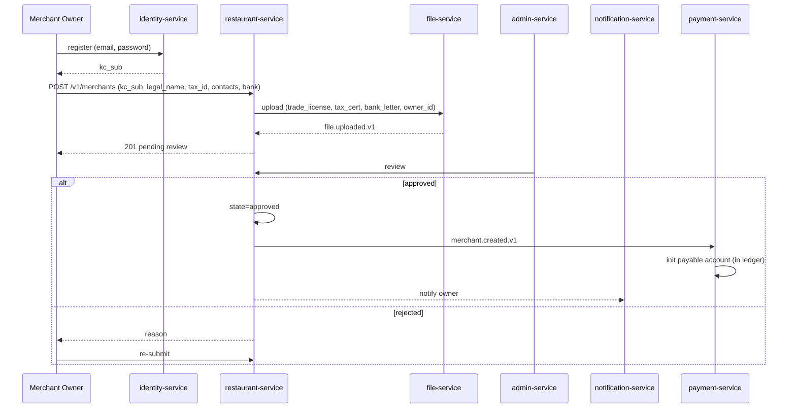
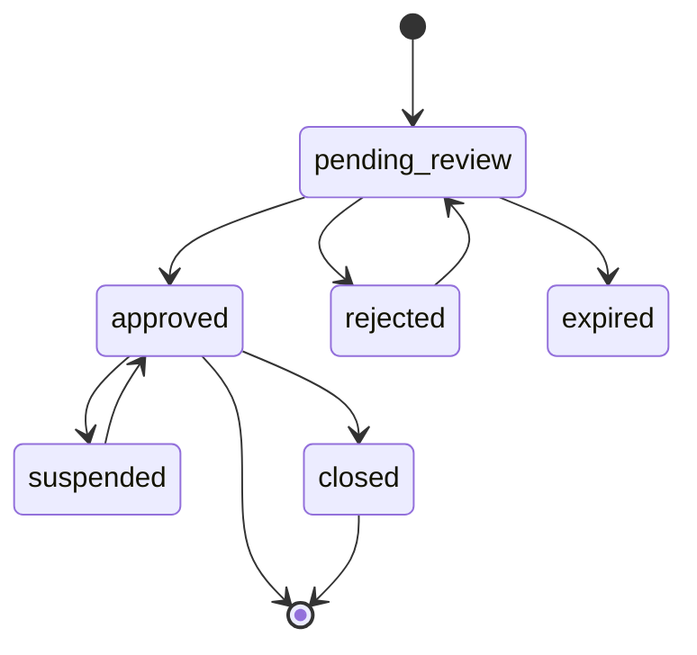
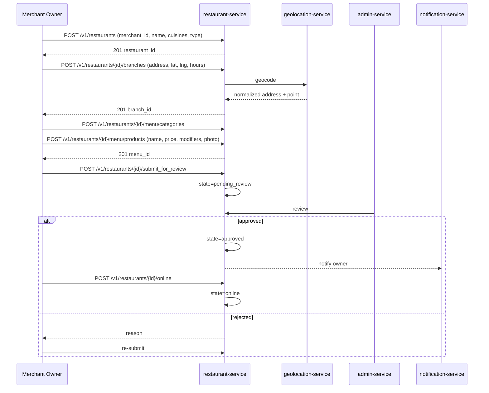
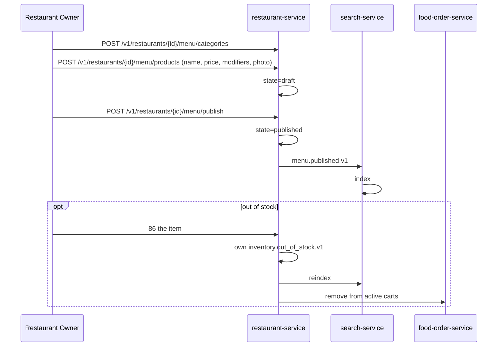
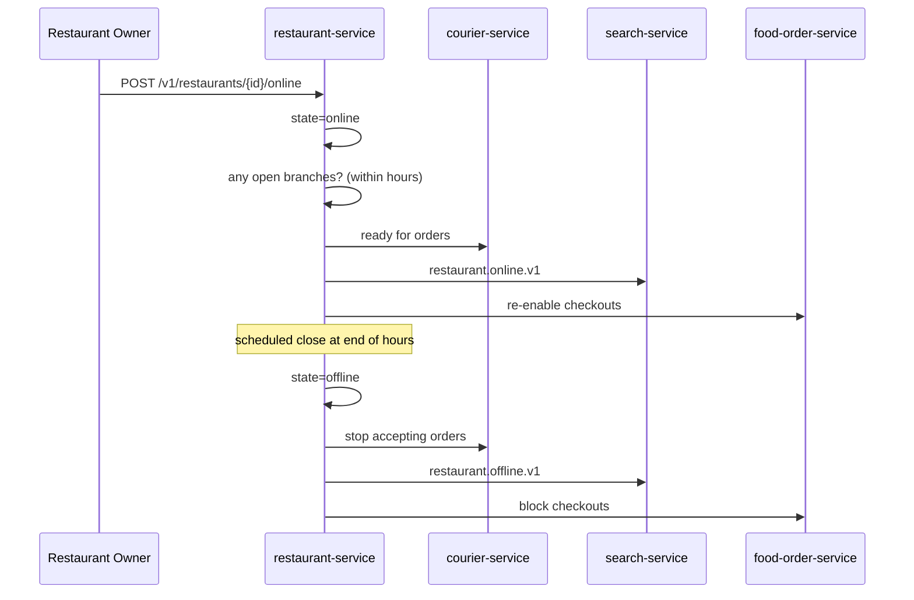
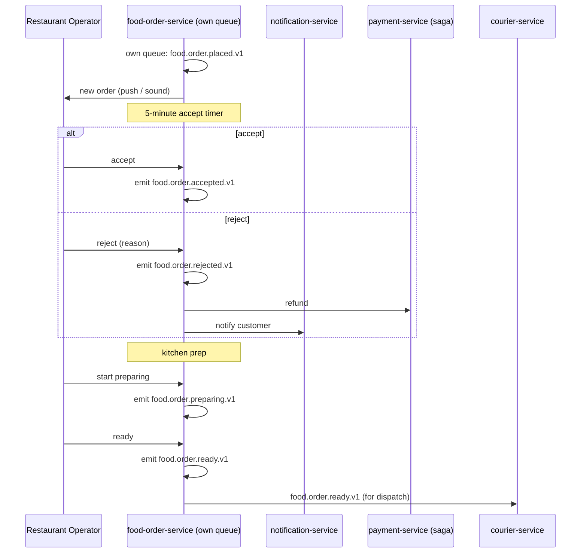
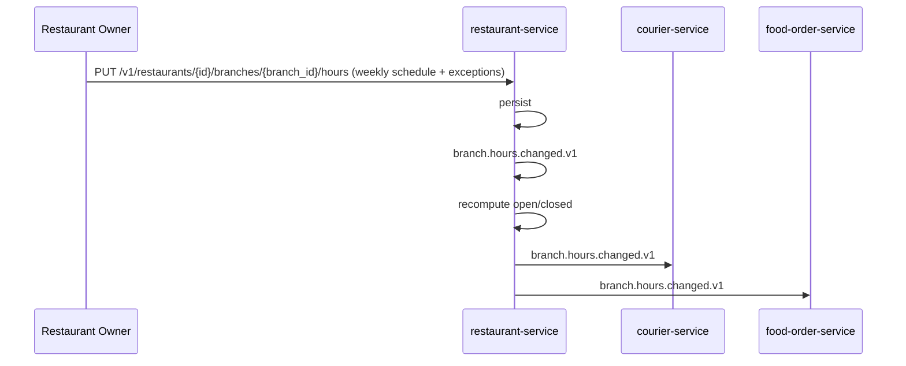
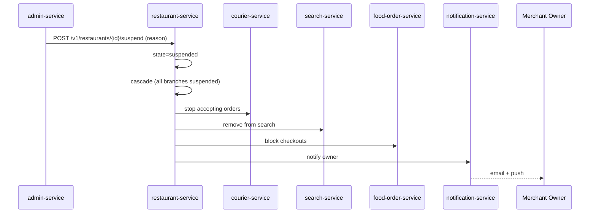
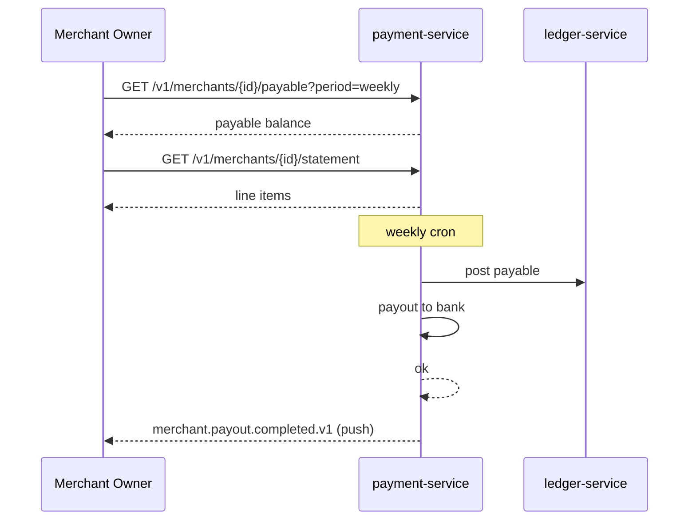
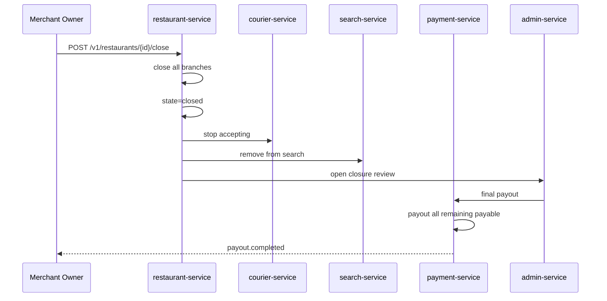

# Merchant Workflows

This document covers merchant and restaurant onboarding, menu
management, branch operations, and settlement. Reflects the
**20-service architecture** consolidated 2026-08-05 per
[ADR-0017](../architecture/adrs/0017-20-service-architecture.md).

> For the **accounting view** of merchant settlement (marketplace VAT,
> commission revenue, merchant payable, payout, dispute debit) see
> [`ACCOUNTING_WORKFLOWS.md`](ACCOUNTING_WORKFLOWS.md) — "Workflow:
> Restaurant Settlement & Marketplace VAT".

## Workflow: Merchant Onboarding

State machine for `merchant` (now in `restaurant.merchants`):

## Workflow: Restaurant Onboarding (under a Merchant)

## Workflow: Menu Management

## Workflow: Restaurant Open / Close

## Workflow: Order Acceptance (Restaurant Operator View)

## Workflow: Branch Hours Management

## Workflow: Restaurant Suspension (Quality / Compliance)

## Workflow: Restaurant Settlement Payout

See [PAYMENT_WORKFLOWS.md](PAYMENT_WORKFLOWS.md) — "Restaurant
Settlement". The merchant-facing view (in `payment-service`, which
absorbed `restaurant-settlement-service`):

## Workflow: Restaurant Closure (Permanent)

## Failure Paths Summary

| Failure | Handling |
|---------|----------|
| Restaurant doesn't accept in T | Auto-reject, customer refunded |
| Restaurant is offline unexpectedly | Orders blocked; restaurant auto-set offline for T |
| Branch hours don't match reality | Reconciliation job flags drift; admin reviews |
| Menu item unavailable | Replaced in cart; user notified |
| Payout fails | Bank details updated; retry |
| Quality issues | Suspension; review; reinstatement after action plan |

## Acceptance Criteria

- Restaurant can complete onboarding in < 48 hours of all documents
  being uploaded.
- 99% of menu changes are visible in the customer app within
  30 seconds.
- 99% of order acceptance decisions happen within 5 minutes.
- 100% of approved payouts are confirmed within 1 business day.