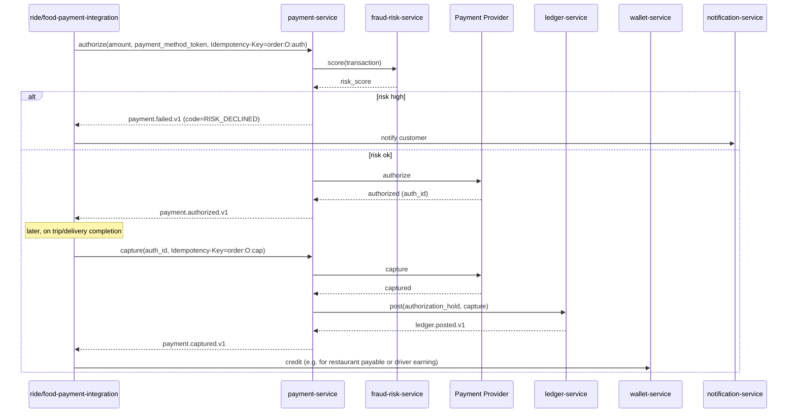
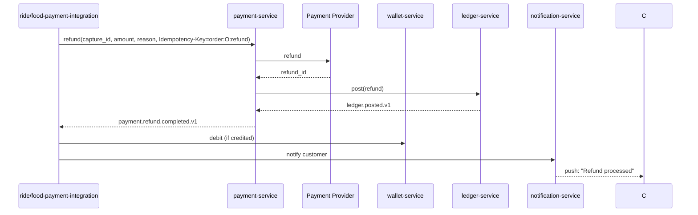
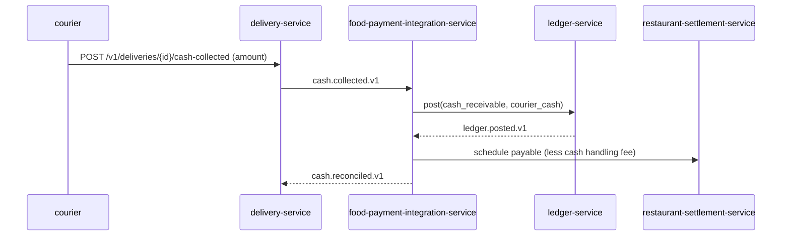
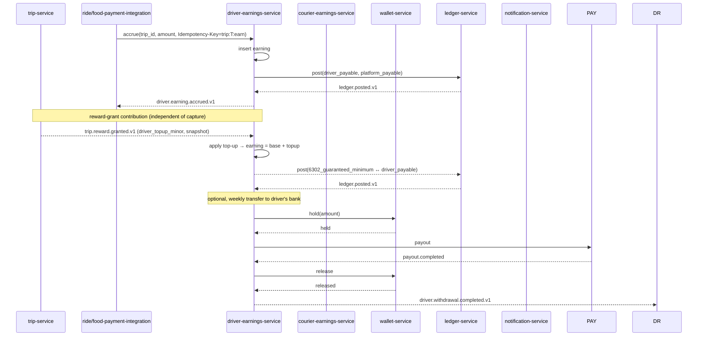
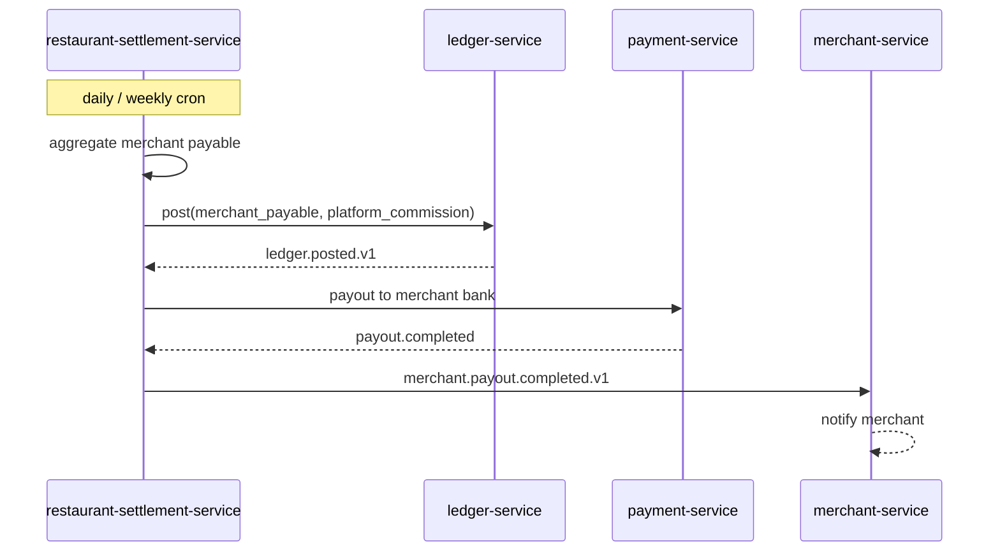
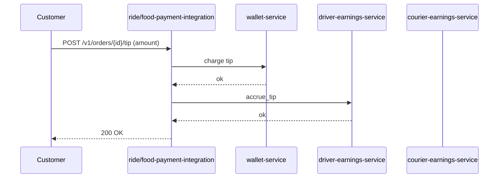
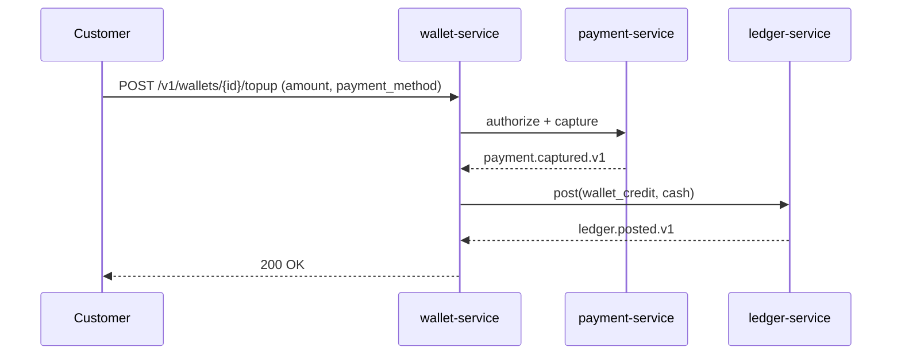
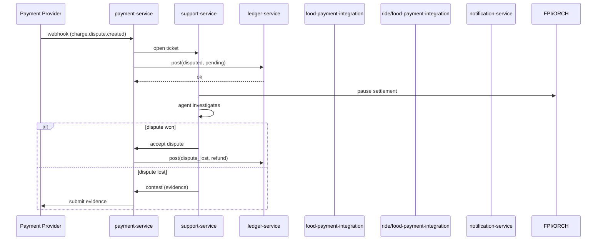

# Payment Workflows

The financial flows cut across ride-hailing and food delivery. This
document consolidates them.

> For the **accounting view** (tax recognition & remittance; gross-to-net
> driver / courier income; marketplace VAT; CIT & regulatory fees; expense
> recognition — incentives, refunds, opex, chargebacks; reconciliation
> & period close) see
> [`ACCOUNTING_WORKFLOWS.md`](ACCOUNTING_WORKFLOWS.md).

## Actors and Services

| Actor | Services |
|-------|----------|
| Customer | `payment-service`, `wallet-service`, `ride-payment-integration-service` / `food-payment-integration-service` |
| Driver/Courier | `driver-earnings-service`, `courier-earnings-service`, `wallet-service` |
| Restaurant/Merchant | `restaurant-settlement-service`, `wallet-service` |
| System | `payment-service`, `ledger-service`, `fraud-risk-service` |

## Workflow: Authorize → Capture (Card)



## Workflow: Refund



## Workflow: Cash on Delivery (where configured)



COD is **only** available when the merchant is configured to allow
it (`merchant.cod_enabled = true` in `configuration-service`). COD
amounts are reconciled daily.

## Workflow: Driver / Courier Earning Accrual



## Workflow: Restaurant Settlement



## Workflow: Tip Adjustment



Tips are added to the next earning accrual; they do not modify the
already-captured base amount.

## Workflow: Wallet Top-up

The customer wallet has **two distinct credit paths** — both routed
through `wallet-service` and posted to `ledger-service` as
`2100_customer_credit_liability` ↔ `cash`, but triggered by different
events.

1. **Customer-initiated top-up** — the wallet holder funds their
   wallet from a payment method (see diagram below).
2. **Reward consumer path** — `trip-service` emits
   `trip.reward.granted.v1` on trip completion when the customer is
   eligible for a credit (loyalty tier, promo, or issue resolution);
   `wallet-service` consumes the event and credits the wallet
   idempotently on `grant_id` (no payment-method authorization is
   involved). Reversals on trip correction emit
   `trip.reward.reversed.v1` and produce a wallet **debit** (new
   posting, not UPDATE).



## Workflow: Reward Reversal (Trip Correction)

When a previously-completed trip is cancelled after-the-fact, corrected
by a support agent, or invalidated by fraud-review,
`trip-service` emits `trip.reward.reversed.v1`. The reversal fans out
to the same consumers as the grant and produces **new postings** — a
ledger-service `UPDATE`/`DELETE` is rejected at the database trigger
level (per [[accounting-four-layer-truth-model]] §"How to apply"). For
the customer side, `wallet-service` debits the wallet (the original
credit posting remains, but a new negative posting offsets it). For the
driver side, `driver-earnings-service` issues an accrual correction
against the same `driver_payable` account.

```mermaid
sequenceDiagram
    participant TR as trip-service
    participant DE as driver-earnings-service
    participant WLT as wallet-service
    participant LD as ledger-service
    participant NOT as notification-service

    TR->>TR: trip cancelled / corrected / fraud-invalid
    TR-->>DE: trip.reward.reversed.v1 (driver_topup_minor)
    TR-->>WLT: trip.reward.reversed.v1 (customer_credit_minor)
    TR-->>NOT: notify driver + customer

    Note over DE,WLT: ledger is append-only; reversals are NEW postings
    DE-->>LD: post NEW ROW: driver_payable ↔ 6302_guaranteed_minimum (negative)
    LD-->>DE: ledger.posted.v1
    WLT-->>LD: post NEW ROW: cash ↔ 2100_customer_credit_liability (negative)
    LD-->>WLT: ledger.posted.v1
    WLT->>WLT: debit customer wallet (idempotent on reversal_id)
    Note over LD: ledger-service blocks UPDATE/DELETE on ledger.postings
```

The reversal idempotency key is `trip:<trip_id>:reward:reversal`; a
duplicate reversal for the same trip is a no-op (the inbox table on
each consumer dedupes by `event_id`, and the consumer handler is
idempotent on reversal_id). For the accounting view see
[`ACCOUNTING_WORKFLOWS.md`](ACCOUNTING_WORKFLOWS.md) §"Workflow:
Guaranteed Rewards — Driver Top-Up + Customer Credit".

## Workflow: Disputed Charge



## Workflow: Idempotency in Practice

Every money-movement call carries an idempotency key. Examples:

| Action | Key pattern |
|--------|-------------|
| Authorize a ride payment | `ride:<ride_id>:auth` |
| Capture a ride payment | `ride:<ride_id>:cap` |
| Refund a ride payment | `ride:<ride_id>:refund:<reason>` |
| Accrue driver earning | `trip:<trip_id>:earn` |
| Accrue courier earning | `delivery:<delivery_id>:earn` |
| Settle merchant payable | `merchant:<merchant_id>:payout:<payout_id>` |
| Wallet top-up | `wallet:<wallet_id>:topup:<request_id>` |
| Trip reward grant (driver + customer) | `trip:<trip_id>:reward:grant` |
| Trip reward reversal | `trip:<trip_id>:reward:reversal` |
| Tip | `order:<order_id>:tip:<request_id>` |

The key is unique per logical operation. Replays of the same key
return the original result without re-executing.

## Failure Paths Summary

| Failure | Handling |
|---------|----------|
| Authorization fails (insufficient funds, expired card) | Customer notified; alternative payment method requested |
| Capture fails (rare) | Refund of any held authorization; ticket opened |
| Provider timeout on authorize | Retry with backoff; on persistent failure, surface error |
| Refund fails | Manual intervention; ticket opened with P1 |
| Webhook lost | Reconciliation job compares ledger to provider reports; missing entries retried |
| Wallet balance drift | Reconciliation job opens a P1 ticket; manual review |
| Driver earning missing | Reconciliation job opens a P1 ticket |

## Acceptance Criteria

- All payment authorizations use idempotency keys (100% coverage).
- All captures happen within 5 minutes of the trigger event.
- All refunds happen within 1 hour of the trigger event.
- Wallet balance always matches the sum of ledger postings for that
  wallet (verified by reconciliation daily).
- 100% of money movement events have a matching `ledger.posted.v1`.
- Each eligible trip produces exactly one credit (one
  `trip.reward.granted.v1` → one wallet credit + one ledger posting);
  reversals are separate postings, not UPDATE.
- Wallet credit balance per customer always equals the sum of
  `2100_customer_credit_liability` postings for that customer
  (reconciled daily).
