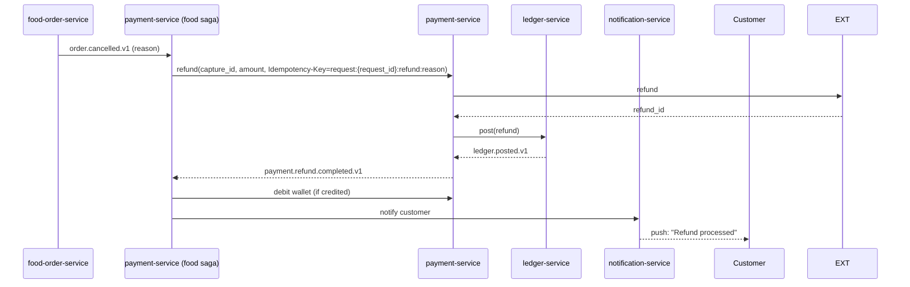
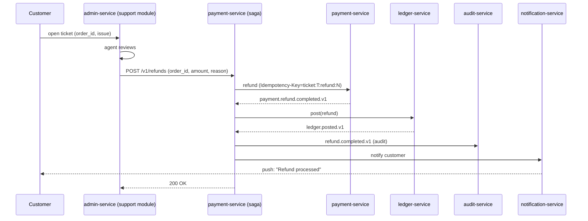
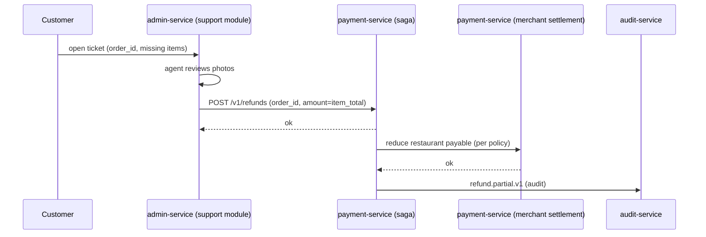
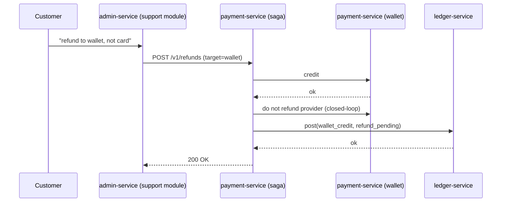
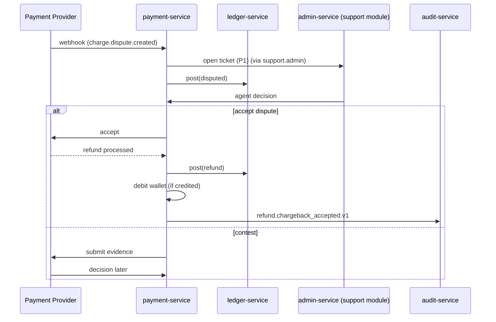
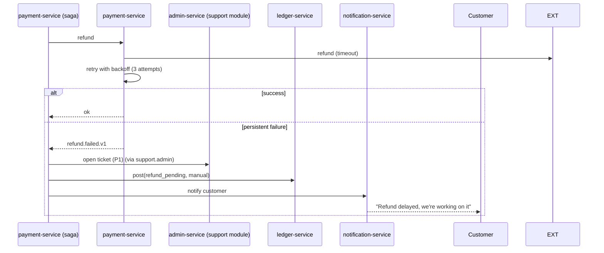

# Refund Workflows

Refunds are critical financial operations. They MUST be idempotent,
auditable, and reconcilable. Reflects the **20-service architecture**
consolidated 2026-08-05 per
[ADR-0017](../architecture/adrs/0017-20-service-architecture.md):
refunds are coordinated by `payment-service` (which absorbed both
the ride and food payment sagas and the wallet).

> For the **accounting view** of refunds (`6200_refunds` expense
> recognition; revenue reversal; closed-loop wallet debit;
> reconciliation drift) see
> [`ACCOUNTING_WORKFLOWS.md`](ACCOUNTING_WORKFLOWS.md) — "Workflow:
> Expense Recognition".

## Refund Categories

| Category | Trigger | Compensation |
|----------|---------|--------------|
| Full refund (cancellation) | Customer cancels before restaurant accept; restaurant rejects; trip cancellation before pickup | 100% of authorized amount |
| Partial refund (cancellation fee) | Customer cancels after accept but before courier en route | Authorized amount minus cancellation fee |
| Quality refund | Wrong / missing items, food quality | Configurable % or amount per policy |
| Goodwill refund | Customer support decision | Up to a per-agent limit |
| Provider-initiated refund | Chargeback won by customer | Full amount |
| Settlement reversal | Restaurant found in violation | Up to the entire settlement |

## Workflow: Auto Refund on Cancellation

## Workflow: Support-Initiated Refund

The agent's identity, ticket id, and refund reason are recorded in
the audit log.

## Workflow: Partial Refund (Quality)

## Workflow: Refund to Wallet (instead of original method)

Closed-loop wallet refunds are allowed when:

- The original payment was authorized < 90 days ago.
- The original method is no longer valid (expired card).
- Customer explicitly requests it.

## Workflow: Provider-Initiated Refund (Chargeback Won)

## Workflow: Refund Failure (Provider Timeout)

Manual refunds are processed by the finance team; they update the
ledger entry to `manual_refund` once the provider confirms.

## Idempotency in Refunds

Every refund call carries an `Idempotency-Key`:

| Pattern | Example |
|---------|---------|
| Auto refund on cancel | `request:{request_id}:refund:cancel` |
| Auto refund on reject | `request:{request_id}:refund:reject` |
| Support refund | `ticket:<ticket_id>:refund:<N>` |
| Chargeback | `chargeback:<chargeback_id>:refund` |

The `(payment_id, idempotency_key)` pair is unique in the
`payment.refunds` table; replays return the original result.

## Compensation / Rollback

Refunds don't have compensations in the strict sense — they ARE the
compensation. But there are edge cases:

- **Refund issued by mistake**: a new "clawback" transaction debits
  the wallet and re-captures. Allowed only within 24h of the refund
  and requires admin approval.
- **Refund fails after wallet was debited**: the wallet is
  re-credited (compensation).

## Audit

Every refund emits `payment.refund.initiated.v1` and
`payment.refund.completed.v1` (or `.failed.v1`). These are persisted
in `audit-service` with:

- Actor (system / support agent id)
- Reason
- Original payment id
- Refund amount
- Idempotency key
- Provider reference

## Acceptance Criteria

- 100% of refunds are idempotent.
- 100% of refunds are recorded in the audit log.
- 99% of refunds are processed by the provider within 5 minutes.
- 100% of failed refunds open a P1 ticket within 1 minute.
- 100% of refunds have a corresponding `ledger.posted.v1` (or
  `manual_refund` flag for pending cases).

## Conductor — Refund Orchestration

All refund flows run on Netflix Conductor per
[ADR-0018](../architecture/adrs/0018-workflow-engine-conductor.md) and
[`shared/CONDUCTOR_WORKFLOWS.md`](../shared/CONDUCTOR_WORKFLOWS.md) 3.3.

The 6 refund categories are encoded as 6 workflow definitions:

| Category | Workflow ID | Compensation steps |
|---|---|---|
| Standard refund | `wf.refund.standard.v1` | 5 (reverse) |
| Partial refund | `wf.refund.partial.v1` | 5 (reverse) |
| Food-order rejection | `wf.refund.food_reject.v1` | 6 (reverse) |
| Cancellation | `wf.refund.cancellation.v1` | 5 (reverse) |
| Dispute (chargeback) | `wf.refund.dispute.v1` | 7 (reverse, includes chargeback path) |
| COD failure | `wf.refund.cod_failed.v1` | 4 (reverse) |

The owner is `payment-service`. Workers run in `payment-service`,
`ledger-service`, `notification-service`, and `customer-service`. Each
worker's task list, idempotency-key namespace, and compensation is
documented in that service's `INTEGRATION.md` "Conductor Workers".
The canonical Kafka signal mapping lives in
[`shared/CONDUCTOR_WORKFLOWS.md`](../shared/CONDUCTOR_WORKFLOWS.md) 3.3 and 6.

The legacy in-service saga pattern (per [ADR-0010](../architecture/adrs/0010-saga-pattern.md))
is **not** used for refunds; Conductor's `compensationSteps` is the
single source of truth for rollback ordering.

The compensation matrix in [`architecture/FAILURE_HANDLING.md`](../architecture/FAILURE_HANDLING.md)
remains authoritative for the forward step ↔ compensation action
pairing (e.g. `payment.captured` → `payment.refund`); Conductor simply
executes the matrix.

## Related docs

- [`../SERVICE_INTEGRATION_MATRIX.md`](../SERVICE_INTEGRATION_MATRIX.md) — service × event × dependency matrix
- [`../architecture/EVENT_ARCHITECTURE.md`](../architecture/EVENT_ARCHITECTURE.md) — event catalog and delivery semantics
- [`../architecture/SERVICE_ISOLATION.md`](../architecture/SERVICE_ISOLATION.md) — downstream failure handling per class
