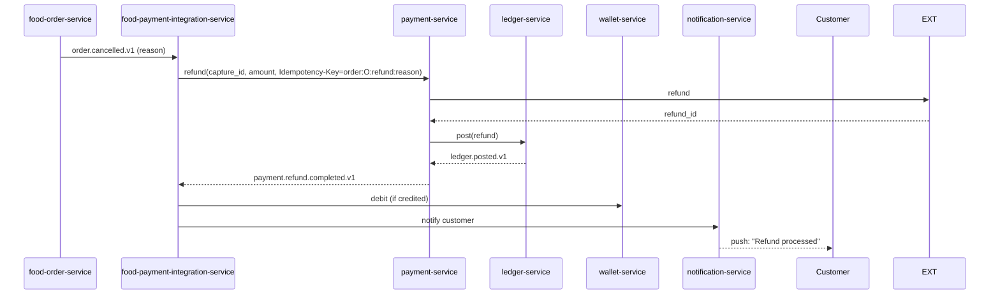
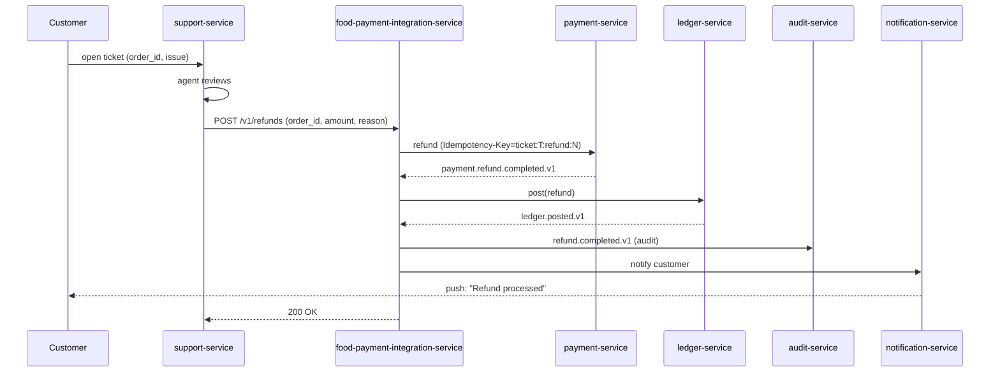
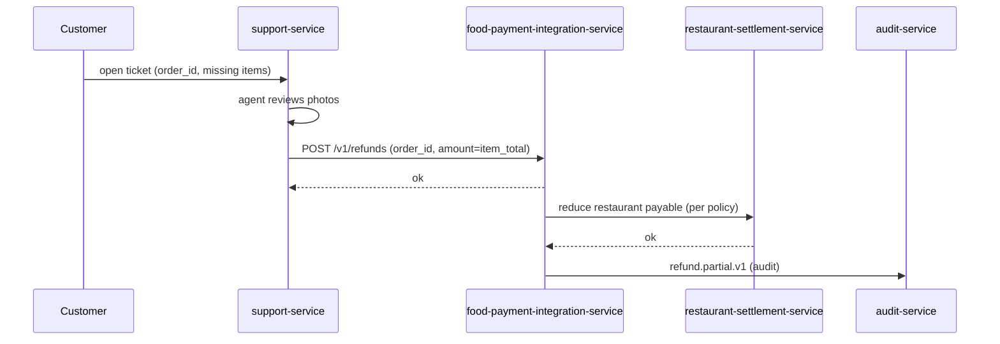
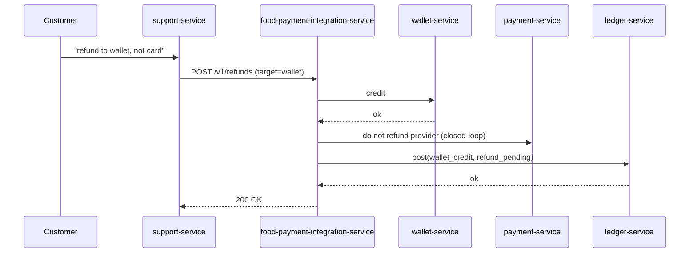
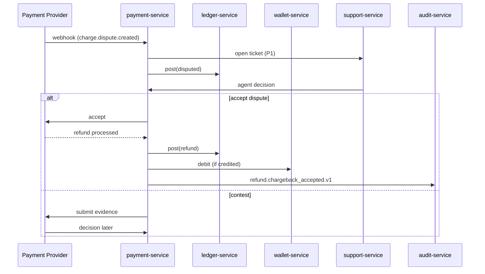
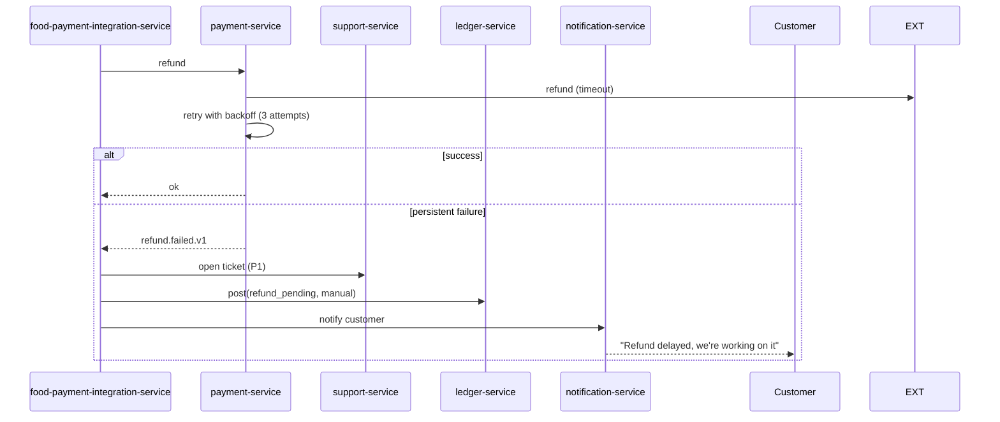

# Refund Workflows

Refunds are critical financial operations. They MUST be idempotent,
auditable, and reconcilable.

> For the **accounting view** of refunds (`6200_refunds` expense
> recognition; revenue reversal; closed-loop wallet debit;
> reconciliation drift) see
> [`ACCOUNTING_WORKFLOWS.md`](ACCOUNTING_WORKFLOWS.md) — "Workflow:
> Expense Recognition".

## Refund Categories

| Category | Trigger | Compensation |
|----------|---------|--------------|
| Full refund (cancellation) | Customer cancels before restaurant accept; restaurant rejects; trip cancellation before pickup | 100% of authorized amount |
| Partial refund (cancellation fee) | Customer cancels after accept but before courier en route | Authorized amount minus cancellation fee |
| Quality refund | Wrong / missing items, food quality | Configurable % or amount per policy |
| Goodwill refund | Customer support decision | Up to a per-agent limit |
| Provider-initiated refund | Chargeback won by customer | Full amount |
| Settlement reversal | Restaurant found in violation | Up to the entire settlement |

## Workflow: Auto Refund on Cancellation

## Workflow: Support-Initiated Refund

The agent's identity, ticket id, and refund reason are recorded in
the audit log.

## Workflow: Partial Refund (Quality)

## Workflow: Refund to Wallet (instead of original method)

Closed-loop wallet refunds are allowed when:

- The original payment was authorized < 90 days ago.
- The original method is no longer valid (expired card).
- Customer explicitly requests it.

## Workflow: Provider-Initiated Refund (Chargeback Won)

## Workflow: Refund Failure (Provider Timeout)

Manual refunds are processed by the finance team; they update the
ledger entry to `manual_refund` once the provider confirms.

## Idempotency in Refunds

Every refund call carries an `Idempotency-Key`:

| Pattern | Example |
|---------|---------|
| Auto refund on cancel | `order:<order_id>:refund:cancel` |
| Auto refund on reject | `order:<order_id>:refund:reject` |
| Support refund | `ticket:<ticket_id>:refund:<N>` |
| Chargeback | `chargeback:<chargeback_id>:refund` |

The `(payment_id, idempotency_key)` pair is unique in the
`payment.refunds` table; replays return the original result.

## Compensation / Rollback

Refunds don't have compensations in the strict sense — they ARE the
compensation. But there are edge cases:

- **Refund issued by mistake**: a new "clawback" transaction debits
  the wallet and re-captures. Allowed only within 24h of the refund
  and requires admin approval.
- **Refund fails after wallet was debited**: the wallet is
  re-credited (compensation).

## Audit

Every refund emits `payment.refund.initiated.v1` and
`payment.refund.completed.v1` (or `.failed.v1`). These are persisted
in `audit-service` with:

- Actor (system / support agent id)
- Reason
- Original payment id
- Refund amount
- Idempotency key
- Provider reference

## Acceptance Criteria

- 100% of refunds are idempotent.
- 100% of refunds are recorded in the audit log.
- 99% of refunds are processed by the provider within 5 minutes.
- 100% of failed refunds open a P1 ticket within 1 minute.
- 100% of refunds have a corresponding `ledger.posted.v1` (or
  `manual_refund` flag for pending cases).
