# Ride Workflows

This document covers the end-to-end flows for the ride-hailing product.
Per-service state machines are in each service's `WORKFLOWS.md`.

> For the **accounting view** of ride transactions (customer transaction
> recognition; driver payable; tax; expense) see
> [`ACCOUNTING_WORKFLOWS.md`](ACCOUNTING_WORKFLOWS.md) — "Workflow:
> Customer Transaction Recognition (Ride / Food)".

## Actors and Services

| Actor | Services they touch directly |
|-------|------------------------------|
| Customer | `api-gateway`, `ride-request-service`, `trip-service`, `payment-service`, `review-rating-service`, `ride-safety-service` |
| Driver | `driver-availability-service`, `driver-location-service`, `dispatch-service`, `trip-service`, `driver-earnings-service` |
| System | `pricing-service`, `eta-routing-service`, `geolocation-service`, `notification-service`, `ride-payment-integration-service` |

## Workflow: Customer Requests a Ride (Happy Path)

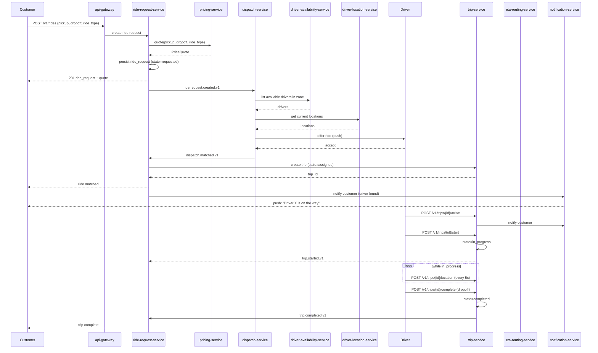

State machine for `ride_request`:

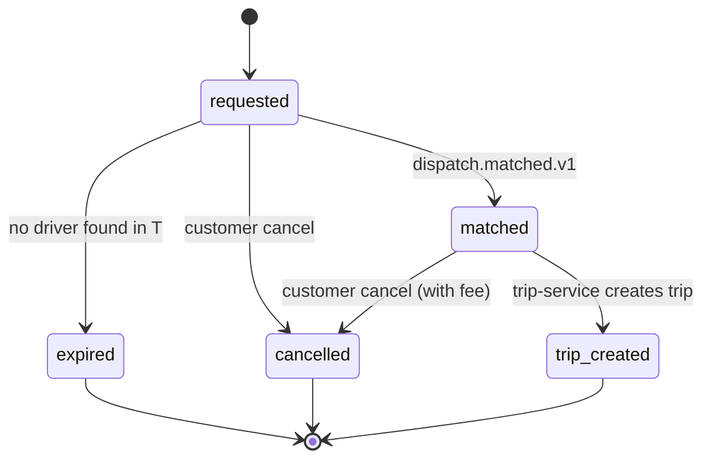

State machine for `trip`:

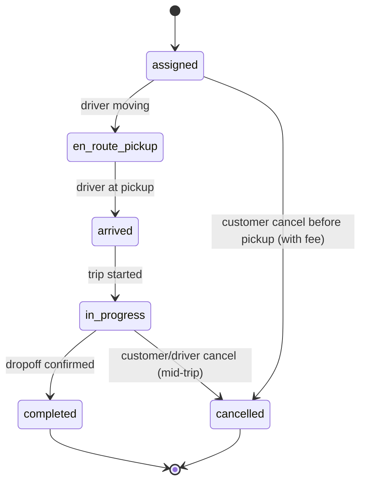

## Workflow: Driver Goes Online

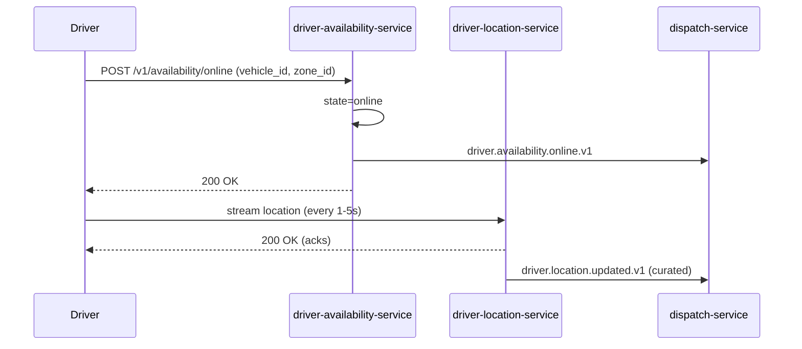

## Workflow: Driver Accepts a Ride Offer

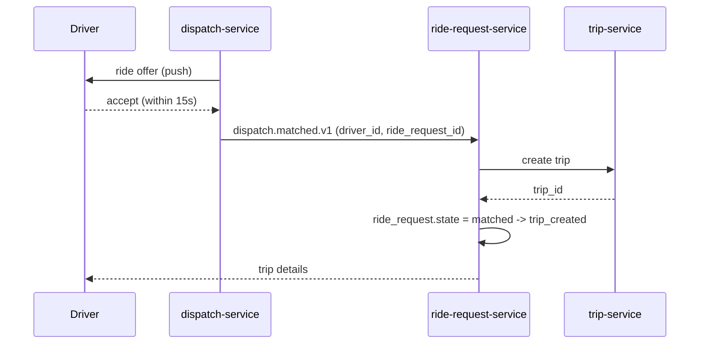

If the driver does not respond in 15s, `dispatch.offer.expired.v1` is
emitted and the next driver is tried.

## Workflow: Customer Cancellation

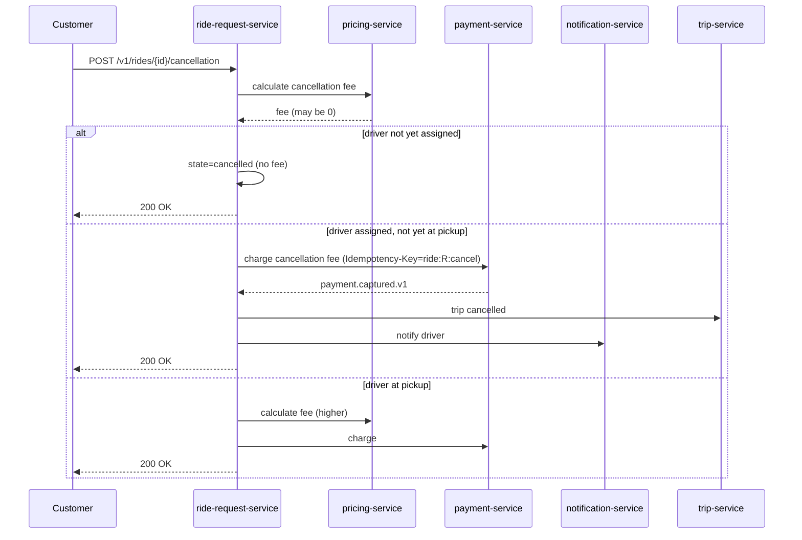

## Workflow: Payment After Trip Completion

See [PAYMENT_WORKFLOWS.md](PAYMENT_WORKFLOWS.md) for the full saga.

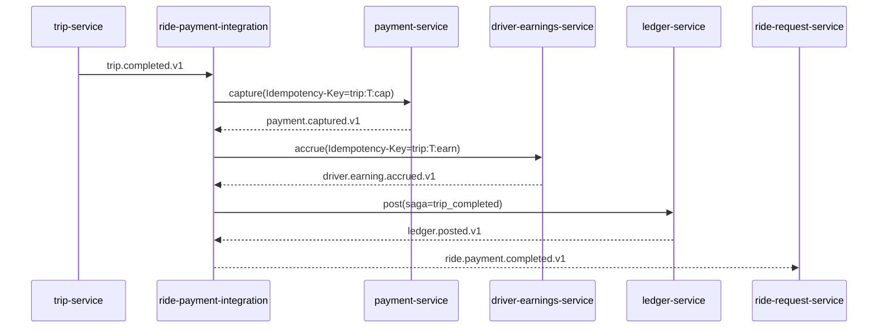

## Workflow: Guaranteed Rewards at Trip Completion

Trip completion triggers an independent **reward evaluation** in
`trip-service`: it determines both a possible driver top-up (when the
trip's accrued earnings fall below the city-configured minimum) and a
possible customer credit (loyalty / promo / issue-resolution). Rewards
are **independent of payment capture** — they fire on `trip.completed.v1`
regardless of whether capture succeeded (see the failure-paths note
"driver is still paid the minimum guarantee via wallet" below). The
grant is committed transactionally with the trip state change and
emitted via the `trip-service` outbox.

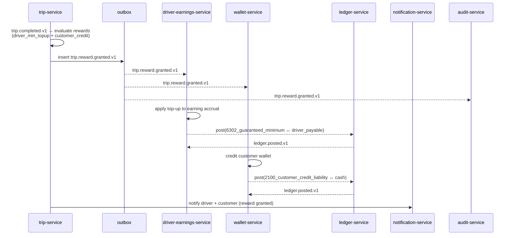

**Relationship with payment capture:** rewards are not gated on
`payment.captured.v1`. The `trip.completed.v1` event is the single
trigger; if capture fails, the failure-paths note below still grants
the driver the minimum guarantee via the wallet. Reversals on
cancellation or trip correction emit `trip.reward.reversed.v1`, which
is consumed by the same fan-out (`driver-earnings-service`,
`wallet-service`, `ledger-service`, `notification-service`,
`audit-service`) and produces **new postings**, never UPDATE/DELETE on
financial ledgers. See the accounting view in
[`ACCOUNTING_WORKFLOWS.md`](ACCOUNTING_WORKFLOWS.md) §"Workflow:
Guaranteed Rewards — Driver Top-Up + Customer Credit".

## Workflow: Driver Cancellation

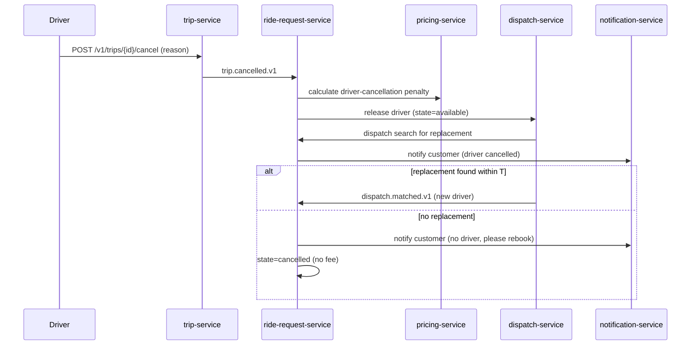

## Workflow: No Drivers Available

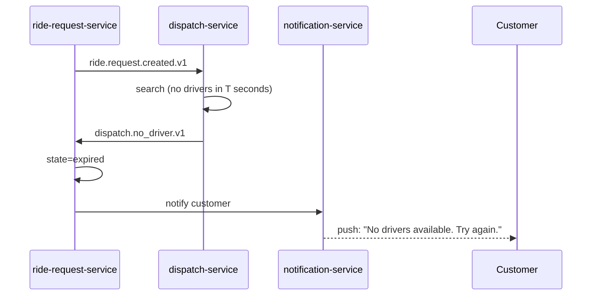

## Workflow: Scheduled Ride

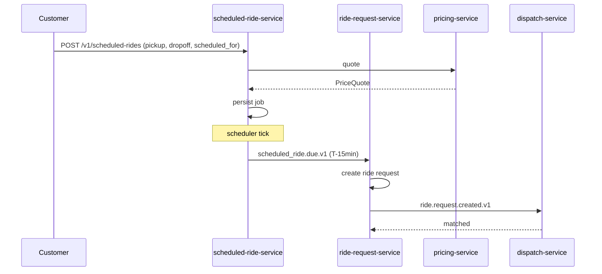

## Workflow: Safety / SOS

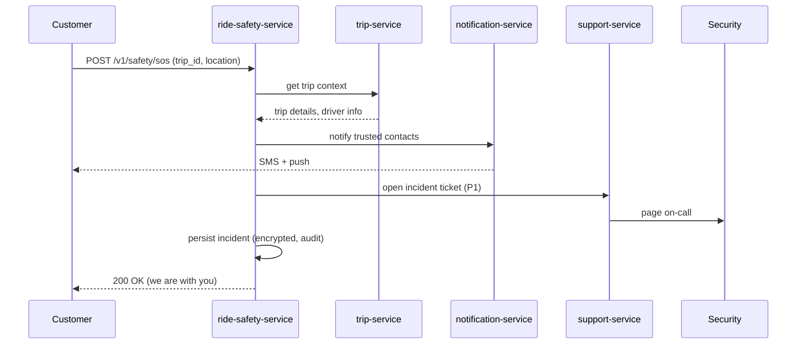

## Workflow: Rating After Trip

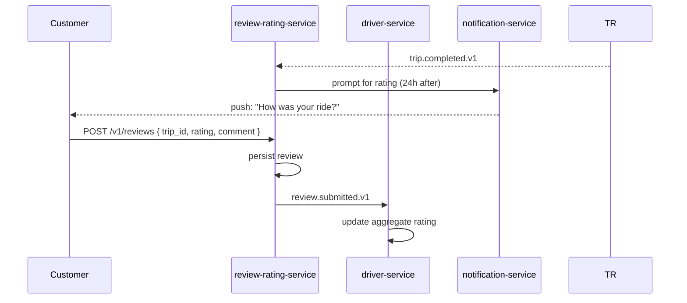

## Workflow: Driver Earnings Withdrawal

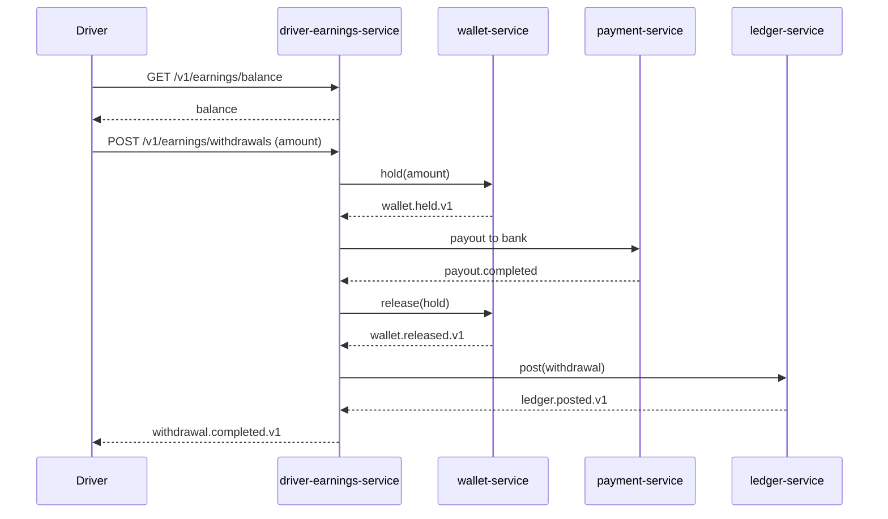

## Failure Paths Summary

| Failure | Handling |
|---------|----------|
| Pricing service down | `ride-request-service` returns 503; gateway suggests "try again" |
| Dispatch service down | `ride-request-service` queues the request and returns 202 |
| Driver location stream lost | Dispatch uses last known location; alerts after 30s |
| Trip service down during a ride | Driver app retries; trip state recoverable from driver location trail and `dispatch.matched.v1` events |
| Payment capture fails | Saga in `ride-payment-integration-service` opens a support ticket; driver is still paid the minimum guarantee via wallet |
| Driver cancels mid-trip | `dispatch-service` searches for replacement; if none, customer rebooked with credit |
| No driver available | Customer prompted to rebook or join waitlist |

## Acceptance Criteria (end-to-end)

- A customer can complete a request-to-ride flow in < 60 seconds
  including payment.
- 99.5% of customers who request a ride are matched within 90
  seconds (target SLO; varies by city/time).
- 99.9% of completed trips have a successful payment capture.
- 99% of completed trips have a successful driver earning accrual
  within 5 minutes.
- 100% of safety incidents open a P1 support ticket within 60
  seconds.
- Each eligible trip produces a `trip.reward.granted.v1` within 1 second
  of trip completion (driver top-up + customer credit fan-out).
