# Ride Workflows

This document covers the end-to-end flows for the ride-hailing product
on the **20-service architecture** (consolidated 2026-08-05 per
[ADR-0016](../architecture/adrs/0016-service-domain-consolidation.md)
→ [ADR-0017](../architecture/adrs/0017-20-service-architecture.md)).
Per-service state machines are in each service's `WORKFLOWS.md`.

> For the **accounting view** of ride transactions (customer transaction
> recognition; driver payable; tax; expense) see
> [`ACCOUNTING_WORKFLOWS.md`](ACCOUNTING_WORKFLOWS.md) — "Workflow:
> Customer Transaction Recognition (Ride / Food)".

## Actors and Services

| Actor | Services they touch directly |
|-------|------------------------------|
| Customer | `api-gateway`, `trip-service` (ride-request), `payment-service` (wallet), `trip-service` (trip reviews), **`chat-service`** *(Phase 7.7 — rider ↔ driver chat during trip)* |
| Driver | `driver-service` (online, location, match), `trip-service` (trip), `payment-service` (earnings), **`chat-service`** *(Phase 7.7)* |
| System | `pricing-service`, `geolocation-service` (ETA / zones), `notification-service`, `payment-service` (saga), **`chat-service`** *(Phase 7.7 — creates `trip_chat` thread on `ride.request.matched.v1`, closes on `trip.completed.v1` / `trip.cancelled.v1`; offline push fallback)* |

## Request lifecycle (parent events)

Per [ADR-0020](../architecture/adrs/0020-polymorphic-request-id.md), every ride request emits polymorphic `request.*.v1` parent events that track the request-level state machine. The domain events (`ride.request.created.v1`, `trip.started.v1`, etc.) continue to exist as children; `request.*.v1` events are the parent layer that consumers needing request-level state can subscribe to instead of all domain events.

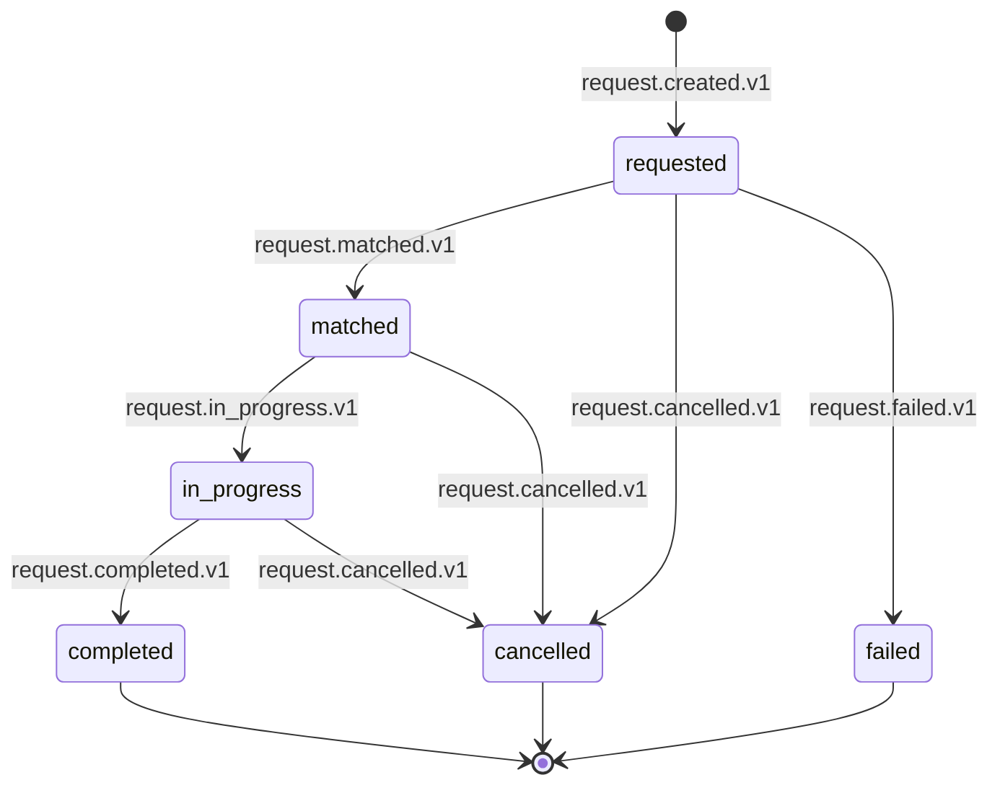

Each `request.*.v1` event carries `request_id`, `service='trip'`, `workflow_process_id`, `status`, and `correlation_id`.

## Workflow: Customer Requests a Ride (Happy Path)

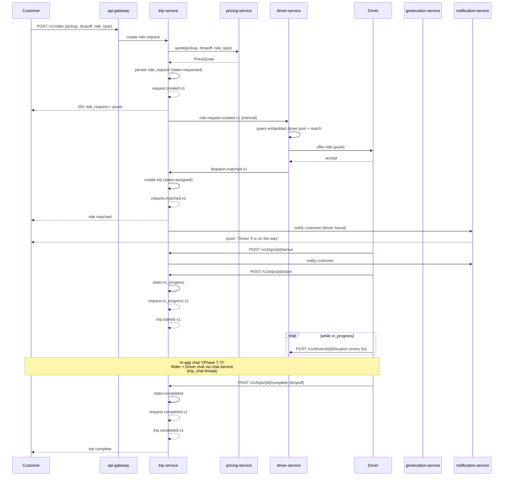

State machine for `ride_request` (inside `trip.ride_requests`):

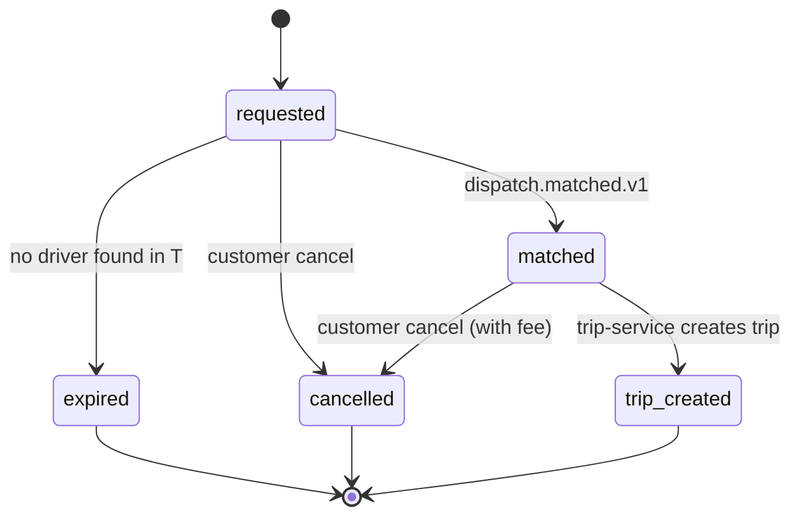

State machine for `trip`:

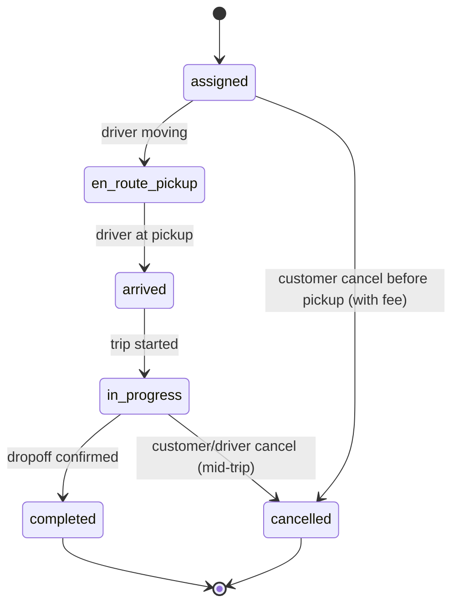

## Workflow: Driver Goes Online

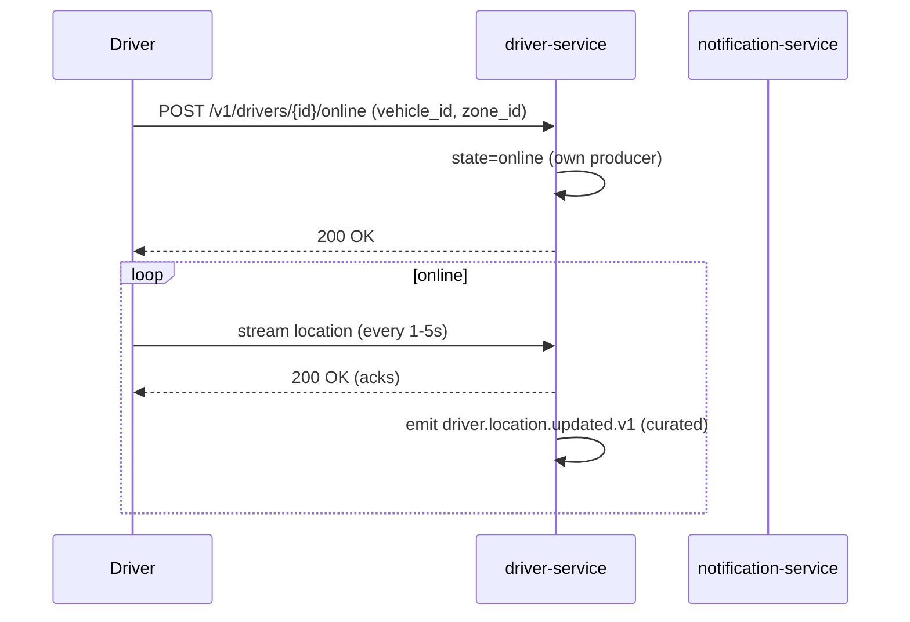

## Workflow: Driver Accepts a Ride Offer

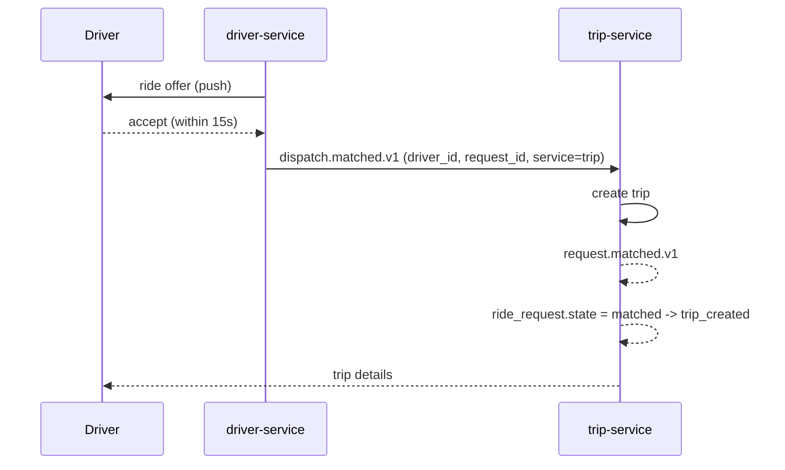

If the driver does not respond in 15s, `dispatch.offer.expired.v1` is
emitted and the next driver is tried.

## Workflow: Customer Cancellation

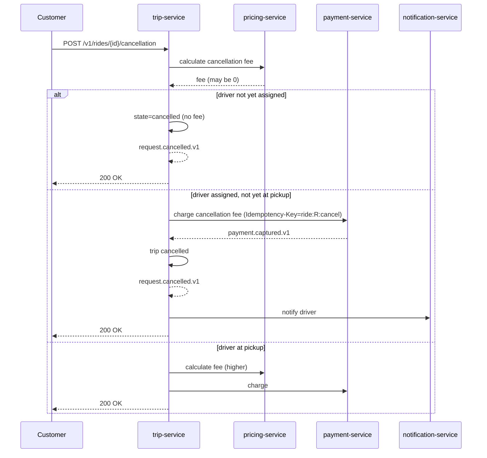

## Workflow: Payment After Trip Completion

See [PAYMENT_WORKFLOWS.md](PAYMENT_WORKFLOWS.md) for the full saga.
The ride payment saga is now orchestrated inside `payment-service`
(absorbed from `ride-payment-integration-service`).

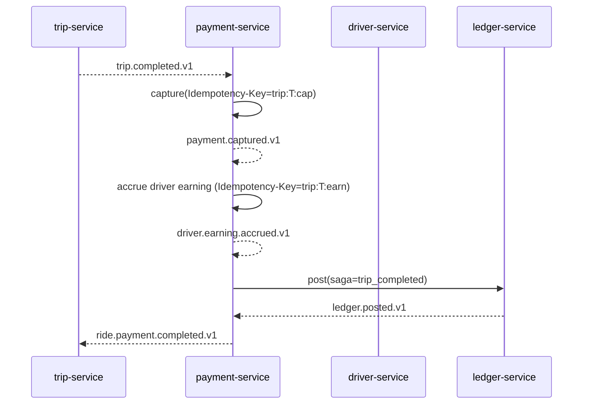

## Workflow: Guaranteed Rewards at Trip Completion

Trip completion triggers an independent **reward evaluation** in
`trip-service`: it determines both a possible driver top-up (when the
trip's accrued earnings fall below the city-configured minimum) and a
possible customer credit (loyalty / promo / issue-resolution). Rewards
are **independent of payment capture** — they fire on `trip.completed.v1`
regardless of whether capture succeeded (see the failure-paths note
"driver is still paid the minimum guarantee via wallet" below). The
grant is committed transactionally with the trip state change and
emitted via the `trip-service` outbox.

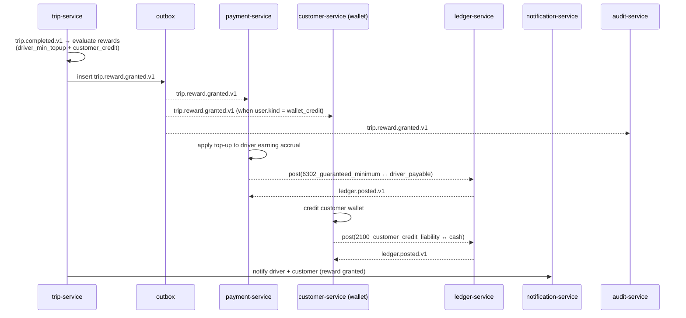

**Relationship with payment capture:** rewards are not gated on
`payment.captured.v1`. The `trip.completed.v1` event is the single
trigger; if capture fails, the failure-paths note below still grants
the driver the minimum guarantee via the wallet. Reversals on
cancellation or trip correction emit `trip.reward.reversed.v1`, which
is consumed by the same fan-out (`payment-service`,
`customer-service` (wallet), `ledger-service`,
`notification-service`, `audit-service`) and produces **new postings**,
never UPDATE/DELETE on financial ledgers. See the accounting view in
[`ACCOUNTING_WORKFLOWS.md`](ACCOUNTING_WORKFLOWS.md) "Workflow:
Guaranteed Rewards — Driver Top-Up + Customer Credit".

## Workflow: Driver Cancellation

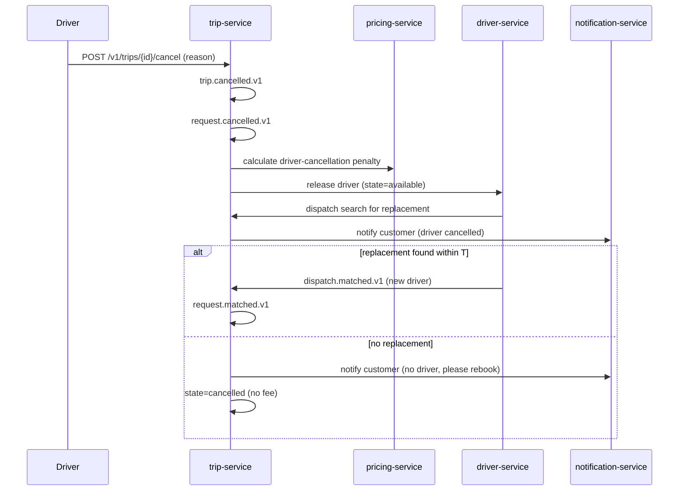

## Workflow: No Drivers Available

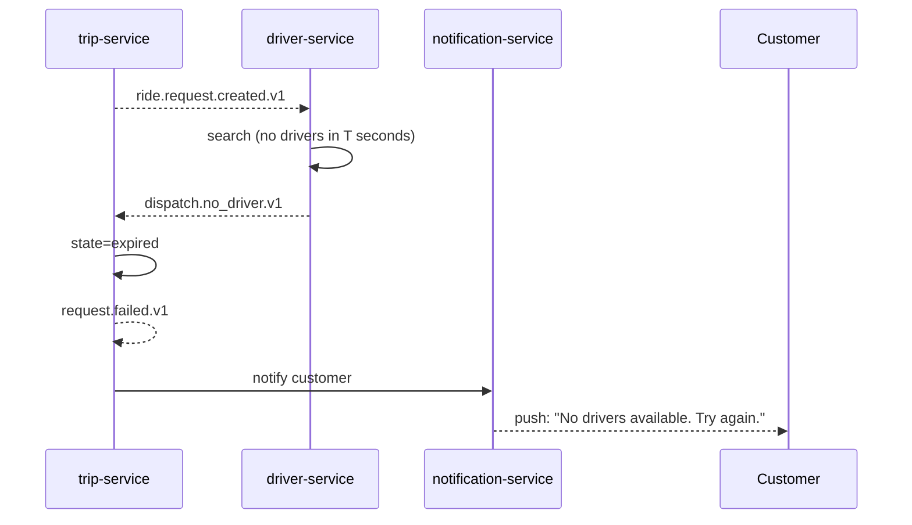

## Workflow: Scheduled Ride

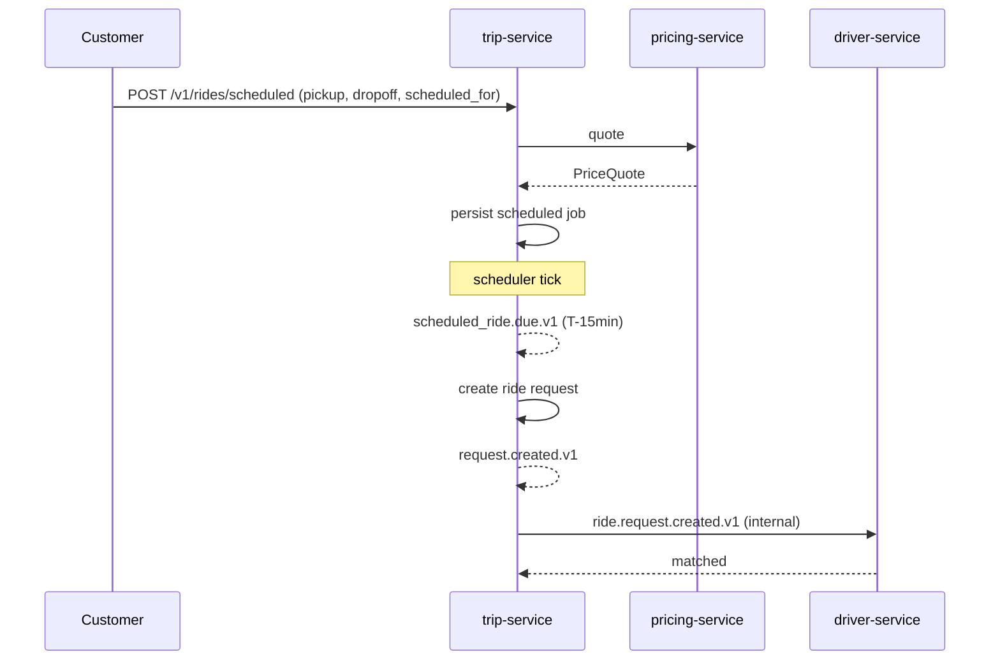

## Workflow: Safety / SOS

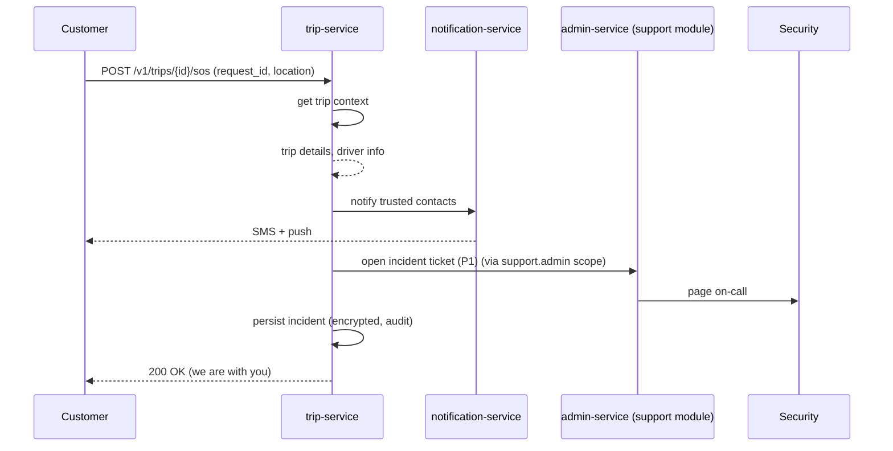

## Workflow: Rating After Trip

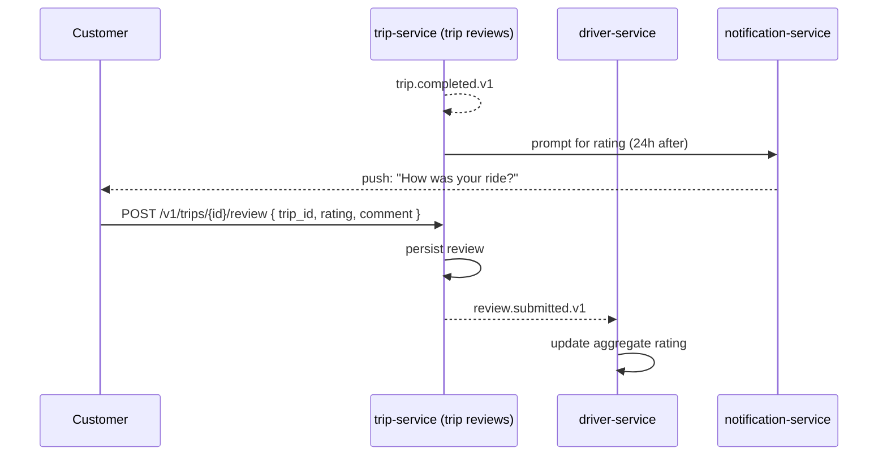

## Workflow: Driver Earnings Withdrawal

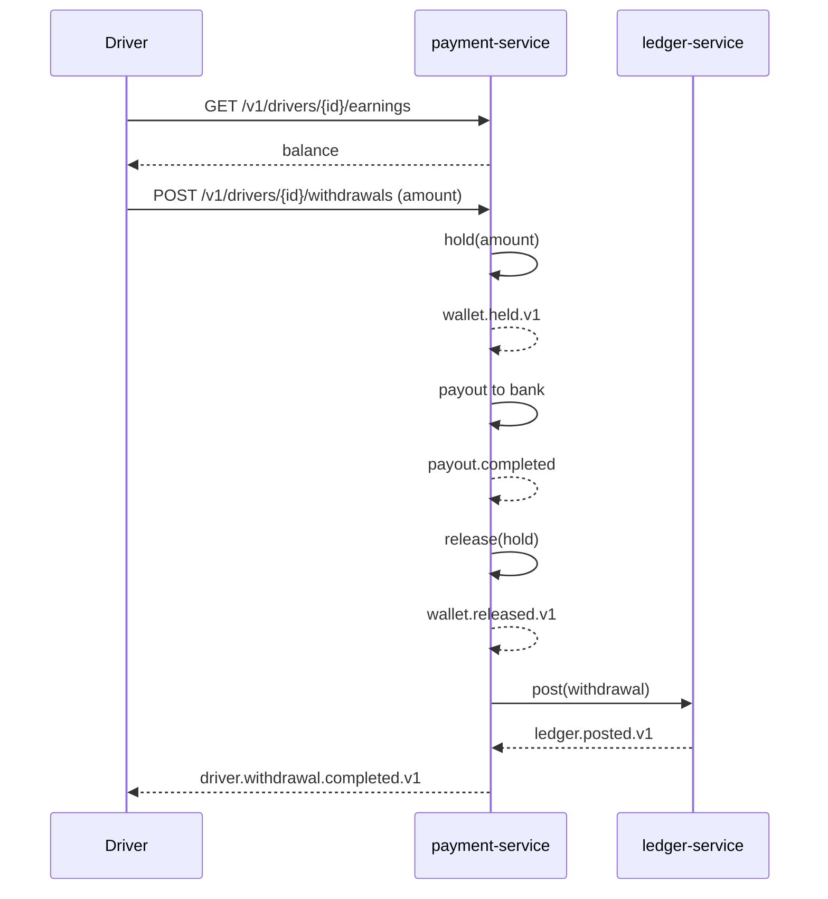

## Failure Paths Summary

| Failure | Handling |
|---------|----------|
| Pricing service down | `trip-service` returns 503; gateway suggests "try again" |
| Driver-service match subsystem down | `trip-service` queues the request and returns 202 |
| Driver location stream lost | `driver-service` uses last known location; alerts after 30s |
| Trip service down during a ride | Driver app retries; trip state recoverable from driver location trail and `dispatch.matched.v1` events |
| Payment capture fails | Saga in `payment-service` opens a support ticket (via `admin-service` support module); driver is still paid the minimum guarantee via wallet |
| Driver cancels mid-trip | `driver-service` searches for replacement; if none, customer rebooked with credit |
| No driver available | Customer prompted to rebook or join waitlist |

## Acceptance Criteria (end-to-end)

- A customer can complete a request-to-ride flow in < 60 seconds
  including payment.
- 99.5% of customers who request a ride are matched within 90
  seconds (target SLO; varies by city/time).
- 99.9% of completed trips have a successful payment capture.
- 99% of completed trips have a successful driver earning accrual
  within 5 minutes.
- 100% of safety incidents open a P1 support ticket within 60
  seconds.
- Each eligible trip produces a `trip.reward.granted.v1` within 1 second
  of trip completion (driver top-up + customer credit fan-out).

## Conductor — Phase 7 Rewards

The Guaranteed Rewards fan-out (per [ADR-0018](../architecture/adrs/0018-workflow-engine-conductor.md)
and [`shared/CONDUCTOR_WORKFLOWS.md`](../shared/CONDUCTOR_WORKFLOWS.md) 3.1)
runs on Netflix Conductor as two workflow definitions:

| Workflow ID | Trigger event | Tasks |
|---|---|---|
| `wf.phase7.reward_grant.v1` | `trip.reward.granted.v1` | 6 (driver earnings, wallet, ledger, notification, audit, reporting) |
| `wf.phase7.reward_reversal.v1` | `trip.reward.reversed.v1` | 6 (mirror with reversal semantics) |

The owner is `trip-service` (which emits the trigger events via its
outbox). The compensation steps run in reverse order on failure:
`compensate_payment_service_driver_earnings_grant` →
`compensate_payment_service_wallet_grant` → etc. The full
specification is in [`shared/CONDUCTOR_WORKFLOWS.md`](../shared/CONDUCTOR_WORKFLOWS.md) 3.1.

The in-service trip state machine (per [ADR-0010](../architecture/adrs/0010-saga-pattern.md))
remains authoritative for the trip lifecycle itself; only the
**reward fan-out** (post-trip) is delegated to Conductor. This is a
targeted adoption — the trip lifecycle saga is not displaced.

## Related docs

- [`../SERVICE_INTEGRATION_MATRIX.md`](../SERVICE_INTEGRATION_MATRIX.md) — service × event × dependency matrix
- [`../architecture/EVENT_ARCHITECTURE.md`](../architecture/EVENT_ARCHITECTURE.md) — event catalog and delivery semantics
- [`../architecture/SERVICE_ISOLATION.md`](../architecture/SERVICE_ISOLATION.md) — downstream failure handling per class
