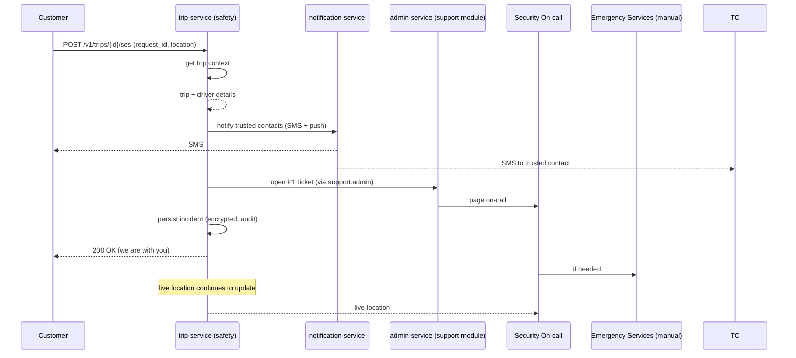
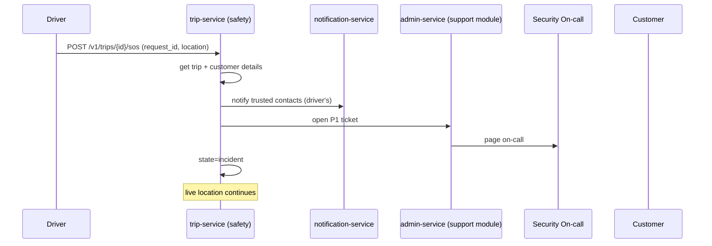
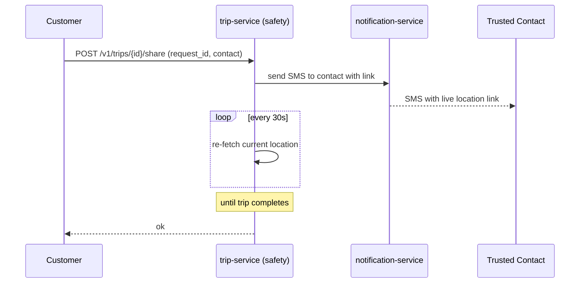
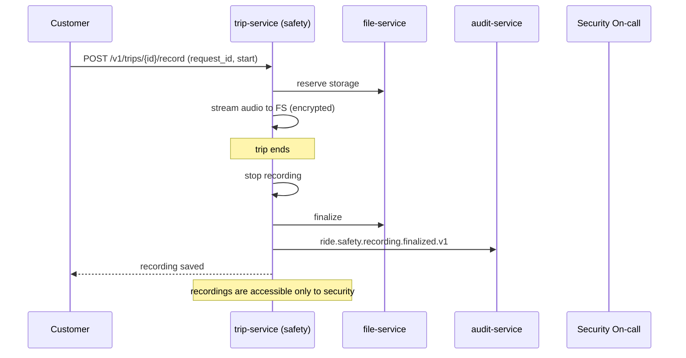
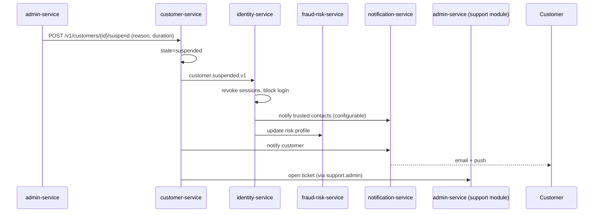
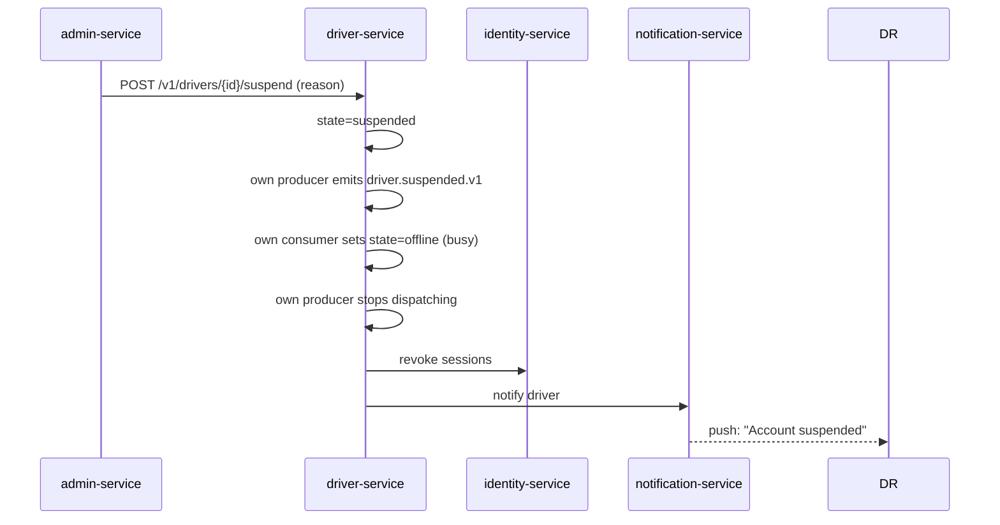
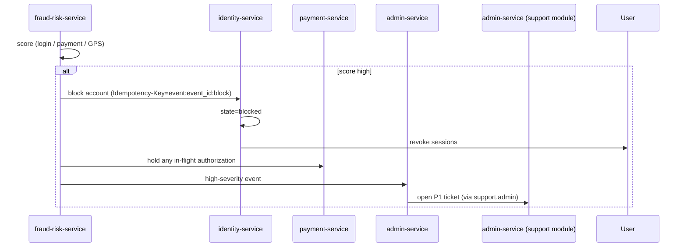
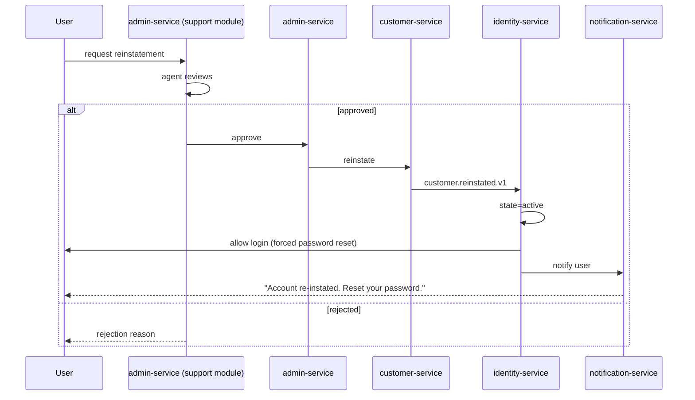
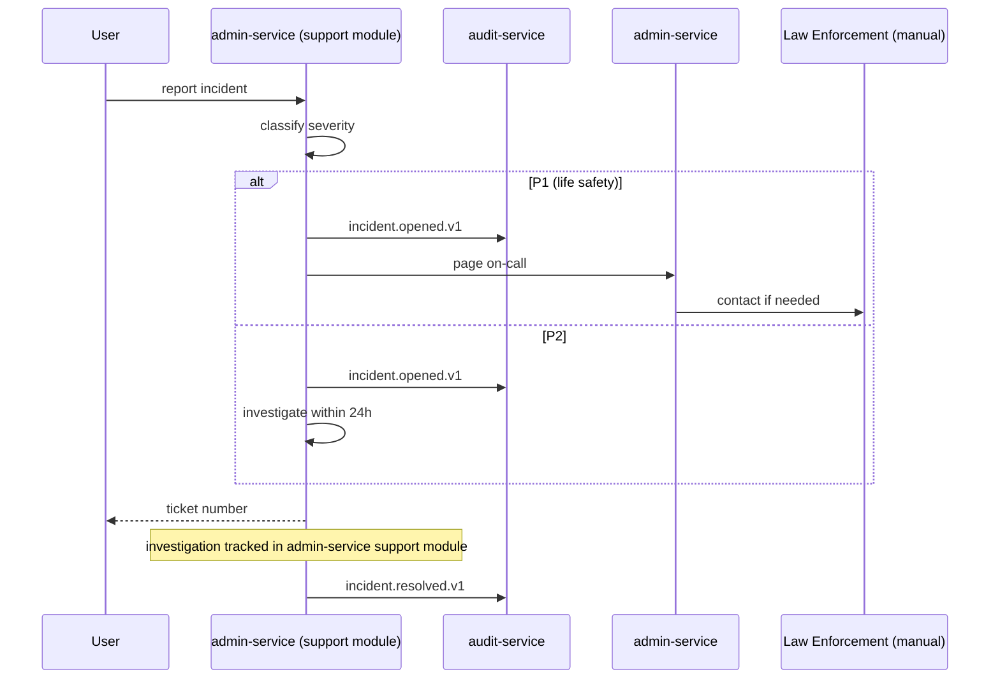

# Safety Workflows

Safety flows cover emergencies during rides and deliveries, account
suspension, fraud, and incident handling. Reflects the **20-service
architecture** consolidated 2026-08-05 per
[ADR-0017](../architecture/adrs/0017-20-service-architecture.md):
the safety capability is owned by `trip-service` (absorbed from
`ride-safety-service`) and the support module is owned by
`admin-service`.

## Request lifecycle note

Safety events are orthogonal to the request lifecycle. An SOS, share, or
recording can be triggered at any point during an active request
(`requested`, `matched`, `in_progress`). Safety workflows use the
`request_id` (with implicit `service='trip'`) to locate the trip
context; they do not emit `request.*.v1` events or alter the request
state machine. Per [ADR-0020](../architecture/adrs/0020-polymorphic-request-id.md).

## Workflow: Customer SOS During a Ride



## Workflow: Driver SOS During a Ride



## Workflow: Share Trip



## Workflow: Audio Recording



## Workflow: Account Suspension (Customer)



## Workflow: Account Suspension (Driver / Courier)



## Workflow: Fraud Detection → Account Block



## Workflow: Account Re-instatement



## Workflow: Incident Reporting (General)



## Workflow: Data Subject Access / Erasure (GDPR / PDPL)

```mermaid
sequenceDiagram
    participant U as User
    participant ADM as admin-service (support module)
    participant ID as identity-service
    participant CST as customer-service
    participant DRV as driver-service
    participant COS as courier-service
    participant PAY as payment-service
    participant LD as ledger-service
    participant AUD as audit-service

    U->>ADM: request data export / erasure
    ADM->>ADM: verify identity
    ADM->>ID: identify user
    alt export
        ADM->>CST,DRV,COS: collect profile
        ADM->>PAY: collect payment history (no PAN)
        ADM-->>U: data package (signed URL, encrypted)
    else erasure
        ADM->>CST,DRV,COS: erase PII columns
        ADM->>ID: anonymize Keycloak user
        ADM->>PAY: mark "erased" (financial records retained per law)
        ADM->>LD: retain ledger (de-identified)
        ADM->>AUD: erasure.completed.v1
    end
```

## Failure Paths Summary

| Failure | Handling |
|---------|----------|
| SOS endpoint unreachable | Mobile app retries with backoff; falls back to phone call to emergency number |
| Trusted contact SMS fails | Retry with alternative channel (push); on failure, log |
| Recording upload fails | Retained in mobile local cache; uploaded on next launch with backoff |
| Account suspension race | Outbox + idempotency ensures only one suspension applies |
| Reinstatement by unauthorized actor | RBAC + audit; high-severity event on every action |

## Acceptance Criteria

- 100% of SOS events open a P1 support ticket within 60 seconds.
- 100% of SOS events notify trusted contacts within 60 seconds.
- 100% of account suspensions are audited.
- 100% of data subject requests are processed within 30 days
  (legal requirement).